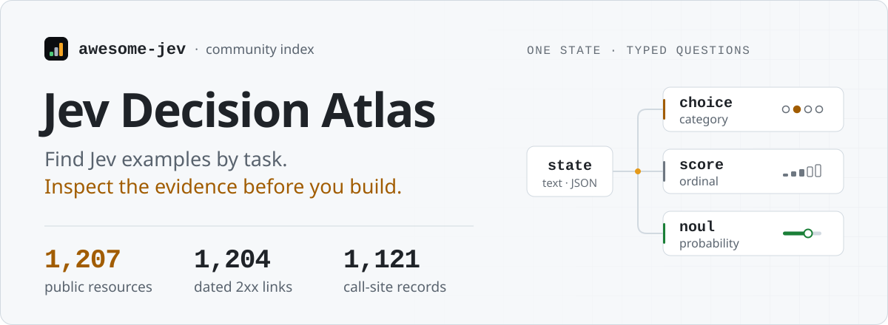
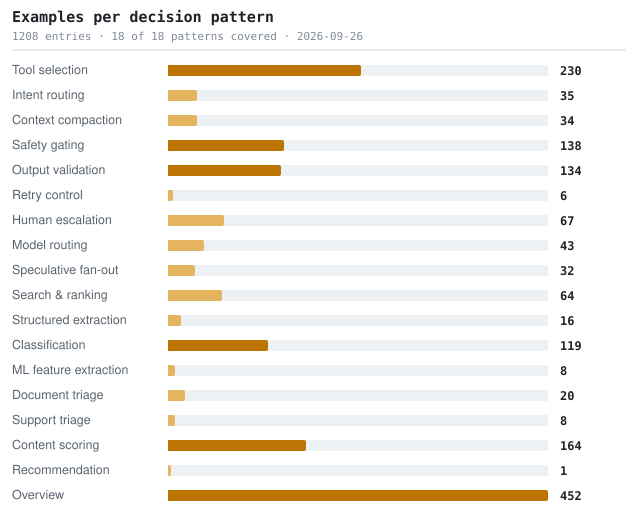

<!--
  This file is generated from catalog.json. Edit the catalog, then run `python3 scripts/build_readme.py`.
-->

<a href="https://kydlikebtc.github.io/awesome-jev/?lang=en">
<picture>
  <source media="(min-width: 768px) and (prefers-color-scheme: light)" srcset="docs/assets/readme-cover-en-light.svg">
  <source media="(max-width: 767px) and (prefers-color-scheme: light)" srcset="docs/assets/readme-cover-en-light-mobile.svg">
  <source media="(max-width: 767px)" srcset="docs/assets/readme-cover-en-dark-mobile.svg">
  <source media="(prefers-color-scheme: dark)" srcset="docs/assets/readme-cover-en-dark.svg">
  
</picture>
</a>

<a href="https://kydlikebtc.github.io/awesome-jev/?lang=en"><kbd>&nbsp;<b>Explore&nbsp;the&nbsp;catalogue&nbsp;↗</b>&nbsp;</kbd></a>
<a href="https://kydlikebtc.github.io/awesome-jev/?collection=first-call&amp;lang=en"><kbd>&nbsp;First&nbsp;call&nbsp;</kbd></a>
<a href="https://kydlikebtc.github.io/awesome-jev/?collection=build&amp;lang=en"><kbd>&nbsp;Adapt&nbsp;a&nbsp;project&nbsp;</kbd></a>
<a href="https://kydlikebtc.github.io/awesome-jev/?collection=measured&amp;lang=en"><kbd>&nbsp;Independent&nbsp;reports&nbsp;</kbd></a>
<a href="README.zh-CN.md"><kbd>&nbsp;中文&nbsp;</kbd></a>

Counts describe saved link and evidence records, not current CI passes or runtime tests. <a href="#what-is-verified-and-what-is-not">About these counts</a>

<b>On this page · full reading map</b>

[Patterns](docs/patterns.md) · [Compatibility](docs/compatibility.md) · [Vetting](docs/vetting.md)

- 01 [What this is](#what-this-is)
- 02 [What Jev returns](#what-jev-returns)
- 03 [Start here](#start-here)
- 04 [Coverage](#coverage)
- 05 [Measured, not claimed](#measured-not-claimed)
- 06 [By decision pattern](#by-decision-pattern)
- 07 [By resource kind](#by-resource-kind)
- 08 [Also in this repo](#also-in-this-repo)
- 09 [What is verified, and what is not](#what-is-verified-and-what-is-not)
- 10 [Machine-readable data](#machine-readable-data)
- 11 [Contributing and licence](#contributing-and-licence)

---

## What this is

- **Jev** is a decision model from TypeSafe AI. It does not write text — you hand it state plus typed questions and it returns typed answers with calibrated confidence, fast and cheap enough to sit in an agent's inner loop.
- **This repo** indexes public examples of using it, organised by the *decision* being made. The resource you read this week is disposable; the decision pattern is not.
- **How to assess it:** every row names its source. Call-site citations, primitive claims and caveats are recorded where available, so you can inspect what was read and what remains untested.

> [!NOTE]
> Not the product, not an SDK, not affiliated with TypeSafe AI, and not a recommendation. Inclusion is a source record, not a runtime or performance endorsement. See [what is verified](#what-is-verified-and-what-is-not).

## What Jev returns

Three primitives. Every pattern below is built out of them, and the asymmetry in the last row is the single most common source of bugs.

<picture>
  <source media="(prefers-color-scheme: dark)" srcset="docs/assets/primitives-en-dark.svg">
  
</picture>

Input is **text only** — string, JSON object, or array of text. Context is **64k** tokens per request, **32k** for the state plus the longest question. Output tokens are free. There are no published weights, so it cannot be run locally. Full cross-platform differences: [`docs/compatibility.md`](docs/compatibility.md).

## Start here

Six things in reading order. Hand-picked, because "most starred" is not the same as "read this first".

1. **[Quickstart](https://docs.typesafe.ai/introduction/quickstart)**

   The canonical first call: one support ticket, one Choice, one Score and one Noul in a single request, in Python, JS and cURL.

2. **[Jev 1.13 known limitations](https://docs.typesafe.ai/model-jaggedness/jev-1.13)**

   The most useful page in the docs and the least linked. It explains, among other things, that a Choice over options and one Noul per option answer different questions.

3. **[Example: three primitives in one request](https://github.com/kydlikebtc/awesome-jev/blob/main/examples/01-three-primitives/main.py)**

   Written from the official API reference and checked field by field against it, but not executed against the live API.

4. **[fast-jev-compaction](https://github.com/tamaratran/fast-jev-compaction)**

   Exactly two nouls per tool call: does knowing this call happened still matter, and is the full output still needed verbatim. Despite the word "scored" in its own description, no score primitive is used.

5. **[ai-cookbook: Jev track](https://github.com/daveebbelaar/ai-cookbook)**

   The best structured tutorial found. It states plainly that typed output does not guarantee a correct decision, lists the documented weaknesses, and qualifies its own cost illustration rather than selling it.

6. **[Hermes Agent: Jev compaction evaluation](https://github.com/NousResearch/hermes-agent)**

   The single most credible row in this catalog. Recall came out below their existing summariser, and at a matched context budget it tied plain recency ordering. Cost was genuinely far lower. Publishing a negative result on a hyped model is rare.

## Coverage

Every decision pattern, sized by how many entries this catalogue contains. Use the pattern index below the chart to jump to a section. A zero is a research gap, not a rendering bug.

<picture>
  <source media="(prefers-color-scheme: dark)" srcset="docs/assets/coverage-en-dark.svg">
  
</picture>

All 18 patterns have at least one catalogue entry. Coverage does not imply runtime testing or equal maturity. See [`docs/status.md`](docs/status.md).

**Pattern index · jump to the examples**

| Decision pattern | Decision pattern |
| :--- | :--- |
| [Tool selection](#tool-selection) · **230** | [Intent routing](#intent-routing) · **35** |
| [Context compaction](#context-compaction) · **34** | [Safety gating](#safety-gating) · **139** |
| [Output validation](#output-validation) · **134** | [Retry control](#retry-control) · **7** |
| [Human escalation](#human-escalation) · **68** | [Model routing](#model-routing) · **44** |
| [Speculative fan-out](#speculative-fan-out) · **32** | [Search & ranking](#search--ranking) · **64** |
| [Structured extraction](#structured-extraction) · **16** | [Classification](#classification) · **119** |
| [ML feature extraction](#ml-feature-extraction) · **8** | [Document triage](#document-triage) · **20** |
| [Support triage](#support-triage) · **8** | [Content scoring](#content-scoring) · **164** |
| [Recommendation](#recommendation) · **1** | [Overview](#overview) · **451** |

## Measured, not claimed

Independent measurement reports in the catalogue, including **negative results** that help explain where an approach fails. These are the original authors' measurements; this repository has not independently reproduced them. Check each report's dataset, method and model version before comparing results.

- **[Hermes Agent: Jev compaction evaluation](https://github.com/NousResearch/hermes-agent)** 
  Ported the Jev compaction approach, measured it against their shipping summariser, and published the conclusion not to adopt it. 
  `Benchmark` · ★248,479 · `Py` · `noul`

  > The single most credible row in this catalog. Recall came out below their existing summariser, and at a matched context budget it tied plain recency ordering. Cost was genuinely far lower. Publishing a negative result on a hyped model is rare.

- **[worldmonitor: news threat classification](https://github.com/koala73/worldmonitor)** 
  Two Choice questions over threat level and category, held in shadow mode after a blind evaluation found Jev merely tied the incumbent model. 
  `Benchmark` · ★87,298 · `TS` · `choice`

  **Caveats:** `shadow mode`

  > Wired in but deliberately inert: by their own statement nothing Jev returns reaches a label, a cache row or an alert. Ships a golden fixture. A model to copy for how to trial a new model without betting production on it.

- **[no-mistakes: Jev review pre-brief, measured and retired](https://github.com/kunchenguid/no-mistakes/pull/1165)** 
  One Score per candidate file to pre-brief code review — measured twice, then removed: more billed input for essentially no wall-clock gain, and offline replay showed the candidate list could not reach where review findings land. 
  `Benchmark` · ★8,617 · `Go` · `score`

  > Removed in PR #1165 (2026-09-22). Their offline measurement found the candidate generator excluded changed files by construction while nearly all review findings sit in changed files, and that per-file excerpts made the list less precise at higher token cost. The code is gone from the default branch, so this row cites the change that removed it.

- **[hippo-memory](https://github.com/kitfunso/hippo-memory)** 
  Biologically-inspired memory for AI agents. Decay, retrieval strengthening, consolidation. Zero runtime deps, SQLite, MCP. Benchmarked retrieval with an opt-in TypeSafe Jev reranker. 
  `Benchmark` · ★756 · kitfunso · `TS`

- **[Probing Jev's behaviour with repeated API calls](https://github.com/ahastudio/til)** 
  Independent Korean-language notes reporting that reversing the order of options shifted a probability enough to flip a 0.9 threshold. 
  `Benchmark` · ★190 · `Py`

  **Caveats:** `no licence` · `unverified claims`

  > The most actionable engineering caveat found anywhere: if option order alone can move a probability past your threshold, your threshold is not as stable as it looks. Independent and unreplicated, so treat the magnitude as indicative.

- **[jevbench](https://github.com/fstandhartinger/jevbench)** 
  JevBench v1 - a benchmark for Jev-class typed decision models: smart, cheap, fast, reliable, open. 
  `Benchmark` · ★107 · fstandhartinger · `Py`

- **[jev-arena](https://github.com/NanmiCoder/jev-arena)** 
  An introduction to Jev with hands-on tests: Choice, Score and Noul turn natural language into typed judgements for classification, scoring and routing, compared with DeepSeek on comment labelling, speed and results, with CSV import, replay and offline reports. 
  `Benchmark` · ★97 · nanmicoder · `JS`

- **[windtunnel](https://github.com/nekuda-ai/WindTunnel)** 
  A WebMCP benchmark, measures WebMCP against other browser-agent interfaces. 
  `Benchmark` · ★80 · nekuda-ai · `TS`

- **[jev-robot-control](https://github.com/openroboto-ai/jev-robot-control)** 
  Jev against two LLMs on direct Cartesian control of an xArm7 in MuJoCo — intent, movement and gripper each step — with recorded responses, trajectories and replays. One seed-0 trial per controller, not a success rate. 
  `Benchmark` · ★44 · openroboto-ai · `Py`

- **[typesafe-ai-benchmark](https://github.com/iammrduncan/typesafe-ai-benchmark)** 
  A gateway that mimics the structured-output shape, used to benchmark against it. 
  `Benchmark` · ★38 · iammrduncan · `TS`

- **[jev-capability-atlas](https://github.com/Zaious/jev-capability-atlas)** 
  Independent, evidence-based map of when TypeSafe's Jev actually holds up vs. breaks down — real API-call receipts, not a leaderboard. 中文為主的雙語 repo。 
  `Benchmark` · ★26 · zaious · `Py`

- **[smartmoney-cub](https://github.com/myc0576/SmartMoney-Cub)** 
  Read-only trading journal and review harness: Jev typed judgments, agent integration, and a reproducible finance benchmark. No orders, no advice. 
  `Benchmark` · ★26 · myc0576 · `Py`

- **[jev-benchmarks](https://github.com/AbdelStark/jev-benchmarks)** 
  Probability-aware evaluation for typed decision models: calibration, selective risk, latency, and reproducible benchmarks. 
  `Benchmark` · ★17 · abdelstark · `Py`

- **[jev-rag-benchmark](https://github.com/erendikmenn/jev-rag-benchmark)** 
  Reproducible benchmark for measuring Jev reranking quality, latency, and cost in RAG 
  `Benchmark` · ★14 · erendikmenn · `Py`

- **[pdf-race](https://github.com/goodrahstar/pdf-race)** 
  Docling → Jev vs Docling → Gemini 3.8 Flash vs Gemini reading the PDF: same documents, one clock, scored against arXiv's own metadata 
  `Benchmark` · ★9 · goodrahstar · `JS`

- **[jev-dspy-lab](https://github.com/jmanhype/jev-dspy-lab)** 
  Reproducible calibration and selective-risk benchmarks for Jev/TypeSafe decisions in DSPy workflows 
  `Benchmark` · ★7 · jmanhype · `Py`

- **[jev-rerank-bench](https://github.com/anessbelbati/jev-rerank-bench)** 
  An independent head-to-head against dedicated rerankers across fourteen datasets. 
  `Benchmark` · ★7 · anessbelbati · `Py`

  > An independent measurement rather than a vendor figure, and a direct comparison against purpose-built rerankers — the comparison that matters for the search-ranking pattern.

- **[jev-benchmark](https://github.com/wondertwins/jev-benchmark)** 
  Benchmarks and a playground for TypeSafe's Jev (System One) model: chess, and who-is-the-player-talking-to for speech-to-text game NPCs 
  `Benchmark` · ★6 · wondertwins · `Py`

- **[jev-korean-benchmark](https://github.com/mahlernim/jev-korean-benchmark)** 
  Reproducible early-access evaluation of Jev on Korean understanding and medical text, with runtime and cost evidence 
  `Benchmark` · ★6 · mahlernim · `Py`

  **Caveats:** `no licence`

- **[jev-ood-calibration](https://github.com/scienthoon/jev-ood-calibration)** 
  Independent calibration test of TypeSafe's Jev on a task it cannot have seen: 900 rule-generated support tickets (choice / score / boolean) plus 3 public benchmarks via Vercel AI Gateway. Raw responses, ECE with noise floor, temperature refit, per-type sign of miscalibration. Reproducible for ~ 
  `Benchmark` · ★6 · scienthoon · `Py`

- **[jev-search-rerank-eval](https://github.com/zhuyansen/jev-search-rerank-eval)** 
  Does a TypeSafe Jev rerank beat embedding search? Graded relevance eval (9,831 pairs, 164 zh/en queries) over the Agent Skills Hub catalog, with the judge-circularity bias measured. 
  `Benchmark` · ★6 · zhuyansen · `Py`

- **[jev-code-review-benchmark](https://github.com/gemanor/jev-code-review-benchmark)** 
  Comparing Jev, Gemini Flash, and Claude Fable on Python code review rules: cost, speed, accuracy, and consistency. Includes results, charts, and reproducible experiments. 
  `Benchmark` · ★5 · gemanor · `Py`

- **[jev-little-airways](https://github.com/lbotinelly/jev-little-airways)** 
  A show-and-tell capability study for Jev, TypeSafe's System One decision model. 
  `Benchmark` · ★5 · lbotinelly · `TS`

- **[jev-phishing-bench](https://github.com/anisselbd/jev-phishing-bench)** 
  Jev (TypeSafe) vs Claude Haiku 4.5 on 2 000 phishing emails: accuracy, calibration, latency, cost. Reproducible benchmark. 
  `Benchmark` · ★5 · anisselbd · `Py`

  **Caveats:** `no licence`

- **[legalforecastbench](https://github.com/johnhughes3/LegalForecastBench)** 
  LegalForecast-MTD benchmark alpha and official evaluation workflows 
  `Benchmark` · ★5 · johnhughes3 · `Py`

- **[jevarena](https://github.com/chenmingtang830/jevarena)** 
  Open-source BYOK arena for Jev and other AI judges. Find failures, compare quality, cost, and latency. 
  `Benchmark` · ★4 · chenmingtang830 · `TS`

- **[sysone-bench](https://github.com/instax-dutta/sysone-bench)** 
  First independent head-to-head benchmark of System One decision models (Laya vs Jev) on byte-identical inputs 
  `Benchmark` · ★4 · instax-dutta · `Py`

- **[ego-jev-ultrafast](https://github.com/shikaizhong-design/ego-jev-ultrafast)** 
  Jev drives your Ego Lite browser: one typed-choice request per step. Single-file, zero-dependency port of browser-use/jev-ultrafast with multi-model benchmarks and extra guardrails. Unofficial. 
  `Benchmark` · ★3 · shikaizhong-design · `JS`

- **[jev-does-not-play-dice](https://github.com/KantaHayashiAI/jev-does-not-play-dice)** 
  Experiments on Jev’s probability calibration, uncertainty reporting, and forecast probability preservation. 
  `Benchmark` · ★3 · kantahayashiai · `JS`

- **[jev-exploration](https://github.com/SamuelSacco/jev-exploration)** 
  Jev (TypeSafe) exploratory thread: claim audit, live demos, and runnable code 
  `Benchmark` · ★3 · samuelsacco · `Py`

  **Caveats:** `no licence`

- **[jev-plays](https://github.com/mansicer/jev-plays)** 
  A System One model plays Craftax while an LLM sets the goals: five agents on the same map, from Jev on raw actions to an LLM controlling every step, compared in logged episodes. 
  `Benchmark` · ★3 · mansicer · `Py`

- **[origin-civilization](https://github.com/JacquesGariepy/ORIGIN-CIVILIZATION)** 
  AI life-and-civilization simulation: TypeSafe Jev makes every decision (typed, probabilistic, auditable); LLMs plan — OpenAI-compatible APIs, local models (Ollama, LM Studio), Claude Code, Codex. 
  `Benchmark` · ★3 · jacquesgariepy · `TS`

- **[typesafe-jev-calibrate-for-code-review](https://github.com/Selmar/typesafe-jev-calibrate-for-code-review)** 
  About calibrating Jev for code reviews 
  `Benchmark` · ★3 · selmar · `Py`

  **Caveats:** `no licence`

- **[jev-agent-failure-benchmark](https://github.com/TokenTrim/jev-agent-failure-benchmark)** 
  Benchmarking Jev (Typesafe.ai) against a strong LLM on the Who&When Pro agent-failure-attribution benchmark (text subset). 
  `Benchmark` · ★2 · tokentrim · `Py`

- **[jev-play-ping-pong](https://github.com/Icohen007/jev-play-ping-pong)** 
  Jev plays browser table tennis in real time: structured telemetry, typed decisions, ordinary Chrome inputs, and auditable evidence. 
  `Benchmark` · ★2 · icohen007 · `JS`

- **[jev-routing-experiment](https://github.com/TokenTrim/jev-routing-experiment)** 
  Benchmarking TypeSafe's Jev decision model as a cost-efficient LLM router on RouterArena 
  `Benchmark` · ★2 · tokentrim · `Py`

- **[zerosweep](https://github.com/sysadarsh/zerosweep)** 
  Autonomous System-One Triage Engine & Benchmark powered by TypeSafe AI (Jev). 75ms inference, $0 output tokens, and RLCD epistemic safety gates. 
  `Benchmark` · ★2 · sysadarsh · `TS`

  **Caveats:** `no licence`

- **[antigravity-mcp-semantic-search-with-typesafeai](https://github.com/greenyamao/Antigravity-mcp-semantic-search-with-TypeSafeAi)** 
  Fast semantic code search & diff sanity auditor for AI coding assistants (Antigravity, Cursor, Claude Code) powered by TypeSafe System One. 
  `Benchmark` · ★1 · greenyamao · `Py`

  **Caveats:** `no licence`

- **[can-jev-bayes](https://github.com/TomRichner/can-jev-bayes)** 
  Jev Bayes, No? Testing TypeSafe AI's Jev against Bayesian-optimal strategies, and testing if Jev can effectivly use Bayesian priors. 
  `Benchmark` · ★1 · tomrichner · `Py`

- **[decision-bench](https://github.com/Hanno-Labs/decision-bench)** 
  Open benchmark runtime for document-grounded decision models 
  `Benchmark` · ★1 · hanno-labs · `Py`

- **[dsh-jev-verify](https://github.com/xienda/dsh-jev-verify)** 
  Jev (TypeSafe System One) decision tools + live verification benchmark for DeepSeek Harness: jev_decision (choice/score/noul) and jev_verify, honest by design. 
  `Benchmark` · ★1 · xienda · `JS`

- **[jev-bench](https://github.com/TheWayWithin/jev-bench)** 
  Does the cited source actually say it? A 42-claim benchmark: Jev (TypeSafe System One) against GPT-5.4, Claude Sonnet 5 and Gemini 3.1 Pro. 
  `Benchmark` · ★1 · thewaywithin · `Py`

- **[jev-benchmark](https://github.com/themsquared/jev-benchmark)** 
  Reproducible benchmark for TypeSafe AI's Jev on agent tool-call risk classification: accuracy, latency, and whether the confidence score is worth routing on. 
  `Benchmark` · ★1 · themsquared · `Py`

- **[jev-decision-benchmarks](https://github.com/baibizhe/jev-decision-benchmarks)** 
  JEV decision benchmark results on MetaTool, When2Call, and BFCL V4, with bilingual tables and reproducible reports. 
  `Benchmark` · ★1 · baibizhe · `Py`

  **Caveats:** `no licence`

- **[jev-eval](https://github.com/4esv/jev-eval)** 
  Benchmark TypeSafe Jev against any OpenRouter model on your own labelled classification data: accuracy, calibration, latency, cost 
  `Benchmark` · ★1 · 4esv · `Py`

  **Caveats:** `no licence`

- **[jev-lab](https://github.com/llt22/jev-lab)** 
  Hands-on research lab for TypeSafe's Jev (System One model): reproducible benchmarks of Noul/Choice/Score primitives, confidence gating, fan-out latency, agent control — plus a living audit of the Jev ecosystem. 
  `Benchmark` · ★1 · llt22 · `Py`

  **Caveats:** `no licence`

- **[jev-lab](https://github.com/danielhirt/jev-lab)** 
  Experiments on TypeSafe Jev (System One decision model) via OpenRouter: repeatability, perturbation, and LLM baseline comparison 
  `Benchmark` · ★1 · danielhirt · `TS`

  **Caveats:** `no licence`

- **[jev-secret-detection](https://github.com/teyhouse/jev-secret-detection)** 
  Measures how well TypeSafe's RLCD-Jev model spots real secret credentials in file snippets 
  `Benchmark` · ★1 · teyhouse · `Py`

  **Caveats:** `no licence`

- **[jev-sim](https://github.com/dashbi1/jev-sim)** 
  Jev-compatible /v1/systemone server reading typed decisions from LLM logits, benchmarked against TypeSafe's Jev on the same items via JevBench 
  `Benchmark` · ★1 · dashbi1 · `Py`

- **[jevsbistro](https://github.com/andrewsilber/JevsBistro)** 
  3D restaurant service simulator for benchmarking low-latency decision models 
  `Benchmark` · ★1 · andrewsilber · `TS`

- **[padflow-jev-evals](https://github.com/zsavage8/padflow-jev-evals)** 
  Typed-decision benchmark from PadFlow (land development SaaS): schemas, anonymized labeled rows, and a runner for confidence-calibrated models like TypeSafe Jev. 
  `Benchmark` · ★1 · zsavage8 · `Py`

- **[what-is-jev](https://github.com/g0runmezadam/what-is-jev)** 
  Independent, source-linked research on TypeSafe AI's Jev (System One), with 947 rubric-scored public repositories, recurring patterns, datasets, and bilingual documentation. 
  `Benchmark` · ★1 · g0runmezadam · `Py`

  > Research about the ecosystem rather than a caller of the API, so it carries no call-site evidence.

- **[agent-handoff-gate](https://github.com/zsoXi/agent-handoff-gate)** 
  An experimental protocol for evidence-aware agent handoffs, bounded worker continuation, and TypeSafe/Jev-assisted review, with reproducible evaluation. 
  `Benchmark` · ★0 · zsoxi · `Py`

- **[jev-acento](https://github.com/marcosmartinez/jev-acento)** 
  ¿Jev entiende tu acento? Pre-registered audit of TypeSafe AI's Jev on Spanish — accuracy, calibration and token cost — plus a CLI to run the same comparison on your own labelled data. 
  `Benchmark` · ★0 · marcosmartinez · `Py`

  > An independent, pre-registered audit of the model outside English — the gap docs/status.md lists as worth watching.

- **[jev-calibration-audit](https://github.com/jujumilk3/jev-calibration-audit)** 
  Independent API-only calibration audit of TypeSafe AI's Jev decision model 
  `Benchmark` · ★0 · jujumilk3 · `Py`

- **[jev-certify](https://github.com/nikkoxgonzales/jev-certify)** 
  Finite-sample guarantees for Jev (TypeSafe's System One). Conformal risk control turns calibrated probabilities into certified routing thresholds; prediction-powered inference audits them. 2,412 decisions on CLINC150 for $0.23 — including the shift and prevalence cases where the guarantee break 
  `Benchmark` · ★0 · nikkoxgonzales · `Py`

- **[jev-cyrillic-audit](https://github.com/AHTOOOXA/jev-cyrillic-audit)** 
  Does TypeSafe's Jev keep its accuracy and calibration on Russian? Independent RU vs EN audit (ECE, reliability diagrams, paired bootstrap) on parallel human-labelled data. 
  `Benchmark` · ★0 · ahtoooxa · `Py`

  > An independent calibration audit outside English — the gap docs/status.md lists as worth watching.

- **[jev-enterprise-decision-fabric](https://github.com/ghubnab99/jev-enterprise-decision-fabric)** 
  Architecture for running many semantic decisions through one validated path, with a labelled 111-case benchmark comparing TypeSafe Jev against a Claude baseline, and a dashboard for inspecting any single decision. Experimental, not production. 
  `Benchmark` · ★0 · ghubnab99 · `C#`

- **[jev-eval](https://github.com/onlyoneaman/jev-eval)** 
  TypeSafe's Jev vs gpt-5.4-mini and gpt-5.6-luna on four public classification sets: cases, per-item answers, scoring, charts 
  `Benchmark` · ★0 · onlyoneaman · `TS`

- **[jev-eval](https://github.com/Shogo-nfrealmusic/jev-eval)** 
  A third-party check of Jev against two LLMs under identical conditions: routing booking inquiries to a photo-shoot service for tourists in Japan, sixty synthetic messages in four languages. 
  `Benchmark` · ★0 · shogo-nfrealmusic · `TS`

  **Caveats:** `no licence`

- **[jev-fanout-bench](https://github.com/blowxian/jev-fanout-bench)** 
  Measured: asking TypeSafe Jev N questions in one call bills the state once. 2,976 real requests, raw data, exact billing check. 
  `Benchmark` · ★0 · blowxian · `Py`

- **[jev-lab](https://github.com/Menny1337/jev-lab)** 
  TypeScript experiments, evaluations, and latency benchmarks for TypeSafe's Jev model 
  `Benchmark` · ★0 · menny1337 · `TS`

  **Caveats:** `no licence`

- **[jev-llm-router-benchmark](https://github.com/erendikmenn/jev-llm-router-benchmark)** 
  Benchmark-driven Jev router and judge for cost-aware, reliable LLM coding workflows 
  `Benchmark` · ★0 · erendikmenn · `Py`

- **[jev-no-enem](https://github.com/patryckalves/jev-no-enem)** 
  Reproducible benchmark evaluating TypeSafe AI's Jev (System One paradigm) on Brazil's ENEM 2025 standardized exam. Evaluates typed decision-making, domain-specific accuracy, and RLCD uncertainty calibration against open LLM baselines with an interactive GitHub Pages dashboard. 
  `Benchmark` · ★0 · patryckalves · `Py`

  **Caveats:** `no licence`

  > An independent evaluation outside English, on a public exam with known answers.

- **[jev-orderby-bench](https://github.com/yodablocks/jev-orderby-bench)** 
  Does ORDER BY over a Jev probability put rows in a defensible order? Independent ranking, calibration and invariant measurements of TypeSafe AI's Jev: passes six pre-registered gates on 360 labeled rows, fails four of six on graded product relevance. 
  `Benchmark` · ★0 · yodablocks · `Py`

- **[jev-playground](https://github.com/hegargarcia/jev-playground)** 
  Benchmarks Jev against other evaluation models in games with explicit states and legal actions: code owns the rules and transitions, each model picks the next action, and outcomes are measured. 
  `Benchmark` · ★0 · hegargarcia · `TS`

  **Caveats:** `no licence`

- **[jev-trace-classifier](https://github.com/sypherin/jev-trace-classifier)** 
  Application of TypeSafe Jev (noul judgment primitive) on the collusion.wiki corpus: agent vs human page authorship, head-to-head vs local Qwen3.8-Flash-Next 
  `Benchmark` · ★0 · sypherin · `Py`

- **[smoking-extraction-benchmark](https://github.com/vclic/smoking-extraction-benchmark)** 
  Synthetic smoking-history extraction benchmark comparing TypeSafe Jev and OpenAI structured outputs, with reproducible accuracy, cost, and latency results. 
  `Benchmark` · ★0 · vclic · `Py`

  **Caveats:** `no licence`

- **[An early-access test of TypeSafe's Jev: calibrated judgments for half a cent](https://lindfors.no/blog/a-first-look-at-typesafes-jev/)** 
  The best independent test found: 24 Norwegian documents on one pinned model version, opening with a case the model got wrong while correctly reporting low confidence. 
  `Benchmark` · Lindfors

  > Methodology is stated cleanly and scoped honestly as a single-day snapshot. Leading with a failure case is what makes it a real calibration test rather than a testimonial.

- **[Testing TypeSafe Jev, Mistral and Gemini for local event validation](https://nearhere.events/blog/typesafe-jev-mistral-gemini-event-validation)** 
  The only three-way head-to-head found, with each model's prompt tuned separately and the scope limited to one task rather than a general ranking. 
  `Benchmark` · Near Here

  > Self-limits correctly: a use-case study, not a model leaderboard. That restraint is rarer than the numbers.

## By decision pattern

The primary index. Each heading is a decision an agent has to make; the rows are examples of making it. Caveats appear as short tags — the full note for each row is in [`catalog.json`](catalog.json) and on [the site](https://kydlikebtc.github.io/awesome-jev/).

### Tool selection

_Which tool or action the agent should call next._

- **[Cookbook: Function calling](https://docs.typesafe.ai/cookbooks/function_calling)** ⭐ 
  Maps natural-language trading requests onto ordinary typed functions by turning function names and closed-set arguments into confidence-aware questions. 
  `Official docs` · `Py` · `choice`

- **[Cookbook: Skill suggestion](https://docs.typesafe.ai/cookbooks/skill_suggestion)** ⭐ 
  Picks at most one skill out of 182 for an agent turn: one request ranks every skill and asks whether the turn needs one at all, a second reads the top three. 
  `Official docs` · `Py` · `choice` · `noul`

- **[Demo: Smart home assistant](https://docs.typesafe.ai/demos/smart-home)** ⭐ 
  Runnable demo code for a smart home assistant that evaluates user requests with typed decisions. 
  `Official docs` · `Py`

- **[ai-hedge-fund](https://github.com/virattt/ai-hedge-fund)** 
  An AI Hedge Fund Team 
  `Integration` · ★63,705 · virattt · `Py`

- **[claude-code-templates: three Jev plugins](https://github.com/davila7/claude-code-templates)** 
  Three independently installable Claude Code plugins — guardrails, model router and skill suggestion — each with its own hooks and tests. 
  `Plugin` · ★31,582 · `Py` · `TS` · `choice` · `score` · `noul`

- **[Composio TypeSafe provider](https://github.com/ComposioHQ/composio/tree/next/python/providers/typesafe)** 
  Compiles a tool catalogue into questions and reconstructs tool calls from the answers, with typed errors for abstention and confirmation-required cases. 
  `Project` · ★30,300 · `Py` · `choice`

- **[FastMCP jev_search transform](https://github.com/PrefectHQ/fastmcp/blob/main/fastmcp_slim/fastmcp/experimental/transforms/jev_search.py)** 
  Two-stage MCP tool search: a wide Choice coarse-ranks the whole catalogue, then a shortlist gets full descriptions plus one Noul each to decide whether it does the job at all. 
  `Project` · ★27,886 · `Py` · `choice` · `noul`

- **[Cua driver: jev-use example](https://github.com/trycua/cua/tree/main/libs/cua-driver/examples/jev-use)** 
  Computer-use action selection in Python and TypeScript: Jev picks the next browser action from an immutable candidate set, with reobserve and abstain as reserved options. 
  `Project` · ★26,164 · `Py` · `TS` · `choice`

- **[jev-ultrafast](https://github.com/browser-use/jev-ultrafast)** 
  A high-speed browser agent from Browser Use: Jev decides the operation and which element to act on, and a small LLM is called only when text must be typed. 
  `Project` · ★19,261 · Browser Use · `Py` · `choice`

  **Caveats:** `vendor numbers`

- **[json-render](https://github.com/vercel-labs/json-render)** 
  Vercel Labs' generative UI framework. In its Jev experiment the model does not write JSON token by token — it only picks components, props and layout. 
  `Project` · ★18,204 · Vercel Labs · `TS` · `choice`

**10 of 230** shown · [all 230 on one page →](docs/by-pattern/tool-selection.md) · [filter on the site](https://kydlikebtc.github.io/awesome-jev/?p=tool-selection&lang=en)

[↑ Pattern index](#pattern-index)

### Intent routing

_Classify what the user wants and send the request down the right branch._

- **[Demo: Smart home assistant](https://docs.typesafe.ai/demos/smart-home)** ⭐ 
  Runnable demo code for a smart home assistant that evaluates user requests with typed decisions. 
  `Official docs` · `Py`

- **[Pattern: Confidence-gated routing](https://docs.typesafe.ai/patterns/confidence-routing)** ⭐ 
  Treat confidence as a second axis: the answer tells you what, the confidence tells you whether to act on it. 
  `Official docs` · `Py`

- **[Pattern: Intent routing](https://docs.typesafe.ai/patterns/intent-routing)** ⭐ 
  Classify an incoming request and route it to the cheapest adequate handler: deterministic code, a specialist LLM, or a person. 
  `Official docs` · `Py` · `choice`

- **[AutoGPT TypeSafe blocks](https://github.com/Significant-Gravitas/AutoGPT/tree/master/autogpt_platform/backend/backend/blocks/typesafe)** 
  Seven production blocks — choice, score, yes/no, ask-many, route, pick-best, filter — with a UTF-8 byte budget, verbatim wire capture and eleven test files. 
  `Project` · ★187,515 · `Py` · `choice` · `score` · `noul`

- **[Airflow LLMBranchOperator with Jev](https://airflow.apache.org/docs/apache-airflow-providers-common-ai/stable/index.html)** 
  Turns downstream task ids into a choice option set, with a minimum-confidence gate that routes uncertain runs to a human. 
  `Integration` · ★46,958 · `Py` · `choice`

- **[Inbox Zero: seven email decisions](https://github.com/elie222/inbox-zero)** 
  Seven distinct email decisions, each with its own separately chosen threshold, falling back to the normal LLM on any error. 
  `Project` · ★12,328 · `TS` · `choice` · `noul`

- **[jev-chat-jarvis](https://github.com/jev-chat/jev-chat-jarvis)** 
  An Android reply co-pilot that judges intent, timing and risk from on-screen text, while separate models handle OCR and drafting. 
  `Project` · ★5,414 · `Java` · `choice` · `score` · `noul`

- **[Real Python: hello-jev](https://github.com/realpython/materials/tree/master/hello-jev)** 
  A teaching example with a deliberate control group: the same station-enquiry task written in plain Python that only accepts Y/N, next to a Noul that reads intent. 
  `Tutorial` · ★5,205 · Real Python · `Py` · `noul`

- **[ai-cookbook: Jev track](https://github.com/daveebbelaar/ai-cookbook)** 
  A graded course from a first call through each primitive, state shapes and criteria, to ticket triage and a multi-step workflow, mirroring all four official patterns. 
  `Tutorial` · ★4,578 · `Py` · `choice` · `score` · `noul`

- **[foreman](https://github.com/thruwire/foreman)** 
  A software-factory foreman that uses Jev to decide what an agent pipeline should do next. 
  `Project` · ★538 · thruwire · `Py`

**10 of 35** shown · [all 35 on one page →](docs/by-pattern/intent-routing.md) · [filter on the site](https://kydlikebtc.github.io/awesome-jev/?p=intent-routing&lang=en)

[↑ Pattern index](#pattern-index)

### Context compaction

_Decide which tool calls and results still matter so stale context can be dropped._

- **[Hermes Agent: Jev compaction evaluation](https://github.com/NousResearch/hermes-agent)** 
  Ported the Jev compaction approach, measured it against their shipping summariser, and published the conclusion not to adopt it. 
  `Benchmark` · ★248,479 · `Py` · `noul`

- **[jcode: memory recall without embeddings](https://github.com/1jehuang/jcode)** 
  Replaces the whole retrieval stack for memory recall — no embeddings, no BM25, no reranker — with one batched Noul per candidate memory. 
  `Project` · ★20,069 · `Rs` · `noul`

- **[fast-jev-compaction](https://github.com/tamaratran/fast-jev-compaction)** 
  A Claude Code plugin that replaces the compaction summary with per-item decisions: stale tool calls are dropped or truncated, everything kept stays verbatim. 
  `Plugin` · ★6,616 · tamaratran · `TS` · `noul`

- **[hermes-jev-skills](https://github.com/kerpopule/hermes-jev-skills)** 
  Nine agent skills plus a CLI covering model routing, memory filtering, turn retention, one-of-many skill selection and next-action choice. 
  `Plugin` · ★718 · `Py` · `choice` · `score` · `noul`

- **[compact-adviser](https://github.com/kunchenguid/compact-adviser)** 
  "Work appears completed or recorded. Run /compact to save tokens." 
  `Project` · ★183 · kunchenguid · `TS`

- **[jev-pruner](https://github.com/tamaratran/jev-pruner)** 
  Trims long shell output before the model sees it, asking one Noul per chunk. 
  `Plugin` · ★144 · tamaratran · `TS` · `noul`

- **[Winnow](https://github.com/GhalebDweikat/winnow)** 
  Context garbage collection for Claude Code: when Read, Bash or Grep dump a wall of output, each chunk is judged for relevance to the current task. 
  `Plugin` · ★79 · `Py` · `noul`

- **[save-token-jev-clean](https://github.com/IAmUnbounded/save-token-jev-clean)** 
  Portable, Jev-guided context compaction for coding agents: instead of an LLM rewriting old context into a lossy summary, Jev decides which tool calls and results still matter, and user and assistant text is kept verbatim. 
  `Plugin` · ★69 · iamunbounded · `TS`

- **[yoshi](https://github.com/compozy/yoshi)** 
  Context-pruning proxy for Claude Code and Codex: Jev judges which history is still needed, measured not claimed. POC here now, heading soon into https://github.com/compozy/compozy 
  `Plugin` · ★25 · compozy · `TS`

- **[claude-jev](https://github.com/0x7067/claude-jev)** 
  Claude Code plugin: Jev for rule checks, verbatim compaction, and prompt routing 
  `Plugin` · ★12 · 0x7067 · `Py`

**10 of 34** shown · [all 34 on one page →](docs/by-pattern/context-compaction.md) · [filter on the site](https://kydlikebtc.github.io/awesome-jev/?p=context-compaction&lang=en)

[↑ Pattern index](#pattern-index)

### Safety gating

_Decide whether an action is safe to run. Defence in depth, never a security boundary._

- **[Cookbook: Classifying RAG passages](https://docs.typesafe.ai/cookbooks/classifying_rag_passages)** ⭐ 
  Scores each retrieved passage, then decides in code which reach the answering model — keeping contradictory ones flagged and dropping ones carrying prompt injection. 
  `Official docs` · `Py`

- **[Cookbook: Guardrails for LLMs](https://docs.typesafe.ai/cookbooks/llm_guardrails)** ⭐ 
  Screens every message in and out of an LLM app in one request, naming hazards and scoring how much harm complying would do. 
  `Official docs` · `Py` · `noul` · `score`

- **[sub2api: Jev as a moderation endpoint](https://github.com/Wei-Shaw/sub2api)** 
  Drops in as a moderation API by asking many parallel Noul questions in one request, one per hazard category, with an anti-injection prefix on every instruction. 
  `Project` · ★42,557 · `Go` · `noul`

- **[claude-code-templates: three Jev plugins](https://github.com/davila7/claude-code-templates)** 
  Three independently installable Claude Code plugins — guardrails, model router and skill suggestion — each with its own hooks and tests. 
  `Plugin` · ★31,582 · `Py` · `TS` · `choice` · `score` · `noul`

- **[@langchain/typesafe](https://github.com/langchain-ai/langchainjs)** 
  The JavaScript counterpart of the LangChain integration, with the same classifier and middleware shapes. 
  `Integration` · ★18,223 · `TS` · `choice` · `score` · `noul`

- **[DeepChat: agent tool-permission review](https://github.com/ThinkInAIXYZ/deepchat)** 
  Reviews each tool call on three axes — risk level, whether the user authorised it, and an explicit prompt-injection pressure check. 
  `Project` · ★6,341 · `TS` · `choice` · `noul`

- **[agentgateway: CI-validated LLM guardrail](https://github.com/agentgateway/agentgateway)** 
  Three Score questions on a shared severity scale, blocking the request when two or more cross the line, and failing closed. 
  `Project` · ★5,017 · `Rs` · `score`

- **[atomic](https://github.com/bastani-inc/atomic)** 
  The verifiable coding agent runtime. Define your coding agent's process in natural language with stages, checks, and approval gates instead of hoping it follows your instructions. 
  `Project` · ★820 · bastani-inc · `TS`

- **[Jev-cu](https://github.com/Sac-Y/Jev-cu)** 
  A computer-use agent that asks which accessibility-tree element to act on, plus a separate noul for whether the action needs explicit user confirmation. 
  `Project` · ★591 · `JS` · `choice` · `noul`

- **[vexjoy-agent](https://github.com/notque/vexjoy-agent)** 
  VexJoy AI Agent with Jev Intelligent Routing - /do routes plain-English requests to the right specialist agent and gates the work with reviews, tests, and a learning loop. 
  `Project` · ★425 · notque · `Py`

**10 of 139** shown · [all 139 on one page →](docs/by-pattern/safety-gating.md) · [filter on the site](https://kydlikebtc.github.io/awesome-jev/?p=safety-gating&lang=en)

[↑ Pattern index](#pattern-index)

### Output validation

_Check a model's output against a rubric before it reaches a user._

- **[Cookbook: Double-checking citations](https://docs.typesafe.ai/cookbooks/citation_check)** ⭐ 
  Catches wrong or invented citations against the source document with one Choice, using its confidence to flag borderline cases for review. 
  `Official docs` · `Py` · `choice`

- **[Cookbook: Guardrails for LLMs](https://docs.typesafe.ai/cookbooks/llm_guardrails)** ⭐ 
  Screens every message in and out of an LLM app in one request, naming hazards and scoring how much harm complying would do. 
  `Official docs` · `Py` · `noul` · `score`

- **[latitude-llm](https://github.com/latitude-dev/latitude-llm)** 
  Open-source observability for AI agents. Find where your agents fail, dispatch your coding agent to fix it, and verify the fix against real traces. 
  `Project` · ★4,672 · latitude-dev · `TS`

- **[reticle](https://github.com/reticlehq/reticle)** 
  AI agents can generate code, but still struggle to understand what they build. Reticle brings Jev-style machine-native runtime perception to web & desktop applications. 
  `Project` · ★830 · reticlehq · `TS`

- **[atomic](https://github.com/bastani-inc/atomic)** 
  The verifiable coding agent runtime. Define your coding agent's process in natural language with stages, checks, and approval gates instead of hoping it follows your instructions. 
  `Project` · ★820 · bastani-inc · `TS`

- **[vexjoy-agent](https://github.com/notque/vexjoy-agent)** 
  VexJoy AI Agent with Jev Intelligent Routing - /do routes plain-English requests to the right specialist agent and gates the work with reviews, tests, and a learning loop. 
  `Project` · ★425 · notque · `Py`

- **[jev-mcp](https://github.com/jkudish/jev-mcp)** 
  A ready-made judgement toolbox for agents: fact verification, content screening, semantic ranking, classification and extraction as separate tools. 
  `Plugin` · ★320 · `JS` · `choice` · `score` · `noul`

- **[JevRev](https://github.com/Alex314618-create/JevRev)** 
  The decision layer beside an LLM: Jev filters plans, checks progress and keeps attention on work worth continuing, while the LLM supplies breadth and implementation. 
  `Project` · ★303 · alex314618-create · `TS`

- **[jev-review](https://github.com/NiazMorshed2007/jev-review)** 
  A local-first MCP plugin for continuous code-quality review by coding agents. 
  `Plugin` · ★217 · niazmorshed2007 · `TS`

- **[abide](https://github.com/coldteadotai/abide)** 
  Make your coding agent abide by all your project rules 
  `Plugin` · ★211 · coldteadotai · `TS`

**10 of 134** shown · [all 134 on one page →](docs/by-pattern/output-validation.md) · [filter on the site](https://kydlikebtc.github.io/awesome-jev/?p=output-validation&lang=en)

[↑ Pattern index](#pattern-index)

### Retry control

_Decide whether a failed step is worth retrying._

- **[jevswiftsdk](https://github.com/NSStudent/JevSwiftSDK)** 
  An independent, type-safe Swift SDK for TypeSafe Jev, with async/await, batching, retries, and SPM support. 
  `SDK` · ★8 · nsstudent · `Swift`

- **[jev-harness](https://github.com/ismaelsoilet/jev-harness)** 
  Zero-dependency System One decision harness: 5 semantic gates saving frontier AI agent tokens on trivial errors & doom loops. Python + TypeScript + Rust. MCP-compatible. 
  `Plugin` · ★6 · ismaelsoilet · `Py`

- **[jev-resilience](https://github.com/Vicente-MD/jev-resilience)** 
  Non-blocking Spring Boot Starter for Spring WebFlux that implements a Semantic Circuit Breaker to detect silent HTTP 200 failures using TypeSafe Jev. 
  `Plugin` · ★2 · vicente-md · `Java`

  **Caveats:** `no licence`

- **[Jev by Example](https://github.com/ReallyArtificial/jev-by-example)** 
  Ten runnable JavaScript agent decisions, one file each: reconciling a new memory against a stored one, gating whether an HTTP 200 really satisfied the task, retry vs. reconcile after an uncertain write, scoring context against a budget, checking a handoff for dropped prohibitions. 
  `Project` · ★1 · Really Artificial · `JS` · `choice` · `score` · `noul`

  **Caveats:** `one commit` · `AI-written`

- **[jev-reasoning-navigator](https://github.com/AndreuVM/jev-reasoning-navigator)** 
  JEV Reasoning Navigator: Cognitive supervision, loop prevention, and anti-hallucination engine for autonomous LLM agents using TypeSafe AI 
  `Project` · ★1 · andreuvm · `Py`

  **Caveats:** `no licence`

- **[XavierJev](https://github.com/liu-x27/XavierJev)** 
  A local decision layer in Jev's shape: yes/no, choice and rubric questions read off one token's logprobs from a local model, with a Claude Code permission gate measured on held-out command sets. 
  `Jev-like alternative` · ★1 · Xinyu Liu · `TS` · `noul` · `choice` · `score`

  **Caveats:** `not Jev itself` · `AI-written`

- **[harnessjudge](https://github.com/ndolinschi/harnessjudge)** 
  Judge agent steps — ok / retry / escalate / stop via TypeSafe Jev 
  `Project` · ★0 · ndolinschi · `TS`

  **Caveats:** `no licence`

All 7 shown · [on its own page](docs/by-pattern/retry-control.md) · [filter on the site](https://kydlikebtc.github.io/awesome-jev/?p=retry-control&lang=en)

[↑ Pattern index](#pattern-index)

### Human escalation

_Use calibrated confidence to decide what a person must see._

- **[Cookbook: Classification using confidence](https://docs.typesafe.ai/cookbooks/classification_using_confidence)** ⭐ 
  Classifies annual reports into 75 industry groups, then reads the answer's own confidence to decide whether to report that group or the broader division above it. 
  `Official docs` · `Py` · `choice`

- **[Cookbook: Double-checking citations](https://docs.typesafe.ai/cookbooks/citation_check)** ⭐ 
  Catches wrong or invented citations against the source document with one Choice, using its confidence to flag borderline cases for review. 
  `Official docs` · `Py` · `choice`

- **[Cookbook: Knowledge graph entity alignment](https://docs.typesafe.ai/cookbooks/entity_alignment)** ⭐ 
  Decides which of 450 candidate pairs from two product catalogues describe the same thing, with one Score whose three levels are the three available actions. 
  `Official docs` · `Py` · `score`

- **[Cookbook: Self-consistency with choices](https://docs.typesafe.ai/cookbooks/consistency_choice_cookbook)** ⭐ 
  Adds an explicit "uncertain" outcome to moderation decisions and measures label agreement against the share of actions taken automatically. 
  `Official docs` · `Py` · `choice`

- **[Cookbook: Self-consistency with nouls](https://docs.typesafe.ai/cookbooks/consistency_noul_cookbook)** ⭐ 
  Routes uncertain probabilities to human review while keeping the underlying noul values visible rather than collapsing them to a label. 
  `Official docs` · `Py` · `noul`

- **[Pattern: Confidence-gated routing](https://docs.typesafe.ai/patterns/confidence-routing)** ⭐ 
  Treat confidence as a second axis: the answer tells you what, the confidence tells you whether to act on it. 
  `Official docs` · `Py`

- **[Confidence](https://docs.typesafe.ai/confidence)** ⭐ 
  How confidence is derived from the probability distribution, and why a threshold tuned on one question type does not transfer to another. 
  `Official docs`

- **[Airflow LLMBranchOperator with Jev](https://airflow.apache.org/docs/apache-airflow-providers-common-ai/stable/index.html)** 
  Turns downstream task ids into a choice option set, with a minimum-confidence gate that routes uncertain runs to a human. 
  `Integration` · ★46,958 · `Py` · `choice`

- **[Composio TypeSafe provider](https://github.com/ComposioHQ/composio/tree/next/python/providers/typesafe)** 
  Compiles a tool catalogue into questions and reconstructs tool calls from the answers, with typed errors for abstention and confirmation-required cases. 
  `Project` · ★30,300 · `Py` · `choice`

- **[Inbox Zero: seven email decisions](https://github.com/elie222/inbox-zero)** 
  Seven distinct email decisions, each with its own separately chosen threshold, falling back to the normal LLM on any error. 
  `Project` · ★12,328 · `TS` · `choice` · `noul`

**10 of 68** shown · [all 68 on one page →](docs/by-pattern/human-escalation.md) · [filter on the site](https://kydlikebtc.github.io/awesome-jev/?p=human-escalation&lang=en)

[↑ Pattern index](#pattern-index)

### Model routing

_Pick which downstream model or tier should handle a request._

- **[Cookbook: Structured data extraction cascade](https://docs.typesafe.ai/cookbooks/sde_cascade)** ⭐ 
  A two-stage mini-then-verify-then-reasoning cascade that reaches most of a big reasoning model's quality at a fraction of the cost. 
  `Official docs` · `Py`

- **[Pattern: Intent routing](https://docs.typesafe.ai/patterns/intent-routing)** ⭐ 
  Classify an incoming request and route it to the cheapest adequate handler: deterministic code, a specialist LLM, or a person. 
  `Official docs` · `Py` · `choice`

- **[claude-code-templates: three Jev plugins](https://github.com/davila7/claude-code-templates)** 
  Three independently installable Claude Code plugins — guardrails, model router and skill suggestion — each with its own hooks and tests. 
  `Plugin` · ★31,582 · `Py` · `TS` · `choice` · `score` · `noul`

- **[@langchain/typesafe](https://github.com/langchain-ai/langchainjs)** 
  The JavaScript counterpart of the LangChain integration, with the same classifier and middleware shapes. 
  `Integration` · ★18,223 · `TS` · `choice` · `score` · `noul`

- **[hermes-jev-skills](https://github.com/kerpopule/hermes-jev-skills)** 
  Nine agent skills plus a CLI covering model routing, memory filtering, turn retention, one-of-many skill selection and next-action choice. 
  `Plugin` · ★718 · `Py` · `choice` · `score` · `noul`

- **[jev-review](https://github.com/devagrawal09/jev-review)** 
  Pre-screens code review with Jev to surface high-risk changes for a more expensive model or a person, with a local dashboard. 
  `Project` · ★582 · `TS` · `choice` · `score` · `noul`

- **[jev-codex-router](https://github.com/0xNatoshi/jev-codex-router)** 
  Judges how hard a coding turn is, then picks the model tier, reasoning depth and speed mode to match. 
  `Plugin` · ★260 · `JS` · `choice` · `score`

- **[Astra-Ares](https://github.com/miuuyy/Astra-Ares)** 
  Adaptive reasoning effort for GPT-6 during Codex tasks, powered by Jev to reduce token usage. 
  `Plugin` · ★250 · miuuyy · `JS`

- **[jevrouter](https://github.com/BillionsBobby/JevRouter)** 
  A router for models, tools and subagents. 
  `Project` · ★189 · billionsbobby · `TS`

- **[jev-eval-agent](https://github.com/vinilana/jev-eval-agent)** 
  An agent that routes evaluation work through typed decisions. 
  `Project` · ★105 · vinilana · `TS`

  **Caveats:** `no licence`

**10 of 44** shown · [all 44 on one page →](docs/by-pattern/model-routing.md) · [filter on the site](https://kydlikebtc.github.io/awesome-jev/?p=model-routing&lang=en)

[↑ Pattern index](#pattern-index)

### Speculative fan-out

_Pack many questions — including speculative ones — into one request and let code pick what mattered._

- **[Cookbook: Parallel questions](https://docs.typesafe.ai/cookbooks/parallel_questions)** ⭐ 
  A 13-question regulatory briefing over one long article, showing that batching every question into one call is far cheaper and faster with no change in answers. 
  `Official docs` · `Py`

- **[Pattern: Speculative fan-out](https://docs.typesafe.ai/patterns/fan-out)** ⭐ 
  Pack many questions, including ones you may not need, into a single request and let your code decide afterwards what was relevant. 
  `Official docs` · `Py`

- **[Quickstart](https://docs.typesafe.ai/introduction/quickstart)** ⭐ 
  The canonical first call: one support ticket, one Choice, one Score and one Noul in a single request, in Python, JS and cURL. 
  `Official docs` · `Py` · `TS` · `sh` · `choice` · `score` · `noul`

- **[AutoGPT TypeSafe blocks](https://github.com/Significant-Gravitas/AutoGPT/tree/master/autogpt_platform/backend/backend/blocks/typesafe)** 
  Seven production blocks — choice, score, yes/no, ask-many, route, pick-best, filter — with a UTF-8 byte budget, verbatim wire capture and eleven test files. 
  `Project` · ★187,515 · `Py` · `choice` · `score` · `noul`

- **[sub2api: Jev as a moderation endpoint](https://github.com/Wei-Shaw/sub2api)** 
  Drops in as a moderation API by asking many parallel Noul questions in one request, one per hazard category, with an anti-injection prefix on every instruction. 
  `Project` · ★42,557 · `Go` · `noul`

- **[jev-ultrafast](https://github.com/browser-use/jev-ultrafast)** 
  A high-speed browser agent from Browser Use: Jev decides the operation and which element to act on, and a small LLM is called only when text must be typed. 
  `Project` · ★19,261 · Browser Use · `Py` · `choice`

  **Caveats:** `vendor numbers`

- **[ai-cookbook: Jev track](https://github.com/daveebbelaar/ai-cookbook)** 
  A graded course from a first call through each primitive, state shapes and criteria, to ticket triage and a multi-step workflow, mirroring all four official patterns. 
  `Tutorial` · ★4,578 · `Py` · `choice` · `score` · `noul`

- **[jev-chat: a tool-calling chatbot with no LLM](https://github.com/w3cj/jev-chat)** 
  A chat bot that does tool calling with no language model anywhere: one request asks the request kind, the tool, and every tool's arguments at once. 
  `Project` · ★94 · `TS` · `choice` · `noul`

- **[jev-sift](https://github.com/kbhuw/jev-sift)** 
  Classify first. Read selectively. A portable agent plugin and MCP tool for batch text classification. 
  `Plugin` · ★46 · kbhuw · `JS`

  **Caveats:** `no licence`

- **[pi-typesafe](https://github.com/DevMortimer/pi-typesafe)** 
  TypeSafe decisions for Pi: batched evaluation tool, terminal playground, and typed API for extension authors 
  `Plugin` · ★45 · devmortimer · `TS`

**10 of 32** shown · [all 32 on one page →](docs/by-pattern/fan-out.md) · [filter on the site](https://kydlikebtc.github.io/awesome-jev/?p=fan-out&lang=en)

[↑ Pattern index](#pattern-index)

### Search & ranking

_Score or re-rank candidates from a cheaper retrieval step._

- **[Cookbook: Classifying RAG passages](https://docs.typesafe.ai/cookbooks/classifying_rag_passages)** ⭐ 
  Scores each retrieved passage, then decides in code which reach the answering model — keeping contradictory ones flagged and dropping ones carrying prompt injection. 
  `Official docs` · `Py`

- **[Cookbook: Line-by-line search](https://docs.typesafe.ai/cookbooks/semantic_find)** ⭐ 
  Semantic search over a terms-of-service document: one request scores 218 line ids with a Choice, and a Noul checks whether the document answers at all. 
  `Official docs` · `Py` · `choice` · `noul`

- **[Cookbook: Re-ranking](https://docs.typesafe.ai/cookbooks/rerank_typesafe)** ⭐ 
  Re-ranks 30-passage BM25 shortlists for 40 legal queries with one question per query-candidate pair, reporting large top-1 and top-10 gains. 
  `Official docs` · `Py`

- **[AutoGPT TypeSafe blocks](https://github.com/Significant-Gravitas/AutoGPT/tree/master/autogpt_platform/backend/backend/blocks/typesafe)** 
  Seven production blocks — choice, score, yes/no, ask-many, route, pick-best, filter — with a UTF-8 byte budget, verbatim wire capture and eleven test files. 
  `Project` · ★187,515 · `Py` · `choice` · `score` · `noul`

- **[OpenViking: retrieval reranking](https://github.com/volcengine/OpenViking)** 
  One Noul per candidate document in a single batched request, with the yes-probability used directly as the relevance score. 
  `Project` · ★38,571 · `Py` · `noul`

- **[FastMCP jev_search transform](https://github.com/PrefectHQ/fastmcp/blob/main/fastmcp_slim/fastmcp/experimental/transforms/jev_search.py)** 
  Two-stage MCP tool search: a wide Choice coarse-ranks the whole catalogue, then a shortlist gets full descriptions plus one Noul each to decide whether it does the job at all. 
  `Project` · ★27,886 · `Py` · `choice` · `noul`

- **[jcode: memory recall without embeddings](https://github.com/1jehuang/jcode)** 
  Replaces the whole retrieval stack for memory recall — no embeddings, no BM25, no reranker — with one batched Noul per candidate memory. 
  `Project` · ★20,069 · `Rs` · `noul`

- **[LanceDB TypeSafeReranker](https://github.com/lancedb/lancedb/blob/main/python/python/lancedb/rerankers/typesafe.py)** 
  A vector-database reranker that asks one Noul per result and uses the yes-probability as an absolute relevance score, comparable across queries. 
  `Project` · ★11,513 · `Py` · `noul`

- **[no-mistakes: Jev review pre-brief, measured and retired](https://github.com/kunchenguid/no-mistakes/pull/1165)** 
  One Score per candidate file to pre-brief code review — measured twice, then removed: more billed input for essentially no wall-clock gain, and offline replay showed the candidate list could not reach where review findings land. 
  `Benchmark` · ★8,617 · `Go` · `score`

- **[jev-chat-jarvis](https://github.com/jev-chat/jev-chat-jarvis)** 
  An Android reply co-pilot that judges intent, timing and risk from on-screen text, while separate models handle OCR and drafting. 
  `Project` · ★5,414 · `Java` · `choice` · `score` · `noul`

**10 of 64** shown · [all 64 on one page →](docs/by-pattern/search-ranking.md) · [filter on the site](https://kydlikebtc.github.io/awesome-jev/?p=search-ranking&lang=en)

[↑ Pattern index](#pattern-index)

### Structured extraction

_Pull typed fields out of messy text by choosing among candidates rather than generating them._

- **[Cookbook: Date extraction](https://docs.typesafe.ai/cookbooks/date_extraction_cookbook)** ⭐ 
  Extracts absolute and relative dates by asking for the parts a document names, then resolving and validating them in code with confidence-based review. 
  `Official docs` · `Py`

- **[Cookbook: Pre-parsed value extraction](https://docs.typesafe.ai/cookbooks/pre_parsed_value_extraction_cookbook)** ⭐ 
  Regexes find candidate emails, phone numbers and amounts; the model selects the requested span so code can normalise a verbatim value. 
  `Official docs` · `Py` · `choice`

- **[Cookbook: Structure recovery](https://docs.typesafe.ai/cookbooks/autoformat)** ⭐ 
  Reconstructs Markdown from plain text that lost its formatting, in two requests: one restitches hard-wrapped lines, one classifies every block. 
  `Official docs` · `Py`

- **[Cookbook: Structured data extraction cascade](https://docs.typesafe.ai/cookbooks/sde_cascade)** ⭐ 
  A two-stage mini-then-verify-then-reasoning cascade that reaches most of a big reasoning model's quality at a fraction of the cost. 
  `Official docs` · `Py`

- **[smart-paste](https://github.com/nomanjack/smart-paste)** 
  Fills form fields from pasted text: the form's heading, labels and your text go to TypeSafe, and it inserts the values it matches for you to review before submitting. 
  `Plugin` · ★38 · nomanjack · `JS`

- **[jev-reviewer](https://github.com/choxos/jev-reviewer)** 
  Data extraction for systematic reviews, quoted from the papers. Ask a trial report and its supplements your extraction form or a RoB 2, ROBINS-I, QUADAS-2 or TIDieR template; Jev points at the lines, every answer is a verbatim quote with its page, you check it and export the table. Files stay i 
  `Project` · ★33 · choxos · `JS`

- **[jev-macos-loop](https://github.com/jcpsimmons/jev-macos-loop)** 
  Open-source macOS AI computer use and native GUI automation on Apple silicon. Jev + OmniParser CoreML + Apple Vision OCR. Bring your own OpenRouter, Vercel AI Gateway, or TypesafeAI token. 
  `Project` · ★21 · jcpsimmons · `JS`

- **[jevfill](https://github.com/imohitmayank/jevfill)** 
  A Chrome extension that fills web forms from unstructured notes with Jev: paste your details once as plain text, with no structured profile, then fill forms on demand. 
  `Plugin` · ★18 · imohitmayank · `TS`

- **[jeveryword](https://github.com/jkrup/jeveryword)** 
  Text extraction with Jev: field extraction, PII detection and exact quotes, built on TypeSafe's Jev. 
  `Project` · ★4 · jkrup · `JS`

- **[jev-mcp-dispatcher](https://github.com/abhishekashokvkumar/jev-mcp-dispatcher)** 
  Natural-language MCP tool dispatcher powered entirely by TypeSafe's Jev — no general-purpose LLM. Discovers a simple MCP server's tool signatures at runtime and uses Jev's typed primitives (Choice/Noul) to pick the right tool and extract its arguments straight out of the sentence. 
  `Plugin` · ★3 · abhishekashokvkumar · `Py`

  **Caveats:** `no licence`

**10 of 16** shown · [all 16 on one page →](docs/by-pattern/data-extraction.md) · [filter on the site](https://kydlikebtc.github.io/awesome-jev/?p=data-extraction&lang=en)

[↑ Pattern index](#pattern-index)

### Classification

_Put an item into a taxonomy, including deep hierarchies walked with probabilities._

- **[Cookbook: Classification using confidence](https://docs.typesafe.ai/cookbooks/classification_using_confidence)** ⭐ 
  Classifies annual reports into 75 industry groups, then reads the answer's own confidence to decide whether to report that group or the broader division above it. 
  `Official docs` · `Py` · `choice`

- **[Cookbook: Hierarchical classification](https://docs.typesafe.ai/cookbooks/hierarchical_classification)** ⭐ 
  Walks deep patent, retail, biomedical and source-code taxonomies with a parallel beam search over Choice probabilities. 
  `Official docs` · `Py` · `choice`

- **[Cookbook: Knowledge graph entity alignment](https://docs.typesafe.ai/cookbooks/entity_alignment)** ⭐ 
  Decides which of 450 candidate pairs from two product catalogues describe the same thing, with one Score whose three levels are the three available actions. 
  `Official docs` · `Py` · `score`

- **[Cookbook: Structure recovery](https://docs.typesafe.ai/cookbooks/autoformat)** ⭐ 
  Reconstructs Markdown from plain text that lost its formatting, in two requests: one restitches hard-wrapped lines, one classifies every block. 
  `Official docs` · `Py`

- **[worldmonitor: news threat classification](https://github.com/koala73/worldmonitor)** 
  Two Choice questions over threat level and category, held in shadow mode after a blind evaluation found Jev merely tied the incumbent model. 
  `Benchmark` · ★87,298 · `TS` · `choice`

  **Caveats:** `shadow mode`

- **[json-render](https://github.com/vercel-labs/json-render)** 
  Vercel Labs' generative UI framework. In its Jev experiment the model does not write JSON token by token — it only picks components, props and layout. 
  `Project` · ★18,204 · Vercel Labs · `TS` · `choice`

- **[Inbox Zero: seven email decisions](https://github.com/elie222/inbox-zero)** 
  Seven distinct email decisions, each with its own separately chosen threshold, falling back to the normal LLM on any error. 
  `Project` · ★12,328 · `TS` · `choice` · `noul`

- **[tax-doc-classifier](https://github.com/kyotofin/tax-doc-classifier)** 
  Tax document page classifier built on Jev decisions. 100% strict accuracy across 261 IRS forms, ~$0.001 per page. 
  `Project` · ★419 · kyotofin · `TS`

- **[classifier-dev](https://github.com/mrmps/classifier-dev)** 
  Zero-shot text classification over plain HTTP — no API key, no account. One Cloudflare Worker, a CLI, and an MCP server. https://classifier.dev 
  `Plugin` · ★417 · mrmps · `TS`

- **[docjev](https://github.com/jerryjliu/docjev)** 
  A very fast document classifier/splitter using Jev 
  `Project` · ★414 · jerryjliu · `Py`

**10 of 119** shown · [all 119 on one page →](docs/by-pattern/classification.md) · [filter on the site](https://kydlikebtc.github.io/awesome-jev/?p=classification&lang=en)

[↑ Pattern index](#pattern-index)

### ML feature extraction

_Turn free text into numeric features for a classical downstream model._

- **[Cookbook: Autoresearch feature discovery](https://docs.typesafe.ai/cookbooks/autoresearch_feature_discovery)** ⭐ 
  An autoresearch loop that proposes questions, turns free text into numeric features, and uses model error to improve a supervised gradient-boosting regressor. 
  `Official docs` · `Py`

- **[nimble](https://github.com/bespokelabsai/nimble)** 
  Local typed decisions, contrastive data curation, and model evaluation. 
  `Project` · ★1,699 · bespokelabsai · `Py`

  **Caveats:** `no licence`

- **[jev-align](https://github.com/sutro-sh/jev-align)** 
  Builds calibrated decision functions from human feedback. 
  `Project` · ★284 · sutro-sh · `Py`

- **[Prism](https://github.com/irfndi/prism-liquidity-agent)** 
  Does not place orders. It judges market conditions such as toxic flow and mean reversion, and hands the assessment to the existing strategy. 
  `Project` · ★97 · `TS` · `choice` · `score`

- **[jev-curate](https://github.com/AkashPriyadarshii/jev-curate)** 
  Curates training data: JSONL and Parquet rows are judged on quality, relevance and risk before deciding what reaches downstream training. 
  `Project` · ★45 · `Rs` · `score` · `noul`

- **[tiershift](https://github.com/iamvatsalpatel/tiershift)** 
  Shift every LLM call to the cheapest model that can handle it. Routing decided by TypeSafe Jev in ~180 ms. No training data. Policy in plain YAML. TypeScript and Python. 
  `Project` · ★3 · iamvatsalpatel · `TS`

- **[jev-board-lab](https://github.com/WebGrga/jev-board-lab)** 
  Interactive explorer and Jev question workspace for Jev Board datasets. 
  `Project` · ★0 · webgrga · `JS`

  **Caveats:** `no licence`

- **[jev-calibrated-narrative-coding](https://github.com/pozapas/jev-calibrated-narrative-coding)** 
  Calibrated conversion of police crash narratives into probabilistic crash variables with a System One model. Pipeline, schema and aggregated results. 
  `Project` · ★0 · pozapas · `Py`

All 8 shown · [on its own page](docs/by-pattern/feature-extraction.md) · [filter on the site](https://kydlikebtc.github.io/awesome-jev/?p=feature-extraction&lang=en)

[↑ Pattern index](#pattern-index)

### Document triage

_Classify and route incoming documents, invoices and forms._

- **[tax-doc-classifier](https://github.com/kyotofin/tax-doc-classifier)** 
  Tax document page classifier built on Jev decisions. 100% strict accuracy across 261 IRS forms, ~$0.001 per page. 
  `Project` · ★419 · kyotofin · `TS`

- **[docjev](https://github.com/jerryjliu/docjev)** 
  A very fast document classifier/splitter using Jev 
  `Project` · ★414 · jerryjliu · `Py`

- **[formanator](https://github.com/timrogers/formanator)** 
  Submit Forma <https://joinforma.com> benefit claims from the command line and Model Context Protocol (MCP) clients, with support for AI-powered receipt analysis with an LLM or Jev 
  `Plugin` · ★99 · timrogers · `Rs`

- **[doc-router](https://github.com/misbahsy/doc-router)** 
  A Document OCR Router to help route pages based on content. 
  `Project` · ★26 · misbahsy · `Rs`

- **[jev-capability-atlas](https://github.com/Zaious/jev-capability-atlas)** 
  Independent, evidence-based map of when TypeSafe's Jev actually holds up vs. breaks down — real API-call receipts, not a leaderboard. 中文為主的雙語 repo。 
  `Benchmark` · ★26 · zaious · `Py`

- **[jevmory](https://github.com/romiluz13/jevmory)** 
  Coding-agent memory where every fact is a verbatim quote graded by TypeSafe Jev's calibrated confidence. Local-first, SQLite receipts, zero dependencies. 
  `Project` · ★9 · romiluz13 · `Py`

- **[pdf-race](https://github.com/goodrahstar/pdf-race)** 
  Docling → Jev vs Docling → Gemini 3.8 Flash vs Gemini reading the PDF: same documents, one clock, scored against arXiv's own metadata 
  `Benchmark` · ★9 · goodrahstar · `JS`

- **[jev-document-classification](https://github.com/Charlyhno-eng/jev-document-classification)** 
  JEV Document Classification enables the rapid and cost-effective classification of text-based documents using AI, leveraging TypeSafe's "System One" model. 
  `Project` · ★4 · charlyhno-eng · `TS`

- **[jev-builder](https://github.com/collapseindex/jev-builder)** 
  A browser form for building requests to TypeSafe's Jev: pick a template, fill in the blanks, copy the request. No JSON, no install, runs locally. 
  `Project` · ★3 · collapseindex · `JS`

- **[decision-first](https://github.com/harrymunro/decision-first)** 
  Agent skill that spots bounded-judgment steps, tries a typed decision model (TypeSafe's Jev) first, and documents every attempt 
  `Plugin` · ★2 · harrymunro · `Py`

**10 of 20** shown · [all 20 on one page →](docs/by-pattern/document-triage.md) · [filter on the site](https://kydlikebtc.github.io/awesome-jev/?p=document-triage&lang=en)

[↑ Pattern index](#pattern-index)

### Support triage

_Route support tickets and conversations by intent and urgency._

- **[Quickstart](https://docs.typesafe.ai/introduction/quickstart)** ⭐ 
  The canonical first call: one support ticket, one Choice, one Score and one Noul in a single request, in Python, JS and cURL. 
  `Official docs` · `Py` · `TS` · `sh` · `choice` · `score` · `noul`

- **[ai-cookbook: Jev track](https://github.com/daveebbelaar/ai-cookbook)** 
  A graded course from a first call through each primitive, state shapes and criteria, to ticket triage and a multi-step workflow, mirroring all four official patterns. 
  `Tutorial` · ★4,578 · `Py` · `choice` · `score` · `noul`

- **[spring-ai-typesafe](https://spring.io/blog/2026/09/21/spring-ai-typesafe-structured-judgment)** 
  A community Spring AI starter bringing typed decisions to Java, with a builder API over the three question types. 
  `Integration` · ★36 · `Java` · `choice` · `score` · `noul`

- **[jev-triage](https://github.com/boldbug1/jev-triage)** 
  Message triage CLI in Go, built on the Jev decision model from TypeSafe AI. Categorizes messages, scores urgency, and flags low-confidence ones for human review. 
  `Project` · ★3 · boldbug1 · `Go`

- **[Example: three primitives in one request](https://github.com/kydlikebtc/awesome-jev/blob/main/examples/01-three-primitives/main.py)** 
  A minimal first call asking a choice, a score and a noul together, annotated with the asymmetries that catch people out. 
  `Snippet` · `Py` · `choice` · `score` · `noul`

  **Caveats:** `code untested`

- **[Jev AI Use Cases](https://medium.com/data-science-in-your-pocket/jev-ai-use-cases-9a87d57ac3b4)** 
  Walks through use case after use case — agent routing, an in-agent decision layer, ticket triage — each with a concrete option set and a sample response. 
  `Tutorial` · Mehul Gupta · `Py` · `choice`

  **Caveats:** `paywall`

- **[Jev on AI/ML API](https://docs.aimlapi.com/api-references/decision-models/typesafe/jev)** 
  Another gateway route, notable because its endpoint path and request envelope differ again from both the native API and Cloudflare's. 
  `Integration` · `Py` · `noul` · `choice` · `score`

- **[Jev on Cloudflare Workers AI](https://developers.cloudflare.com/ai/models/typesafe/jev/)** 
  Workers AI binding and REST samples asking a noul, a choice and a score in one call, with the full response including per-answer confidence. 
  `Integration` · `TS` · `sh` · `noul` · `choice` · `score`

All 8 shown · [on its own page](docs/by-pattern/support-triage.md) · [filter on the site](https://kydlikebtc.github.io/awesome-jev/?p=support-triage&lang=en)

[↑ Pattern index](#pattern-index)

### Content scoring

_Score quality, risk or relevance on an ordered scale._

- **[Cookbook: Self-consistency with choices](https://docs.typesafe.ai/cookbooks/consistency_choice_cookbook)** ⭐ 
  Adds an explicit "uncertain" outcome to moderation decisions and measures label agreement against the share of actions taken automatically. 
  `Official docs` · `Py` · `choice`

- **[Pattern: Composite scoring](https://docs.typesafe.ai/patterns/composite-scoring)** ⭐ 
  Break one broad judgement into atomic scores and combine them with weights that live in your code, not in the prompt. 
  `Official docs` · `Py` · `score`

- **[AutoGPT TypeSafe blocks](https://github.com/Significant-Gravitas/AutoGPT/tree/master/autogpt_platform/backend/backend/blocks/typesafe)** 
  Seven production blocks — choice, score, yes/no, ask-many, route, pick-best, filter — with a UTF-8 byte budget, verbatim wire capture and eleven test files. 
  `Project` · ★187,515 · `Py` · `choice` · `score` · `noul`

- **[worldmonitor: news threat classification](https://github.com/koala73/worldmonitor)** 
  Two Choice questions over threat level and category, held in shadow mode after a blind evaluation found Jev merely tied the incumbent model. 
  `Benchmark` · ★87,298 · `TS` · `choice`

  **Caveats:** `shadow mode`

- **[gptcache](https://github.com/zilliztech/GPTCache)** 
  Semantic cache for LLMs. Fully integrated with LangChain and llama_index. 
  `Project` · ★8,201 · zilliztech · `Py`

- **[jev-chat-jarvis](https://github.com/jev-chat/jev-chat-jarvis)** 
  An Android reply co-pilot that judges intent, timing and risk from on-screen text, while separate models handle OCR and drafting. 
  `Project` · ★5,414 · `Java` · `choice` · `score` · `noul`

- **[ai-cookbook: Jev track](https://github.com/daveebbelaar/ai-cookbook)** 
  A graded course from a first call through each primitive, state shapes and criteria, to ticket triage and a multi-step workflow, mirroring all four official patterns. 
  `Tutorial` · ★4,578 · `Py` · `choice` · `score` · `noul`

- **[jev-review](https://github.com/devagrawal09/jev-review)** 
  Pre-screens code review with Jev to surface high-risk changes for a more expensive model or a person, with a local dashboard. 
  `Project` · ★582 · `TS` · `choice` · `score` · `noul`

- **[pg-jev](https://github.com/realZachi/pg-jev)** 
  A real PostgreSQL extension exposing the primitives as SQL functions, so a semantic decision can appear in a WHERE clause over any row type. 
  `Project` · ★324 · `Py` · `sh` · `choice` · `score` · `noul`

- **[llm2jev](https://github.com/Yinsongxu/LLM2Jev)** 
  Adapt local language models into Jev-compatible structured decision engines with Choice, Score, and Noul outputs powered by prefill-only binary inference. 
  `Project` · ★286 · yinsongxu · `Py`

**10 of 164** shown · [all 164 on one page →](docs/by-pattern/content-scoring.md) · [filter on the site](https://kydlikebtc.github.io/awesome-jev/?p=content-scoring&lang=en)

[↑ Pattern index](#pattern-index)

### Recommendation

_Choose what to surface next, fast enough for a live conversation._

- **[Jevflix](https://github.com/ArielBubis/Jevflix)** 
  Jev picks, you watch. A hybrid movie recommender: fast semantic + keyword search narrows 4,800 films to a shortlist, then TypeSafe Jev reads your constraints and picks the one film that fits - with a confidence score that decides whether to answer instantly or ask a follow-up. 
  `Project` · ★0 · arielbubis · `Py`

All 1 shown · [on its own page](docs/by-pattern/recommendation.md) · [filter on the site](https://kydlikebtc.github.io/awesome-jev/?p=recommendation&lang=en)

[↑ Pattern index](#pattern-index)

### Overview

_Surveys the model or the space rather than one pattern._

- **[Official agent skill for Claude Code](https://docs.typesafe.ai/agent-skill)** ⭐ 
  Installs a TypeSafe skill into Claude Code so an agent can write correct Jev calls without you pasting the API shape each time. 
  `Official docs` · ★2,036 · `sh`

- **[typesafe-ai/skills](https://github.com/typesafe-ai/skills)** ⭐ 
  The official agent-skills repository behind the Claude Code plugin, holding the SKILL.md that teaches an agent the System One API. 
  `Plugin` · ★2,036 · `sh`

- **[system-one-adapter-python](https://github.com/typesafe-ai/system-one-adapter-python)** ⭐ 
  A drop-in TypeSafeClient replacement backed by ordinary LLM APIs, so you can run Jev-shaped code without Jev access. 
  `SDK` · ★285 · `Py`

- **[@typesafe-ai/sdk (TypeScript / JavaScript)](https://github.com/typesafe-ai/typesafe-sdk-js)** ⭐ 
  The official TypeScript client. Ships ESM, CJS and type declarations, with lowercase choice()/score()/noul() helper factories. 
  `SDK` · ★232 · `TS` · `JS` · `choice` · `score` · `noul`

- **[typesafe-sdk (Python)](https://github.com/typesafe-ai/typesafe-sdk-python)** ⭐ 
  The official Python client. Sync and async clients, retry policy with retry-after support, and Choice/Score/Noul helper classes. 
  `SDK` · ★219 · `Py` · `choice` · `score` · `noul`

- **[API reference](https://docs.typesafe.ai/api)** ⭐ 
  The one endpoint, POST /v1/systemone, with the exact request and answer shapes for all three question types. 
  `Official docs` · `sh` · `Py` · `TS`

- **[Models, pricing and limits](https://docs.typesafe.ai/models)** ⭐ 
  The authoritative sheet: jev-1.13.0, $0.042 per Mtok input with output free, 64k context, 32k for state plus the longest question, text input only. 
  `Official docs` · `sh` · `Py` · `TS`

- **[Primitives: Choice, Score, Noul](https://docs.typesafe.ai/primitives)** ⭐ 
  What each primitive is for and how to write criteria, including the 255-option cap on Choice and the 2-10 level range on Score. 
  `Official docs` · `Py` · `TS` · `choice` · `score` · `noul`

- **[Introducing System One models and Jev](https://typesafe.ai/blog/introducing-system-one-models-and-jev)** ⭐ 
  The launch post: what a System One model is, why decisions were split from generation, and the vendor's latency and cost claims. 
  `Article` · Diogo Almeida

  **Caveats:** `vendor numbers`

- **[Jev 1.13 known limitations](https://docs.typesafe.ai/model-jaggedness/jev-1.13)** ⭐ 
  The vendor's own list of where the model fails: literal reading, arithmetic and counting, date comparison, indirection, large noisy states, adversarial content. 
  `Official docs`

**10 of 451** shown · [all 451 on one page →](docs/by-pattern/overview.md) · [filter on the site](https://kydlikebtc.github.io/awesome-jev/?p=overview&lang=en)

[↑ Pattern index](#pattern-index)

## By resource kind

The same rows grouped by what you will find when you open the link.

| Kind | Examples | What you will find |
| --- | ---: | --- |
| **Official docs** | **31** | Vendor documentation, cookbooks and pattern pages. |
| **SDK** | **94** | Client libraries, official and community. |
| **Integration** | **34** | A gateway, framework or platform route to the model. |
| **Snippet** | **4** | Small runnable examples in this repository. |
| **Project** | **653** | An application or library that calls Jev in anger. |
| **Plugin** | **238** | Editor, agent and MCP integrations you can install. |
| **Tutorial** | **9** | Step-by-step material with code. |
| **Benchmark** | **70** | Measurement. Check whether it is independent or vendor-reported. |
| **Article** | **12** | Explainers, analysis and launch coverage. |
| **Video** | **3** | Walkthroughs and reviews. |
| **Discussion** | **2** | Threads worth reading, including the sceptical ones. |
| **Jev-like alternative** | **58** | Independent reimplementations. These do NOT call Jev. |

## Also in this repo

The parts that are not the catalog.

<b>Preview the searchable catalogue</b>

Filter by clicking a bar. Two more views: <a href="https://kydlikebtc.github.io/awesome-jev/?view=prims">primitives</a> · <a href="https://kydlikebtc.github.io/awesome-jev/?view=compat">compatibility</a>. Every filter and entry is a shareable URL.

| File | What it is |
| --- | --- |
| [`docs/patterns.md`](docs/patterns.md) | Every pattern defined, each with an explicit *when NOT to use this*. |
| [`docs/compatibility.md`](docs/compatibility.md) | Model string, field names, request shape, endpoint and env var differ per platform. This is that table. |
| [`docs/vetting.md`](docs/vetting.md) | What to check before trusting a row, and the one mistake most people make. |
| [`docs/status.md`](docs/status.md) | What week one of this ecosystem actually looked like, gaps included. |
| [`docs/method.md`](docs/method.md) | How the catalog was built, what was excluded, and where it is weakest. |
| [`docs/sources.md`](docs/sources.md) | Where every row came from, and the licence position. |
| [`examples/`](examples/) | Four runnable examples. One deliberately leaves the threshold policy to you. |
| [`schema/entry.schema.json`](schema/entry.schema.json) | What a catalog entry may contain. |
| [`.claude-plugin/`](.claude-plugin/) | Install the skill and the MCP server together in Claude Code: `/plugin marketplace add kydlikebtc/awesome-jev`, then `/plugin install awesome-jev@awesome-jev`. |
| [`src/awesome_jev_mcp/`](src/awesome_jev_mcp/) | An MCP server, so an agent can query the catalogue instead of reading it. Caveats travel with every result, and so does how current the data is. |
| [`skills/awesome-jev/`](skills/awesome-jev/) | An agent skill: the facts that generated Jev code most often gets wrong, and the design rules worth following. |
| [`scripts/verify_claims.py`](scripts/verify_claims.py) | Re-reads every cited call site weekly, so a primitive claim is checkable rather than asserted. |
| [`scripts/refresh_metadata.py`](scripts/refresh_metadata.py) | Re-reads stars, licences and archive status from the GitHub API and opens a PR. |

## What is verified, and what is not

- **Link checks** — 1205 rows carry an HTTP 2xx response and a `checked` date; 3 carry no dated success record. Dates vary by row and a past success does not guarantee availability today. Stars and licences are repository metadata snapshots.

- **Source and code review** — `evidence.path` cites the file read, `evidence.read_on` records the reported review date, and `evidence_none` explains missing file evidence. Reading a call site is separate from running it. Summaries include source descriptions and machine translations; see the [method and its limits](docs/method.md).

- **Call-site text checks** — 1122 rows record a file and matching strings in `evidence`. The weekly [claims job](https://github.com/kydlikebtc/awesome-jev/actions/workflows/claims.yml) checks that those strings remain on the default branch and reports missing text or files. This count measures recorded evidence, **not latest CI passes**. A text match does not prove that a call executes, the API is compatible, or the result is correct.

- **Runtime and performance not independently tested here** — treat every catalogue entry as untested by this repository, including entries without `code-untested`. Linked benchmarks describe their authors' measurements; this catalogue has not reproduced them. Repository build checks and package smoke tests do not exercise those integrations or the live Jev API, and inclusion is not a security review.

### What the tags mean

| Tag | Means |
| --- | --- |
| `not Jev itself` | Does not call Jev at all. A compatible API does not imply compatible calibration, so thresholds do not transfer. |
| `shadow mode` | Wired in but deliberately inert — nothing it returns reaches a user-visible decision. |
| `early access` | Needs waitlist access to run. |
| `code untested` | The code was read, not executed. |
| `one commit` | One commit, so maintenance is unlikely. |
| `no licence` | No LICENSE file, whatever a README badge claims. A blocker for reuse. |
| `3rd-party key` | Needs a key for a service other than TypeSafe. |
| `vendor numbers` | Repeats the vendor's own benchmarks rather than an independent measurement. |
| `unverified claims` | Makes measurement claims that could not be checked. |
| `AI-written` | Reads as machine-generated content. |
| `marketing` | Published to sell something as much as to explain. |
| `paywall` | Behind a paywall or a metered reader. |
| `archived` | Development has visibly stopped. |

### Retired links

Links that stopped resolving, kept so a dead reference stays searchable instead of vanishing.

| Example | Why |
| --- | --- |
| jev-atlas | Retired 2026-09-24: the repository returns 404 on both the API and the web while its owner's account still exists — deleted or made private. Kept here so the reference stays searchable. `HTTP 404` |
| jev-mac-voice | Retired 2026-09-24: the repository returns 404 on both the API and the web while its owner's account still exists — deleted or made private. Kept here so the reference stays searchable. `HTTP 404` |

## Machine-readable data

One entry per example, validated against a JSON Schema on every push.

| File | What it is |
| --- | --- |
| [`catalog.json`](https://raw.githubusercontent.com/kydlikebtc/awesome-jev/main/catalog.json) | 1208 entries |
| [`retired.json`](https://raw.githubusercontent.com/kydlikebtc/awesome-jev/main/retired.json) | 2 retired |
| [`compat.json`](https://raw.githubusercontent.com/kydlikebtc/awesome-jev/main/compat.json) | The platform matrix behind `docs/compatibility.md` |
| [`patterns.json`](https://raw.githubusercontent.com/kydlikebtc/awesome-jev/main/patterns.json) | The decision taxonomy both generators and the MCP server read |
| [`collections.json`](https://raw.githubusercontent.com/kydlikebtc/awesome-jev/main/collections.json) | Bilingual editorial paths, selection reasons and limitations |
| [`schema/entry.schema.json`](https://raw.githubusercontent.com/kydlikebtc/awesome-jev/main/schema/entry.schema.json) | One entry's shape |
| [`llms.txt`](https://raw.githubusercontent.com/kydlikebtc/awesome-jev/main/llms.txt) | For agents, with the caveats spelled out |

## Contributing and licence

Corrections take priority over additions — a wrong row costs more than a missing one. See [CONTRIBUTING.md](CONTRIBUTING.md); the bar is *could a reader act on this row without opening the link?*

Code in `scripts/`, `site/` and `examples/` is [MIT](LICENSE-MIT). Catalog metadata is [CC0-1.0](LICENSE-CC0), with a per-row `license` field. Linked works keep their own licences — `repo_license` records what each declares.

**Maintenance checks:**  · [Scheduled link checks](https://github.com/kydlikebtc/awesome-jev/actions/workflows/links.yml) · [Call-site text checks](https://github.com/kydlikebtc/awesome-jev/actions/workflows/claims.yml)

---

**Jev Decision Atlas** · [↑ Back to top](#top) · [中文](README.zh-CN.md)
