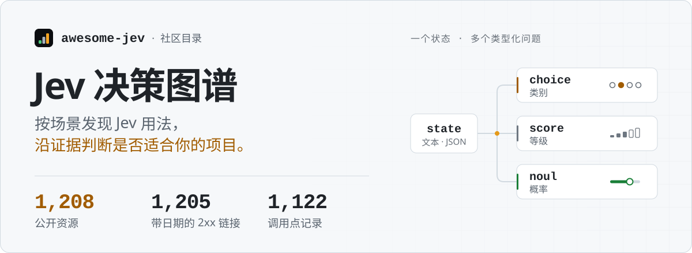
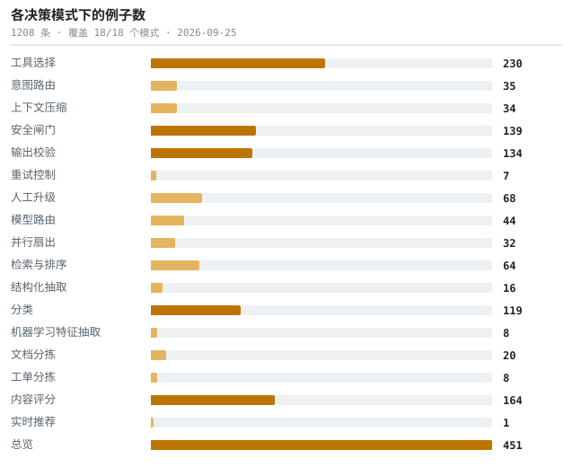

<!--
  本文件由 catalog.json 生成。请修改目录数据后运行 `python3 scripts/build_readme.py`。
-->

<a href="https://kydlikebtc.github.io/awesome-jev/?lang=zh">
<picture>
  <source media="(min-width: 768px) and (prefers-color-scheme: light)" srcset="docs/assets/readme-cover-zh-light.svg">
  <source media="(max-width: 767px) and (prefers-color-scheme: light)" srcset="docs/assets/readme-cover-zh-light-mobile.svg">
  <source media="(max-width: 767px)" srcset="docs/assets/readme-cover-zh-dark-mobile.svg">
  <source media="(prefers-color-scheme: dark)" srcset="docs/assets/readme-cover-zh-dark.svg">
  
</picture>
</a>

<a href="https://kydlikebtc.github.io/awesome-jev/?lang=zh"><kbd>&nbsp;<b>浏览资源目录&nbsp;↗</b>&nbsp;</kbd></a>
<a href="https://kydlikebtc.github.io/awesome-jev/?collection=first-call&amp;lang=zh"><kbd>&nbsp;第一次调用&nbsp;</kbd></a>
<a href="https://kydlikebtc.github.io/awesome-jev/?collection=build&amp;lang=zh"><kbd>&nbsp;改造现有项目&nbsp;</kbd></a>
<a href="https://kydlikebtc.github.io/awesome-jev/?collection=measured&amp;lang=zh"><kbd>&nbsp;独立测量报告&nbsp;</kbd></a>
<a href="README.md"><kbd>&nbsp;English&nbsp;</kbd></a>

数字统计已保存的链接与证据记录，不代表当前 CI 通过数或运行测试结果。 <a href="#哪些经过核实哪些没有">统计口径</a>

<b>阅读导航 · 完整目录</b>

[决策模式](docs/patterns.md) · [兼容性](docs/compatibility.md) · [核查指南](docs/vetting.md)

- 01 [这是什么](#这是什么)
- 02 [Jev 返回什么](#jev-返回什么)
- 03 [从这里开始](#从这里开始)
- 04 [覆盖度](#覆盖度)
- 05 [实测，而非宣称](#实测而非宣称)
- 06 [按决策模式](#按决策模式)
- 07 [按资源形态](#按资源形态)
- 08 [本仓库还有什么](#本仓库还有什么)
- 09 [哪些经过核实，哪些没有](#哪些经过核实哪些没有)
- 10 [机器可读数据](#机器可读数据)
- 11 [参与贡献与许可](#参与贡献与许可)

---

## 这是什么

- **Jev** 是 TypeSafe AI 的决策模型。它不生成文本 —— 你给它状态和类型化问题，它返回带校准置信度的类型化答案，快且便宜到可以放进智能体的内层循环。
- **本仓库**收集它的公开使用例子，按所做的**决策**组织。你这周读的那篇资料是一次性的，决策模式不是。
- **如何判断可信度：**每一行都写明来源；有依据时记录调用点、原语声明和注意事项，方便你查看读过什么，以及哪些部分仍未实测。

> [!NOTE]
> 不是产品本身，不是 SDK，与 TypeSafe AI 无隶属关系，也不构成推荐。收录是一份来源记录，不代表运行验证或性能背书。详见[哪些经过核实](#哪些经过核实哪些没有)。

## Jev 返回什么

三个原语。下面所有模式都由它们构成，而最后一行那个不对称是最常见的 bug 来源。

<picture>
  <source media="(prefers-color-scheme: dark)" srcset="docs/assets/primitives-zh-dark.svg">
  
</picture>

输入**仅支持文本** —— 字符串、JSON 对象、或文本数组。上下文每次请求 **64k** token，其中 state 加最长的那个问题占 **32k**。输出 token 免费。权重未公开，因此无法本地运行。跨平台差异全表见 [`docs/compatibility.md`](docs/compatibility.md)。

## 从这里开始

六条，按阅读顺序。手工挑选 —— 因为「star 最多」和「该先读哪个」不是一回事。

1. **[Quickstart](https://docs.typesafe.ai/introduction/quickstart)**

   官方第一课：一条工单，一次请求里同时问一个 Choice、一个 Score 和一个 Noul，给了 Python / JS / cURL 三种写法。

2. **[Jev 1.13 known limitations](https://docs.typesafe.ai/model-jaggedness/jev-1.13)**

   官方文档里最有用、却最少被引用的一页。它还解释了一件事：对选项做一个 Choice，和每个选项各问一个 Noul，问的根本不是同一个问题。

3. **[Example: three primitives in one request](https://github.com/kydlikebtc/awesome-jev/blob/main/examples/01-three-primitives/main.py)**

   按官方 API 参考编写并逐字段对照核实，但未针对线上 API 实际执行过。

4. **[fast-jev-compaction](https://github.com/tamaratran/fast-jev-compaction)**

   每次工具调用恰好两个 noul：知道这次调用发生过是否还有意义、以及是否还需要完整原文输出。尽管它自己的描述里用了「打分」，实际并未使用 score 原语。

5. **[ai-cookbook: Jev track](https://github.com/daveebbelaar/ai-cookbook)**

   找到的最好的结构化教程。它明确指出类型化输出不保证决策正确、列出了官方记录的弱项，并且对自己给出的成本示例做了限定而不是拿来营销。

6. **[Hermes Agent: Jev compaction evaluation](https://github.com/NousResearch/hermes-agent)**

   本目录可信度最高的一条。召回率低于他们现有的摘要器，在相同上下文预算下与「按时间倒序」打平。成本确实低得多。在一个被热炒的模型上公开负面结果，非常少见。

## 覆盖度

全部决策模式，按本目录的收录数量排列长度。图表下方的场景索引可跳转到对应章节。数字为 0 的是待补的研究缺口，不是渲染 bug。

<picture>
  <source media="(prefers-color-scheme: dark)" srcset="docs/assets/coverage-zh-dark.svg">
  
</picture>

全部 18 个模式均已收录条目。覆盖不代表已运行验证或各模式成熟度相同。 详见 [`docs/status.md`](docs/status.md)。

**场景索引 · 点击跳转到条目**

| 场景 | 场景 |
| :--- | :--- |
| [工具选择](#工具选择) · **230** | [意图路由](#意图路由) · **35** |
| [上下文压缩](#上下文压缩) · **34** | [安全闸门](#安全闸门) · **138** |
| [输出校验](#输出校验) · **134** | [重试控制](#重试控制) · **6** |
| [人工升级](#人工升级) · **67** | [模型路由](#模型路由) · **43** |
| [并行扇出](#并行扇出) · **32** | [检索与排序](#检索与排序) · **64** |
| [结构化抽取](#结构化抽取) · **16** | [分类](#分类) · **119** |
| [机器学习特征抽取](#机器学习特征抽取) · **8** | [文档分拣](#文档分拣) · **20** |
| [工单分拣](#工单分拣) · **8** | [内容评分](#内容评分) · **164** |
| [实时推荐](#实时推荐) · **1** | [总览](#总览) · **451** |

## 实测，而非宣称

本目录收录的独立测量报告，包括有助于理解适用边界的**负面结果**。这些是原作者的测量，本仓库没有独立复现。比较结果前，请分别查看数据集、测试方法和模型版本。

- **[Hermes Agent: Jev compaction evaluation](https://github.com/NousResearch/hermes-agent)** 
  把 Jev 压缩方案移植过来，与自家在用的摘要器对比实测，最后公开结论：不采用。 
  `基准测试` · ★248,479 · `Py` · `noul`

  > 本目录可信度最高的一条。召回率低于他们现有的摘要器，在相同上下文预算下与「按时间倒序」打平。成本确实低得多。在一个被热炒的模型上公开负面结果，非常少见。

- **[worldmonitor: news threat classification](https://github.com/koala73/worldmonitor)** 
  用两个 Choice 判断威胁等级与类别；盲测发现 Jev 只是与原有模型打平，于是一直保持影子运行。 
  `基准测试` · ★87,298 · `TS` · `choice`

  **注意:** `仅影子运行`

  > 接进去了但故意不生效：按他们自己的说法，Jev 返回的任何东西都不会进入标签、缓存行或告警。带黄金测试集。想在不拿生产环境下注的前提下试新模型，这是值得照抄的做法。

- **[no-mistakes: Jev review pre-brief, measured and retired](https://github.com/kunchenguid/no-mistakes/pull/1165)** 
  为代码审查预选上下文：每个候选文件问一个 Score —— 测了两次后被移除：计费输入明显增加、耗时几乎没有收益；离线回放还表明，候选列表根本够不到审查发现实际所在的位置。 
  `基准测试` · ★8,617 · `Go` · `score`

  > 已在 PR #1165（2026-09-22）中移除。他们的离线测量发现：候选生成器从构造上就排除了被改动的文件，而几乎所有审查发现都落在被改动的文件上；按文件附带摘录反而让列表更不精确、token 成本更高。代码已不在默认分支上，所以这一行引用的是移除它的那次改动。

- **[hippo-memory](https://github.com/kitfunso/hippo-memory)** 
  受生物启发的智能体记忆：衰减、检索强化与巩固。零运行时依赖，基于 SQLite。 (机翻) 
  `基准测试` · ★756 · kitfunso · `TS`

- **[Probing Jev's behaviour with repeated API calls](https://github.com/ahastudio/til)** 
  独立的韩语实测笔记，报告仅仅把选项顺序倒过来，就能让概率移动到足以翻转 0.9 阈值的程度。 
  `基准测试` · ★190 · `Py`

  **注意:** `无许可证` · `宣称未核实`

  > 在所有资料里找到的最具操作价值的工程警示：如果仅仅选项顺序就能把概率推过你的阈值，那你的阈值没有看上去那么稳。这是独立且未被复现的结果，具体幅度请当作指示性数据。

- **[jevbench](https://github.com/fstandhartinger/jevbench)** 
  JevBench v1 —— 面向 Jev 这类类型化决策模型的基准。 (机翻) 
  `基准测试` · ★107 · fstandhartinger · `Py`

- **[jev-arena](https://github.com/NanmiCoder/jev-arena)** 
  Jev 模型介绍与实测：通过 Choice / Score / Noul 将自然语言转为带类型的判断与概率，用于分类、评分和路由；支持与 DeepSeek 等模型对比评论打标、速度与结果，含 CSV/Excel 导入、原速回放与离线报告。 
  `基准测试` · ★97 · nanmicoder · `JS`

- **[windtunnel](https://github.com/nekuda-ai/WindTunnel)** 
  一个 WebMCP 基准，衡量 WebMCP 与其他浏览器智能体接口的差距。 (机翻) 
  `基准测试` · ★80 · nekuda-ai · `TS`

- **[jev-robot-control](https://github.com/openroboto-ai/jev-robot-control)** 
  在 MuJoCo 中直接对 xArm7 做笛卡尔控制，对比 Jev 与两个 LLM：每一步选择意图、移动方向和夹爪动作，附原始响应、轨迹与回放。每个控制器只跑了一次（seed 0），不是成功率估计。 (机翻) 
  `基准测试` · ★44 · openroboto-ai · `Py`

- **[typesafe-ai-benchmark](https://github.com/iammrduncan/typesafe-ai-benchmark)** 
  一个模仿其结构化输出形状的网关，用于与之对比测试。 
  `基准测试` · ★38 · iammrduncan · `TS`

- **[jev-capability-atlas](https://github.com/Zaious/jev-capability-atlas)** 
  独立的、基于证据的能力地图：Jev 在哪些场景站得住、在哪些场景崩掉 —— 附真实 API 调用凭据。 (机翻) 
  `基准测试` · ★26 · zaious · `Py`

- **[smartmoney-cub](https://github.com/myc0576/SmartMoney-Cub)** 
  只读的交易日志与复盘 harness：Jev 类型化判断、智能体集成，以及一个可复现的金融基准。 (机翻) 
  `基准测试` · ★26 · myc0576 · `Py`

- **[jev-benchmarks](https://github.com/AbdelStark/jev-benchmarks)** 
  面向类型化决策模型的概率感知评测：校准度、选择性风险、延迟，以及可复现的基准。 (机翻) 
  `基准测试` · ★17 · abdelstark · `Py`

- **[jev-rag-benchmark](https://github.com/erendikmenn/jev-rag-benchmark)** 
  可复现的基准：衡量 Jev 在 RAG 里的重排质量、延迟与成本。 (机翻) 
  `基准测试` · ★14 · erendikmenn · `Py`

- **[pdf-race](https://github.com/goodrahstar/pdf-race)** 
  Docling → Jev 对比 Docling → Gemini Flash 以及 Gemini 直接读 PDF：同样的文档、同一个计时器，按 arXiv 标准打分。 (机翻) 
  `基准测试` · ★9 · goodrahstar · `JS`

- **[jev-dspy-lab](https://github.com/jmanhype/jev-dspy-lab)** 
  在 DSPy 工作流中对 Jev 决策做可复现的校准与选择性风险基准。 (机翻) 
  `基准测试` · ★7 · jmanhype · `Py`

- **[jev-rerank-bench](https://github.com/anessbelbati/jev-rerank-bench)** 
  与专用重排模型在 14 个数据集上的独立横评。 
  `基准测试` · ★7 · anessbelbati · `Py`

  > 这是独立实测而非厂商数字，而且直接对比了专门做重排的模型 —— 这正是 search-ranking 模式该看的对比。

- **[jev-benchmark](https://github.com/wondertwins/jev-benchmark)** 
  Jev 的基准与 playground：国际象棋，以及语音转写中的说话对象判定。 (机翻) 
  `基准测试` · ★6 · wondertwins · `Py`

- **[jev-korean-benchmark](https://github.com/mahlernim/jev-korean-benchmark)** 
  可复现的早期访问评测：Jev 在韩语理解与医学文本上的表现，附运行时与成本证据。 (机翻) 
  `基准测试` · ★6 · mahlernim · `Py`

  **注意:** `无许可证`

- **[jev-ood-calibration](https://github.com/scienthoon/jev-ood-calibration)** 
  在一个它不可能见过的任务上做独立校准测试：900 条规则生成的支持工单。 (机翻) 
  `基准测试` · ★6 · scienthoon · `Py`

- **[jev-search-rerank-eval](https://github.com/zhuyansen/jev-search-rerank-eval)** 
  TypeSafe Jev 重排能否胜过向量检索？在 Agent Skills Hub 目录上做分级相关性评测（9,831 对、164 条中英文查询），并测量了“裁判循环”偏差。 (机翻) 
  `基准测试` · ★6 · zhuyansen · `Py`

- **[jev-code-review-benchmark](https://github.com/gemanor/jev-code-review-benchmark)** 
  在 Python 代码审查规则上比较 Jev、Gemini Flash 与 Claude Fable：成本、速度、准确率与一致性。 (机翻) 
  `基准测试` · ★5 · gemanor · `Py`

- **[jev-little-airways](https://github.com/lbotinelly/jev-little-airways)** 
  Jev 的能力展示与研究：一次 show-and-tell 式的考察。 (机翻) 
  `基准测试` · ★5 · lbotinelly · `TS`

- **[jev-phishing-bench](https://github.com/anisselbd/jev-phishing-bench)** 
  在 2000 封钓鱼邮件上对比 Jev 与一个轻量 LLM：准确率、校准度、延迟、成本。 (机翻) 
  `基准测试` · ★5 · anisselbd · `Py`

  **注意:** `无许可证`

- **[legalforecastbench](https://github.com/johnhughes3/LegalForecastBench)** 
  LegalForecast-MTD 基准 alpha 版与官方评测流程。 (机翻) 
  `基准测试` · ★5 · johnhughes3 · `Py`

- **[jevarena](https://github.com/chenmingtang830/jevarena)** 
  开源的自带 key 竞技场，用来评测 Jev 与其他 AI 裁判：找出失败案例，比较质量、成本与延迟。 (机翻) 
  `基准测试` · ★4 · chenmingtang830 · `TS`

- **[sysone-bench](https://github.com/instax-dutta/sysone-bench)** 
  首个独立的 System One 决策模型横评（Laya 对比 Jev）。 (机翻) 
  `基准测试` · ★4 · instax-dutta · `Py`

- **[ego-jev-ultrafast](https://github.com/shikaizhong-design/ego-jev-ultrafast)** 
  Jev 驱动你的轻量浏览器：每步一次类型化选择请求，单文件零依赖。 (机翻) 
  `基准测试` · ★3 · shikaizhong-design · `JS`

- **[jev-does-not-play-dice](https://github.com/KantaHayashiAI/jev-does-not-play-dice)** 
  关于 Jev 概率校准、不确定性表达以及预测概率保真度的实验。 (机翻) 
  `基准测试` · ★3 · kantahayashiai · `JS`

- **[jev-exploration](https://github.com/SamuelSacco/jev-exploration)** 
  Jev 探索性合集：宣称核查、实时演示与可运行代码。 (机翻) 
  `基准测试` · ★3 · samuelsacco · `Py`

  **注意:** `无许可证`

- **[jev-plays](https://github.com/mansicer/jev-plays)** 
  由 System One 模型玩 Craftax，LLM 负责设定目标：同一张地图上的五种智能体，从 Jev 直接操作原始动作到 LLM 控制每一步，用记录下来的对局进行比较。 (机翻) 
  `基准测试` · ★3 · mansicer · `Py`

- **[origin-civilization](https://github.com/JacquesGariepy/ORIGIN-CIVILIZATION)** 
  AI 生命与文明模拟：每个决策都由 Jev 做出。 (机翻) 
  `基准测试` · ★3 · jacquesgariepy · `TS`

- **[typesafe-jev-calibrate-for-code-review](https://github.com/Selmar/typesafe-jev-calibrate-for-code-review)** 
  关于为代码审查校准 Jev 的研究。 (机翻) 
  `基准测试` · ★3 · selmar · `Py`

  **注意:** `无许可证`

- **[jev-agent-failure-benchmark](https://github.com/TokenTrim/jev-agent-failure-benchmark)** 
  在一个智能体失败归因基准上，把 Jev 与一个强 LLM 做对比测试。 (机翻) 
  `基准测试` · ★2 · tokentrim · `Py`

- **[jev-play-ping-pong](https://github.com/Icohen007/jev-play-ping-pong)** 
  让 Jev 实时玩浏览器乒乓球：结构化遥测与类型化决策。 (机翻) 
  `基准测试` · ★2 · icohen007 · `JS`

- **[jev-routing-experiment](https://github.com/TokenTrim/jev-routing-experiment)** 
  在 RouterArena 上把 Jev 当作低成本 LLM 路由器做基准测试。 (机翻) 
  `基准测试` · ★2 · tokentrim · `Py`

- **[zerosweep](https://github.com/sysadarsh/zerosweep)** 
  自主的 System-One 分拣引擎与基准，75 毫秒推理。 (机翻) 
  `基准测试` · ★2 · sysadarsh · `TS`

  **注意:** `无许可证`

- **[antigravity-mcp-semantic-search-with-typesafeai](https://github.com/greenyamao/Antigravity-mcp-semantic-search-with-TypeSafeAi)** 
  给 AI 编程助手的快速语义代码搜索与 diff 合理性审查。 (机翻) 
  `基准测试` · ★1 · greenyamao · `Py`

  **注意:** `无许可证`

- **[can-jev-bayes](https://github.com/TomRichner/can-jev-bayes)** 
  Jev 会贝叶斯吗？把 TypeSafe AI 的 Jev 与贝叶斯最优策略对比，并测试它能否有效使用贝叶斯推理。 (机翻) 
  `基准测试` · ★1 · tomrichner · `Py`

- **[decision-bench](https://github.com/Hanno-Labs/decision-bench)** 
  面向基于文档的决策模型的开放基准运行框架。 (机翻) 
  `基准测试` · ★1 · hanno-labs · `Py`

- **[dsh-jev-verify](https://github.com/xienda/dsh-jev-verify)** 
  给 DeepSeek Harness 的 Jev 决策工具与实时验证基准。 (机翻) 
  `基准测试` · ★1 · xienda · `JS`

- **[jev-bench](https://github.com/TheWayWithin/jev-bench)** 
  引用的来源真的这么说了吗？一个包含 42 条论断的基准：Jev（TypeSafe System One）对比 GPT 与 Claude 等模型。 (机翻) 
  `基准测试` · ★1 · thewaywithin · `Py`

- **[jev-benchmark](https://github.com/themsquared/jev-benchmark)** 
  TypeSafe AI Jev 在智能体工具调用风险分类上的可复现基准：准确率、延迟，以及其置信度是否可信。 (机翻) 
  `基准测试` · ★1 · themsquared · `Py`

- **[jev-decision-benchmarks](https://github.com/baibizhe/jev-decision-benchmarks)** 
  JEV 在 MetaTool、When2Call 与 BFCL V4 上的决策基准结果，附双语表格和可复现报告。 (机翻) 
  `基准测试` · ★1 · baibizhe · `Py`

  **注意:** `无许可证`

- **[jev-eval](https://github.com/4esv/jev-eval)** 
  在你自己的标注分类数据上，把 Jev 与任意 OpenRouter 模型做基准对比：准确率与校准度。 (机翻) 
  `基准测试` · ★1 · 4esv · `Py`

  **注意:** `无许可证`

- **[jev-lab](https://github.com/llt22/jev-lab)** 
  TypeSafe Jev（System One 模型）的动手研究实验室：对 Noul/Choice/Score 原语的可复现基准。 (机翻) 
  `基准测试` · ★1 · llt22 · `Py`

  **注意:** `无许可证`

- **[jev-lab](https://github.com/danielhirt/jev-lab)** 
  通过 OpenRouter 对 TypeSafe Jev（System One 决策模型）做的实验：可重复性、扰动敏感性与 LLM 基线对比。 (机翻) 
  `基准测试` · ★1 · danielhirt · `TS`

  **注意:** `无许可证`

- **[jev-secret-detection](https://github.com/teyhouse/jev-secret-detection)** 
  衡量 Jev 在文件片段中识别真实密钥凭据的能力。 (机翻) 
  `基准测试` · ★1 · teyhouse · `Py`

  **注意:** `无许可证`

- **[jev-sim](https://github.com/dashbi1/jev-sim)** 
  从 LLM logits 读出类型化决策的 Jev 兼容 /v1/systemone 服务，带基准。 (机翻) 
  `基准测试` · ★1 · dashbi1 · `Py`

- **[jevsbistro](https://github.com/andrewsilber/JevsBistro)** 
  用于低延迟决策模型基准测试的 3D 餐厅服务模拟器。 (机翻) 
  `基准测试` · ★1 · andrewsilber · `TS`

- **[padflow-jev-evals](https://github.com/zsavage8/padflow-jev-evals)** 
  来自某土地开发 SaaS 的类型化决策基准：schema、匿名标注数据与运行器。 (机翻) 
  `基准测试` · ★1 · zsavage8 · `Py`

- **[what-is-jev](https://github.com/g0runmezadam/what-is-jev)** 
  关于 TypeSafe AI Jev（System One）的独立、有来源的研究，包含对 947 个公开仓库的评分。 (机翻) 
  `基准测试` · ★1 · g0runmezadam · `Py`

  > 这是对生态的研究，而不是 API 的调用者，因此没有调用点证据。

- **[agent-handoff-gate](https://github.com/zsoXi/agent-handoff-gate)** 
  面向证据感知的智能体交接与有界工作续跑的实验性协议。 (机翻) 
  `基准测试` · ★0 · zsoxi · `Py`

- **[jev-acento](https://github.com/marcosmartinez/jev-acento)** 
  Jev 听得懂你的口音吗？一项预先注册的、针对 TypeSafe AI Jev 西班牙语表现的审计——准确率、校准与 token 成本。 (机翻) 
  `基准测试` · ★0 · marcosmartinez · `Py`

  > 一项独立、预先注册的非英语审计——正是 docs/status.md 中列为值得关注的空白。

- **[jev-calibration-audit](https://github.com/jujumilk3/jev-calibration-audit)** 
  仅通过 API 对 Jev 做的独立校准审计。 (机翻) 
  `基准测试` · ★0 · jujumilk3 · `Py`

- **[jev-certify](https://github.com/nikkoxgonzales/jev-certify)** 
  给 Jev 的有限样本保证：用保形风险控制把校准概率转成可证的约束。 (机翻) 
  `基准测试` · ★0 · nikkoxgonzales · `Py`

- **[jev-cyrillic-audit](https://github.com/AHTOOOXA/jev-cyrillic-audit)** 
  TypeSafe 的 Jev 在俄语上能保持准确率与校准吗？一项独立的俄英对照审计（ECE、可靠性图）。 (机翻) 
  `基准测试` · ★0 · ahtoooxa · `Py`

  > 一项独立的非英语校准审计——正是 docs/status.md 中列为值得关注的空白。

- **[jev-enterprise-decision-fabric](https://github.com/ghubnab99/jev-enterprise-decision-fabric)** 
  让大量语义决策走同一条经过验证的路径的架构，附带标注数据集。 (机翻) 
  `基准测试` · ★0 · ghubnab99 · `C#`

- **[jev-eval](https://github.com/onlyoneaman/jev-eval)** 
  在四个公开分类数据集上比较 TypeSafe 的 Jev 与两款 GPT 模型：案例、逐条答案、评分全部公开。 (机翻) 
  `基准测试` · ★0 · onlyoneaman · `TS`

- **[jev-eval](https://github.com/Shogo-nfrealmusic/jev-eval)** 
  第三方在相同条件下对比 Jev 与两款 LLM：为面向日本游客的摄影服务路由预订咨询，共六十条四种语言的合成消息。 (机翻) 
  `基准测试` · ★0 · shogo-nfrealmusic · `TS`

  **注意:** `无许可证`

- **[jev-fanout-bench](https://github.com/blowxian/jev-fanout-bench)** 
  实测：在一次调用里向 TypeSafe Jev 提 N 个问题，state 只计费一次。基于 2,976 次真实请求，附原始数据和精确的计费核对。 (机翻) 
  `基准测试` · ★0 · blowxian · `Py`

- **[jev-lab](https://github.com/Menny1337/jev-lab)** 
  针对 TypeSafe Jev 模型的 TypeScript 实验、评测与延迟基准。 (机翻) 
  `基准测试` · ★0 · menny1337 · `TS`

  **注意:** `无许可证`

- **[jev-llm-router-benchmark](https://github.com/erendikmenn/jev-llm-router-benchmark)** 
  以基准驱动的 Jev 路由器与评判者，服务于成本可控的 LLM 编程流程。 (机翻) 
  `基准测试` · ★0 · erendikmenn · `Py`

- **[jev-no-enem](https://github.com/patryckalves/jev-no-enem)** 
  在巴西 2025 年 ENEM 标准化考试上评测 TypeSafe AI Jev（System One 范式）的可复现基准。 (机翻) 
  `基准测试` · ★0 · patryckalves · `Py`

  **注意:** `无许可证`

  > 一项非英语的独立评测，使用的是有标准答案的公开考试。

- **[jev-orderby-bench](https://github.com/yodablocks/jev-orderby-bench)** 
  按 Jev 概率做 ORDER BY 能否给出站得住脚的排序？独立的排序、校准与不变量实测。 (机翻) 
  `基准测试` · ★0 · yodablocks · `Py`

- **[jev-playground](https://github.com/hegargarcia/jev-playground)** 
  在状态明确、合法动作清晰的游戏里，把 Jev 与其他评估模型做对比：规则和状态转移由代码掌控，每个模型选择下一步动作，结果可测量。 (机翻) 
  `基准测试` · ★0 · hegargarcia · `TS`

  **注意:** `无许可证`

- **[jev-trace-classifier](https://github.com/sypherin/jev-trace-classifier)** 
  把 Jev 的 noul 原语应用到一个共谋语料库上。 (机翻) 
  `基准测试` · ★0 · sypherin · `Py`

- **[smoking-extraction-benchmark](https://github.com/vclic/smoking-extraction-benchmark)** 
  合成的吸烟史抽取基准：对比 Jev 与 OpenAI 结构化输出。 (机翻) 
  `基准测试` · ★0 · vclic · `Py`

  **注意:** `无许可证`

- **[An early-access test of TypeSafe's Jev: calibrated judgments for half a cent](https://lindfors.no/blog/a-first-look-at-typesafes-jev/)** 
  找到的最好的独立实测：固定单一模型版本、24 份挪威语文档，开篇就展示了一个模型答错、但同时正确报出低置信度的案例。 
  `基准测试` · Lindfors

  > 方法论交代干净，并诚实限定为「单日快照」。开篇就摆失败案例，这才让它成为真正的校准检验，而不是一篇软文。

- **[Testing TypeSafe Jev, Mistral and Gemini for local event validation](https://nearhere.events/blog/typesafe-jev-mistral-gemini-event-validation)** 
  找到的唯一三方横评，每个模型分别调过提示词，且明确把范围限定在单一任务上、不做通用排名。 
  `基准测试` · Near Here

  > 自我限定很规范：这是用例研究，不是模型排行榜。这种克制比数字本身更少见。

## 按决策模式

主索引。每个标题是智能体必须做的一个决策；下面的行是做这个决策的例子。警示以短标记呈现 —— 每行的完整备注在 [`catalog.json`](catalog.json) 和[站点](https://kydlikebtc.github.io/awesome-jev/)里。

### 工具选择

_智能体下一步该调用哪个工具或动作。_

- **[Cookbook: Function calling](https://docs.typesafe.ai/cookbooks/function_calling)** ⭐ 
  把自然语言的交易请求映射到普通的类型化函数：函数名和有限取值的参数各自变成一个带置信度的问题。 
  `官方文档` · `Py` · `choice`

- **[Cookbook: Skill suggestion](https://docs.typesafe.ai/cookbooks/skill_suggestion)** ⭐ 
  为智能体的一轮对话从 182 个技能里最多挑一个：第一次请求给所有技能排序并顺便问「这轮到底需不需要技能」，第二次细读前三名。 
  `官方文档` · `Py` · `choice` · `noul`

- **[Demo: Smart home assistant](https://docs.typesafe.ai/demos/smart-home)** ⭐ 
  一个可运行的智能家居助手示例，用类型化决策来解析用户请求。 
  `官方文档` · `Py`

- **[ai-hedge-fund](https://github.com/virattt/ai-hedge-fund)** 
  一支 AI 对冲基金团队：多个投资者智能体协作做出交易决策；TypeSafe（Jev）是可选的模型提供方之一。 (机翻) 
  `平台集成` · ★63,705 · virattt · `Py`

- **[claude-code-templates: three Jev plugins](https://github.com/davila7/claude-code-templates)** 
  三个可独立安装的 Claude Code 插件 —— 护栏、模型路由、技能推荐 —— 各自带 hook 和测试。 
  `插件` · ★31,582 · `Py` · `TS` · `choice` · `score` · `noul`

- **[Composio TypeSafe provider](https://github.com/ComposioHQ/composio/tree/next/python/providers/typesafe)** 
  把工具目录编译成问题，再从答案还原出 tool call，并为「弃权」和「需确认」两种情况定义了专门的错误类型。 
  `开源项目` · ★30,300 · `Py` · `choice`

- **[FastMCP jev_search transform](https://github.com/PrefectHQ/fastmcp/blob/main/fastmcp_slim/fastmcp/experimental/transforms/jev_search.py)** 
  两段式 MCP 工具检索：先用一个宽 Choice 对整个目录粗排，再给候选短名单配完整描述，每个候选各配一个 Noul 判断它到底是否胜任。 
  `开源项目` · ★27,886 · `Py` · `choice` · `noul`

- **[Cua driver: jev-use example](https://github.com/trycua/cua/tree/main/libs/cua-driver/examples/jev-use)** 
  Python 与 TypeScript 双实现的 computer-use 动作选择：Jev 从不可变候选集里挑下一个浏览器动作，保留 reobserve 和 abstain 两个特殊选项。 
  `开源项目` · ★26,164 · `Py` · `TS` · `choice`

- **[jev-ultrafast](https://github.com/browser-use/jev-ultrafast)** 
  Browser Use 做的高速浏览器 Agent。Jev 每一步只判断「做什么、点哪个元素」，要打字才叫小模型。 
  `开源项目` · ★19,261 · Browser Use · `Py` · `choice`

  **注意:** `厂商自报数据`

- **[json-render](https://github.com/vercel-labs/json-render)** 
  Vercel Labs 的生成式 UI 框架。实验里 Jev 不逐 token 写 JSON，只负责选组件、属性和布局。 
  `开源项目` · ★18,204 · Vercel Labs · `TS` · `choice`

已显示 **10 / 230** 条 · [在单独页面查看全部 230 条 →](docs/by-pattern/tool-selection.zh-CN.md) · [在站点上筛选](https://kydlikebtc.github.io/awesome-jev/?p=tool-selection&lang=zh)

[↑ 场景索引](#pattern-index)

### 意图路由

_判断用户意图，把请求分流到正确的分支。_

- **[Demo: Smart home assistant](https://docs.typesafe.ai/demos/smart-home)** ⭐ 
  一个可运行的智能家居助手示例，用类型化决策来解析用户请求。 
  `官方文档` · `Py`

- **[Pattern: Confidence-gated routing](https://docs.typesafe.ai/patterns/confidence-routing)** ⭐ 
  把 confidence 当作第二个维度：答案告诉你「是什么」，置信度告诉你「该不该照它执行」。 
  `官方文档` · `Py`

- **[Pattern: Intent routing](https://docs.typesafe.ai/patterns/intent-routing)** ⭐ 
  对进来的请求做分类，路由到足够用的最便宜那个处理方：确定性代码、专用 LLM、或人。 
  `官方文档` · `Py` · `choice`

- **[AutoGPT TypeSafe blocks](https://github.com/Significant-Gravitas/AutoGPT/tree/master/autogpt_platform/backend/backend/blocks/typesafe)** 
  七个生产级 block（choice/score/yes-no/ask-many/route/pick-best/filter），带 UTF-8 字节预算、逐字报文留存和十一个测试文件。 
  `开源项目` · ★187,515 · `Py` · `choice` · `score` · `noul`

- **[Airflow LLMBranchOperator with Jev](https://airflow.apache.org/docs/apache-airflow-providers-common-ai/stable/index.html)** 
  把下游任务 id 变成 choice 的选项集，并用最小置信度闸门把不确定的运行转给人处理。 
  `平台集成` · ★46,958 · `Py` · `choice`

- **[Inbox Zero: seven email decisions](https://github.com/elie222/inbox-zero)** 
  七个互不相同的邮件决策，每个都有自己单独设定的阈值，任何出错都回落到普通 LLM。 
  `开源项目` · ★12,328 · `TS` · `choice` · `noul`

- **[jev-chat-jarvis](https://github.com/jev-chat/jev-chat-jarvis)** 
  一个 Android 回复副驾：从屏幕文本判断意图、时机和风险，OCR 与文案起草交给另外的模型。 
  `开源项目` · ★5,414 · `Java` · `choice` · `score` · `noul`

- **[Real Python: hello-jev](https://github.com/realpython/materials/tree/master/hello-jev)** 
  带对照组的教学示例：同一个问询台任务，一份是只认 Y/N 的纯 Python 写法，旁边是一个能读出意图的 Noul。 
  `教程` · ★5,205 · Real Python · `Py` · `noul`

- **[ai-cookbook: Jev track](https://github.com/daveebbelaar/ai-cookbook)** 
  一套循序渐进的课程：从第一次调用、逐个原语、state 形状与 criteria，一直到工单分拣和多步工作流，并对应了全部四个官方模式。 
  `教程` · ★4,578 · `Py` · `choice` · `score` · `noul`

- **[foreman](https://github.com/thruwire/foreman)** 
  一个「软件工厂工头」，用 Jev 决定智能体流水线下一步该做什么。 
  `开源项目` · ★538 · thruwire · `Py`

已显示 **10 / 35** 条 · [在单独页面查看全部 35 条 →](docs/by-pattern/intent-routing.zh-CN.md) · [在站点上筛选](https://kydlikebtc.github.io/awesome-jev/?p=intent-routing&lang=zh)

[↑ 场景索引](#pattern-index)

### 上下文压缩

_判断哪些工具调用和结果仍然相关，从而丢弃过期上下文。_

- **[Hermes Agent: Jev compaction evaluation](https://github.com/NousResearch/hermes-agent)** 
  把 Jev 压缩方案移植过来，与自家在用的摘要器对比实测，最后公开结论：不采用。 
  `基准测试` · ★248,479 · `Py` · `noul`

- **[jcode: memory recall without embeddings](https://github.com/1jehuang/jcode)** 
  把记忆召回的整套检索栈替换掉 —— 不用 embedding、不用 BM25、不用重排器 —— 改为对每条候选记忆批量问一个 Noul。 
  `开源项目` · ★20,069 · `Rs` · `noul`

- **[fast-jev-compaction](https://github.com/tamaratran/fast-jev-compaction)** 
  一个 Claude Code 插件，用逐条决策取代压缩式摘要：过期的工具调用被丢弃或截断，保留下来的全部逐字不变。 
  `插件` · ★6,616 · tamaratran · `TS` · `noul`

- **[hermes-jev-skills](https://github.com/kerpopule/hermes-jev-skills)** 
  九个 agent 技能加一个 CLI，覆盖模型路由、记忆过滤、对话轮保留、多选一技能选择和下一步动作决策。 
  `插件` · ★718 · `Py` · `choice` · `score` · `noul`

- **[compact-adviser](https://github.com/kunchenguid/compact-adviser)** 
  判断工作是否已完成或已记录，据此提示运行上下文压缩。 (机翻) 
  `开源项目` · ★183 · kunchenguid · `TS`

- **[jev-pruner](https://github.com/tamaratran/jev-pruner)** 
  在模型看到之前先修剪冗长的 shell 输出，每个片段问一个 Noul。 
  `插件` · ★144 · tamaratran · `TS` · `noul`

- **[Winnow](https://github.com/GhalebDweikat/winnow)** 
  给 Claude Code 做上下文垃圾回收。Read / Bash / Grep 吐一大堆时，Jev 先判断哪些真和当前任务有关。 
  `插件` · ★79 · `Py` · `noul`

- **[save-token-jev-clean](https://github.com/IAmUnbounded/save-token-jev-clean)** 
  为编码智能体提供可移植的、由 Jev 引导的上下文压缩：不让另一个 LLM 把旧上下文改写成有损摘要，而是由 Jev 判断哪些工具调用和结果仍然重要，用户与助手的文字保持原样。 (机翻) 
  `插件` · ★69 · iamunbounded · `TS`

- **[yoshi](https://github.com/compozy/yoshi)** 
  给 Claude Code 和 Codex 做的上下文裁剪代理：由 Jev 判断哪些历史还需要 —— 实测而非宣称。 (机翻) 
  `插件` · ★25 · compozy · `TS`

- **[claude-jev](https://github.com/0x7067/claude-jev)** 
  Claude Code 插件：Jev 负责规则检查、逐字压缩与提示路由。 (机翻) 
  `插件` · ★12 · 0x7067 · `Py`

已显示 **10 / 34** 条 · [在单独页面查看全部 34 条 →](docs/by-pattern/context-compaction.zh-CN.md) · [在站点上筛选](https://kydlikebtc.github.io/awesome-jev/?p=context-compaction&lang=zh)

[↑ 场景索引](#pattern-index)

### 安全闸门

_在执行前判断一个动作是否安全。属纵深防御，绝不是安全边界。_

- **[Cookbook: Classifying RAG passages](https://docs.typesafe.ai/cookbooks/classifying_rag_passages)** ⭐ 
  给每条召回的段落打分，再由代码决定哪些能进入回答模型 —— 矛盾的标记保留，夹带提示注入的直接丢弃。 
  `官方文档` · `Py`

- **[Cookbook: Guardrails for LLMs](https://docs.typesafe.ai/cookbooks/llm_guardrails)** ⭐ 
  用一次请求筛查 LLM 应用的每一条进出消息，既点明风险类型、又给「照做会造成多大危害」打分。 
  `官方文档` · `Py` · `noul` · `score`

- **[sub2api: Jev as a moderation endpoint](https://github.com/Wei-Shaw/sub2api)** 
  作为审核 API 的直接替代：一次请求并行问多个 Noul，每个危害类别一个，且每条指令都带反注入前缀。 
  `开源项目` · ★42,557 · `Go` · `noul`

- **[claude-code-templates: three Jev plugins](https://github.com/davila7/claude-code-templates)** 
  三个可独立安装的 Claude Code 插件 —— 护栏、模型路由、技能推荐 —— 各自带 hook 和测试。 
  `插件` · ★31,582 · `Py` · `TS` · `choice` · `score` · `noul`

- **[@langchain/typesafe](https://github.com/langchain-ai/langchainjs)** 
  LangChain 集成的 JavaScript 对应版本，分类器与 middleware 形状一致。 
  `平台集成` · ★18,223 · `TS` · `choice` · `score` · `noul`

- **[DeepChat: agent tool-permission review](https://github.com/ThinkInAIXYZ/deepchat)** 
  从三个维度审查每次工具调用：风险等级、用户是否授权、以及一个显式的提示注入压力检查。 
  `开源项目` · ★6,341 · `TS` · `choice` · `noul`

- **[agentgateway: CI-validated LLM guardrail](https://github.com/agentgateway/agentgateway)** 
  三个共用同一严重度量表的 Score 问题，两项以上越线即拦截请求，并且失败时默认关闭。 
  `开源项目` · ★5,017 · `Rs` · `score`

- **[atomic](https://github.com/bastani-inc/atomic)** 
  可验证的编程智能体运行时：用自然语言定义智能体的流程。 (机翻) 
  `开源项目` · ★820 · bastani-inc · `TS`

- **[Jev-cu](https://github.com/Sac-Y/Jev-cu)** 
  一个 computer-use 智能体：判断该对无障碍树里哪个元素操作，并单独用一个 noul 判断这个动作是否需要用户显式确认。 
  `开源项目` · ★591 · `JS` · `choice` · `noul`

- **[vexjoy-agent](https://github.com/notque/vexjoy-agent)** 
  带 Jev 智能路由的 AI 智能体：把大白话请求分派给合适的专家智能体。 (机翻) 
  `开源项目` · ★425 · notque · `Py`

已显示 **10 / 138** 条 · [在单独页面查看全部 138 条 →](docs/by-pattern/safety-gating.zh-CN.md) · [在站点上筛选](https://kydlikebtc.github.io/awesome-jev/?p=safety-gating&lang=zh)

[↑ 场景索引](#pattern-index)

### 输出校验

_在输出到达用户前，按评分标准检查模型产出。_

- **[Cookbook: Double-checking citations](https://docs.typesafe.ai/cookbooks/citation_check)** ⭐ 
  用一个 Choice 对着原文核查引用是否错误或凭空编造，并用它的置信度把边缘情况标出来送审。 
  `官方文档` · `Py` · `choice`

- **[Cookbook: Guardrails for LLMs](https://docs.typesafe.ai/cookbooks/llm_guardrails)** ⭐ 
  用一次请求筛查 LLM 应用的每一条进出消息，既点明风险类型、又给「照做会造成多大危害」打分。 
  `官方文档` · `Py` · `noul` · `score`

- **[latitude-llm](https://github.com/latitude-dev/latitude-llm)** 
  面向 AI 智能体的开源可观测性：定位智能体在哪里失败。 (机翻) 
  `开源项目` · ★4,672 · latitude-dev · `TS`

- **[reticle](https://github.com/reticlehq/reticle)** 
  AI 智能体能生成代码，却仍难以理解自己构建的东西。Reticle 用 TypeSafe Jev 路由验证流程，并由 Jev 驱动对页面的探索。 (机翻) 
  `开源项目` · ★830 · reticlehq · `TS`

- **[atomic](https://github.com/bastani-inc/atomic)** 
  可验证的编程智能体运行时：用自然语言定义智能体的流程。 (机翻) 
  `开源项目` · ★820 · bastani-inc · `TS`

- **[vexjoy-agent](https://github.com/notque/vexjoy-agent)** 
  带 Jev 智能路由的 AI 智能体：把大白话请求分派给合适的专家智能体。 (机翻) 
  `开源项目` · ★425 · notque · `Py`

- **[jev-mcp](https://github.com/jkudish/jev-mcp)** 
  现成的 Agent 判断工具箱：事实核验、内容筛查、语义排序、分类和信息提取，各自独立成工具。 
  `插件` · ★320 · `JS` · `choice` · `score` · `noul`

- **[JevRev](https://github.com/Alex314618-create/JevRev)** 
  LLM 身边的决策层：Jev 负责筛选方案、检查进度，把注意力留在值得继续的工作上；LLM 负责广度和具体实现。 (机翻) 
  `开源项目` · ★303 · alex314618-create · `TS`

- **[jev-review](https://github.com/NiazMorshed2007/jev-review)** 
  一个本地优先的 MCP 插件，供编程智能体做持续的代码质量审查。 
  `插件` · ★217 · niazmorshed2007 · `TS`

- **[abide](https://github.com/coldteadotai/abide)** 
  让你的编码智能体遵守项目里的所有规则。 (机翻) 
  `插件` · ★211 · coldteadotai · `TS`

已显示 **10 / 134** 条 · [在单独页面查看全部 134 条 →](docs/by-pattern/output-validation.zh-CN.md) · [在站点上筛选](https://kydlikebtc.github.io/awesome-jev/?p=output-validation&lang=zh)

[↑ 场景索引](#pattern-index)

### 重试控制

_判断失败的步骤是否值得重试。_

- **[jevswiftsdk](https://github.com/NSStudent/JevSwiftSDK)** 
  独立的类型安全 Swift SDK，支持 async/await、批处理与重试。 (机翻) 
  `SDK` · ★8 · nsstudent · `Swift`

- **[jev-harness](https://github.com/ismaelsoilet/jev-harness)** 
  零依赖的 System One 决策框架：用 5 道语义关卡，在琐碎错误和“死循环”上替前沿 AI 智能体省下 token。 (机翻) 
  `插件` · ★6 · ismaelsoilet · `Py`

- **[jev-resilience](https://github.com/Vicente-MD/jev-resilience)** 
  给 Spring WebFlux 的非阻塞 Starter，实现一个语义熔断器来检测静默故障。 (机翻) 
  `插件` · ★2 · vicente-md · `Java`

  **注意:** `无许可证`

- **[Jev by Example](https://github.com/ReallyArtificial/jev-by-example)** 
  十个可运行的 JavaScript 智能体决策，一个文件一个：新记忆与旧记忆冲突时该改还是该留、工具返回 200 是否真的完成了任务、写入超时后该重试还是该对账、上下文分块在预算内如何取舍、压缩后的交接是否丢掉了某条禁令。Jev 只回答带类型的问题，阈值和最终提案由普通代码决定。 
  `开源项目` · ★1 · Really Artificial · `JS` · `choice` · `score` · `noul`

  **注意:** `仅一次提交` · `疑似 AI 生成`

- **[jev-reasoning-navigator](https://github.com/AndreuVM/jev-reasoning-navigator)** 
  JEV 推理导航器：面向自主 LLM 智能体的认知监督、防止循环与反幻觉引擎。 (机翻) 
  `开源项目` · ★1 · andreuvm · `Py`

  **注意:** `无许可证`

- **[harnessjudge](https://github.com/ndolinschi/harnessjudge)** 
  评判智能体的每一步：通过／重试／升级／停止。 (机翻) 
  `开源项目` · ★0 · ndolinschi · `TS`

  **注意:** `无许可证`

已显示全部 6 条 · [单独页面](docs/by-pattern/retry-control.zh-CN.md) · [在站点上筛选](https://kydlikebtc.github.io/awesome-jev/?p=retry-control&lang=zh)

[↑ 场景索引](#pattern-index)

### 人工升级

_用校准置信度决定哪些情况必须由人来看。_

- **[Cookbook: Classification using confidence](https://docs.typesafe.ai/cookbooks/classification_using_confidence)** ⭐ 
  把年报分入 75 个行业组，再根据答案自身的置信度决定：报这个细分组，还是退回上一层的大类。 
  `官方文档` · `Py` · `choice`

- **[Cookbook: Double-checking citations](https://docs.typesafe.ai/cookbooks/citation_check)** ⭐ 
  用一个 Choice 对着原文核查引用是否错误或凭空编造，并用它的置信度把边缘情况标出来送审。 
  `官方文档` · `Py` · `choice`

- **[Cookbook: Knowledge graph entity alignment](https://docs.typesafe.ai/cookbooks/entity_alignment)** ⭐ 
  判断两份商品目录间 450 个候选配对里哪些指的是同一个东西 —— 一个 Score 就够，它的三级正好对应三种可执行动作。 
  `官方文档` · `Py` · `score`

- **[Cookbook: Self-consistency with choices](https://docs.typesafe.ai/cookbooks/consistency_choice_cookbook)** ⭐ 
  在内容审核决策里显式加入「不确定」这个选项，并衡量标签一致率与自动处置比例之间的取舍。 
  `官方文档` · `Py` · `choice`

- **[Cookbook: Self-consistency with nouls](https://docs.typesafe.ai/cookbooks/consistency_noul_cookbook)** ⭐ 
  把不确定的概率转人工复核，同时保留底层的 noul 数值本身，而不是压成一个标签了事。 
  `官方文档` · `Py` · `noul`

- **[Pattern: Confidence-gated routing](https://docs.typesafe.ai/patterns/confidence-routing)** ⭐ 
  把 confidence 当作第二个维度：答案告诉你「是什么」，置信度告诉你「该不该照它执行」。 
  `官方文档` · `Py`

- **[Confidence](https://docs.typesafe.ai/confidence)** ⭐ 
  confidence 如何从概率分布推导出来，以及为什么在一种问题类型上调好的阈值不能挪到另一种上用。 
  `官方文档`

- **[Airflow LLMBranchOperator with Jev](https://airflow.apache.org/docs/apache-airflow-providers-common-ai/stable/index.html)** 
  把下游任务 id 变成 choice 的选项集，并用最小置信度闸门把不确定的运行转给人处理。 
  `平台集成` · ★46,958 · `Py` · `choice`

- **[Composio TypeSafe provider](https://github.com/ComposioHQ/composio/tree/next/python/providers/typesafe)** 
  把工具目录编译成问题，再从答案还原出 tool call，并为「弃权」和「需确认」两种情况定义了专门的错误类型。 
  `开源项目` · ★30,300 · `Py` · `choice`

- **[Inbox Zero: seven email decisions](https://github.com/elie222/inbox-zero)** 
  七个互不相同的邮件决策，每个都有自己单独设定的阈值，任何出错都回落到普通 LLM。 
  `开源项目` · ★12,328 · `TS` · `choice` · `noul`

已显示 **10 / 67** 条 · [在单独页面查看全部 67 条 →](docs/by-pattern/human-escalation.zh-CN.md) · [在站点上筛选](https://kydlikebtc.github.io/awesome-jev/?p=human-escalation&lang=zh)

[↑ 场景索引](#pattern-index)

### 模型路由

_选择由哪个下游模型或档位处理请求。_

- **[Cookbook: Structured data extraction cascade](https://docs.typesafe.ai/cookbooks/sde_cascade)** ⭐ 
  「小模型 → 校验 → 推理模型」的两段级联，用一小部分成本拿到接近大推理模型的质量。 
  `官方文档` · `Py`

- **[Pattern: Intent routing](https://docs.typesafe.ai/patterns/intent-routing)** ⭐ 
  对进来的请求做分类，路由到足够用的最便宜那个处理方：确定性代码、专用 LLM、或人。 
  `官方文档` · `Py` · `choice`

- **[claude-code-templates: three Jev plugins](https://github.com/davila7/claude-code-templates)** 
  三个可独立安装的 Claude Code 插件 —— 护栏、模型路由、技能推荐 —— 各自带 hook 和测试。 
  `插件` · ★31,582 · `Py` · `TS` · `choice` · `score` · `noul`

- **[@langchain/typesafe](https://github.com/langchain-ai/langchainjs)** 
  LangChain 集成的 JavaScript 对应版本，分类器与 middleware 形状一致。 
  `平台集成` · ★18,223 · `TS` · `choice` · `score` · `noul`

- **[hermes-jev-skills](https://github.com/kerpopule/hermes-jev-skills)** 
  九个 agent 技能加一个 CLI，覆盖模型路由、记忆过滤、对话轮保留、多选一技能选择和下一步动作决策。 
  `插件` · ★718 · `Py` · `choice` · `score` · `noul`

- **[jev-review](https://github.com/devagrawal09/jev-review)** 
  代码审查前先过一遍 Jev，把高风险改动挑出来，再交给更贵的大模型或人。带本地看板。 
  `开源项目` · ★582 · `TS` · `choice` · `score` · `noul`

- **[jev-codex-router](https://github.com/0xNatoshi/jev-codex-router)** 
  先让 Jev 判断这一轮编程任务有多难，再决定模型档位、推理深度和速度模式。 
  `插件` · ★260 · `JS` · `choice` · `score`

- **[Astra-Ares](https://github.com/miuuyy/Astra-Ares)** 
  在 Codex 任务中为 GPT-6 自适应地调整推理力度，由 Jev 驱动，以减少 token 消耗。 (机翻) 
  `插件` · ★250 · miuuyy · `JS`

- **[jevrouter](https://github.com/BillionsBobby/JevRouter)** 
  面向模型、工具和子智能体的路由器。 
  `开源项目` · ★189 · billionsbobby · `TS`

- **[jev-eval-agent](https://github.com/vinilana/jev-eval-agent)** 
  一个把评测工作通过类型化决策来路由的智能体。 
  `开源项目` · ★105 · vinilana · `TS`

  **注意:** `无许可证`

已显示 **10 / 43** 条 · [在单独页面查看全部 43 条 →](docs/by-pattern/model-routing.zh-CN.md) · [在站点上筛选](https://kydlikebtc.github.io/awesome-jev/?p=model-routing&lang=zh)

[↑ 场景索引](#pattern-index)

### 并行扇出

_把大量问题（包括推测性的）打包进一次请求，再由代码挑出真正用得上的答案。_

- **[Cookbook: Parallel questions](https://docs.typesafe.ai/cookbooks/parallel_questions)** ⭐ 
  对一篇长文提 13 个合规问题，证明全部打包进一次调用便宜得多、也快得多，而答案不变。 
  `官方文档` · `Py`

- **[Pattern: Speculative fan-out](https://docs.typesafe.ai/patterns/fan-out)** ⭐ 
  把大量问题（包括可能用不上的）打包进一次请求，之后再由代码决定哪些答案真的用得上。 
  `官方文档` · `Py`

- **[Quickstart](https://docs.typesafe.ai/introduction/quickstart)** ⭐ 
  官方第一课：一条工单，一次请求里同时问一个 Choice、一个 Score 和一个 Noul，给了 Python / JS / cURL 三种写法。 
  `官方文档` · `Py` · `TS` · `sh` · `choice` · `score` · `noul`

- **[AutoGPT TypeSafe blocks](https://github.com/Significant-Gravitas/AutoGPT/tree/master/autogpt_platform/backend/backend/blocks/typesafe)** 
  七个生产级 block（choice/score/yes-no/ask-many/route/pick-best/filter），带 UTF-8 字节预算、逐字报文留存和十一个测试文件。 
  `开源项目` · ★187,515 · `Py` · `choice` · `score` · `noul`

- **[sub2api: Jev as a moderation endpoint](https://github.com/Wei-Shaw/sub2api)** 
  作为审核 API 的直接替代：一次请求并行问多个 Noul，每个危害类别一个，且每条指令都带反注入前缀。 
  `开源项目` · ★42,557 · `Go` · `noul`

- **[jev-ultrafast](https://github.com/browser-use/jev-ultrafast)** 
  Browser Use 做的高速浏览器 Agent。Jev 每一步只判断「做什么、点哪个元素」，要打字才叫小模型。 
  `开源项目` · ★19,261 · Browser Use · `Py` · `choice`

  **注意:** `厂商自报数据`

- **[ai-cookbook: Jev track](https://github.com/daveebbelaar/ai-cookbook)** 
  一套循序渐进的课程：从第一次调用、逐个原语、state 形状与 criteria，一直到工单分拣和多步工作流，并对应了全部四个官方模式。 
  `教程` · ★4,578 · `Py` · `choice` · `score` · `noul`

- **[jev-chat: a tool-calling chatbot with no LLM](https://github.com/w3cj/jev-chat)** 
  一个完全不含语言模型的 tool calling 聊天机器人：一次请求同时问清请求类型、该调哪个工具、以及每个工具的参数。 
  `开源项目` · ★94 · `TS` · `choice` · `noul`

- **[jev-sift](https://github.com/kbhuw/jev-sift)** 
  先分类，再选择性阅读：可移植的批量文本分类插件与 MCP 工具。 (机翻) 
  `插件` · ★46 · kbhuw · `JS`

  **注意:** `无许可证`

- **[pi-typesafe](https://github.com/DevMortimer/pi-typesafe)** 
  给 Pi 用的 Jev 决策：批量评估工具、终端 playground，以及给扩展作者的类型化 API。 (机翻) 
  `插件` · ★45 · devmortimer · `TS`

已显示 **10 / 32** 条 · [在单独页面查看全部 32 条 →](docs/by-pattern/fan-out.zh-CN.md) · [在站点上筛选](https://kydlikebtc.github.io/awesome-jev/?p=fan-out&lang=zh)

[↑ 场景索引](#pattern-index)

### 检索与排序

_对来自廉价检索步骤的候选做打分或重排。_

- **[Cookbook: Classifying RAG passages](https://docs.typesafe.ai/cookbooks/classifying_rag_passages)** ⭐ 
  给每条召回的段落打分，再由代码决定哪些能进入回答模型 —— 矛盾的标记保留，夹带提示注入的直接丢弃。 
  `官方文档` · `Py`

- **[Cookbook: Line-by-line search](https://docs.typesafe.ai/cookbooks/semantic_find)** ⭐ 
  对一份服务条款做语义检索：一次请求用 Choice 给 218 个行号打分，同时用 Noul 判断文档里到底有没有答案。 
  `官方文档` · `Py` · `choice` · `noul`

- **[Cookbook: Re-ranking](https://docs.typesafe.ai/cookbooks/rerank_typesafe)** ⭐ 
  对 40 个法律检索问题各取 30 条 BM25 候选，按「问题-候选」逐对提问重排，top-1 与 top-10 准确率均大幅提升。 
  `官方文档` · `Py`

- **[AutoGPT TypeSafe blocks](https://github.com/Significant-Gravitas/AutoGPT/tree/master/autogpt_platform/backend/backend/blocks/typesafe)** 
  七个生产级 block（choice/score/yes-no/ask-many/route/pick-best/filter），带 UTF-8 字节预算、逐字报文留存和十一个测试文件。 
  `开源项目` · ★187,515 · `Py` · `choice` · `score` · `noul`

- **[OpenViking: retrieval reranking](https://github.com/volcengine/OpenViking)** 
  单次批量请求里对每个候选文档问一个 Noul，直接把「是」的概率当相关性分数。 
  `开源项目` · ★38,571 · `Py` · `noul`

- **[FastMCP jev_search transform](https://github.com/PrefectHQ/fastmcp/blob/main/fastmcp_slim/fastmcp/experimental/transforms/jev_search.py)** 
  两段式 MCP 工具检索：先用一个宽 Choice 对整个目录粗排，再给候选短名单配完整描述，每个候选各配一个 Noul 判断它到底是否胜任。 
  `开源项目` · ★27,886 · `Py` · `choice` · `noul`

- **[jcode: memory recall without embeddings](https://github.com/1jehuang/jcode)** 
  把记忆召回的整套检索栈替换掉 —— 不用 embedding、不用 BM25、不用重排器 —— 改为对每条候选记忆批量问一个 Noul。 
  `开源项目` · ★20,069 · `Rs` · `noul`

- **[LanceDB TypeSafeReranker](https://github.com/lancedb/lancedb/blob/main/python/python/lancedb/rerankers/typesafe.py)** 
  向量数据库的重排器：对每条结果问一个 Noul，把「是」的概率当作绝对相关性分数 —— 可以跨查询比较。 
  `开源项目` · ★11,513 · `Py` · `noul`

- **[no-mistakes: Jev review pre-brief, measured and retired](https://github.com/kunchenguid/no-mistakes/pull/1165)** 
  为代码审查预选上下文：每个候选文件问一个 Score —— 测了两次后被移除：计费输入明显增加、耗时几乎没有收益；离线回放还表明，候选列表根本够不到审查发现实际所在的位置。 
  `基准测试` · ★8,617 · `Go` · `score`

- **[jev-chat-jarvis](https://github.com/jev-chat/jev-chat-jarvis)** 
  一个 Android 回复副驾：从屏幕文本判断意图、时机和风险，OCR 与文案起草交给另外的模型。 
  `开源项目` · ★5,414 · `Java` · `choice` · `score` · `noul`

已显示 **10 / 64** 条 · [在单独页面查看全部 64 条 →](docs/by-pattern/search-ranking.zh-CN.md) · [在站点上筛选](https://kydlikebtc.github.io/awesome-jev/?p=search-ranking&lang=zh)

[↑ 场景索引](#pattern-index)

### 结构化抽取

_从杂乱文本中取出类型化字段 —— 靠在候选中选择，而不是生成。_

- **[Cookbook: Date extraction](https://docs.typesafe.ai/cookbooks/date_extraction_cookbook)** ⭐ 
  抽取绝对与相对日期：先问文档里点明了哪些部分，再在代码里做解析与校验，并按置信度决定是否送审。 
  `官方文档` · `Py`

- **[Cookbook: Pre-parsed value extraction](https://docs.typesafe.ai/cookbooks/pre_parsed_value_extraction_cookbook)** ⭐ 
  先用正则找出候选的邮箱、电话、金额，再让模型挑出被问到的那一段，于是代码拿到的是逐字原值。 
  `官方文档` · `Py` · `choice`

- **[Cookbook: Structure recovery](https://docs.typesafe.ai/cookbooks/autoformat)** ⭐ 
  用两次请求把丢了格式的纯文本还原成 Markdown：一次把硬换行的段落重新接起来，一次给每个块分类。 
  `官方文档` · `Py`

- **[Cookbook: Structured data extraction cascade](https://docs.typesafe.ai/cookbooks/sde_cascade)** ⭐ 
  「小模型 → 校验 → 推理模型」的两段级联，用一小部分成本拿到接近大推理模型的质量。 
  `官方文档` · `Py`

- **[smart-paste](https://github.com/nomanjack/smart-paste)** 
  根据粘贴的文本自动填写表单：把表单标题、字段标签和你的文字交给 TypeSafe，插入匹配到的值，提交前由你检查。 (机翻) 
  `插件` · ★38 · nomanjack · `JS`

- **[jev-reviewer](https://github.com/choxos/jev-reviewer)** 
  系统综述的数据抽取：让 Jev 从论文及其补充材料里按抽取表取值，并附原文引用。 (机翻) 
  `开源项目` · ★33 · choxos · `JS`

- **[jev-macos-loop](https://github.com/jcpsimmons/jev-macos-loop)** 
  开源的 macOS computer use 与原生 GUI 自动化，运行在 Apple 芯片上。 (机翻) 
  `开源项目` · ★21 · jcpsimmons · `JS`

- **[jevfill](https://github.com/imohitmayank/jevfill)** 
  一个 Chrome 扩展：用 Jev 根据零散的文字笔记自动填写网页表单。把个人信息以纯文本粘贴一次即可，无需结构化档案，随时按需填表。 (机翻) 
  `插件` · ★18 · imohitmayank · `TS`

- **[jeveryword](https://github.com/jkrup/jeveryword)** 
  用 Jev 做文本抽取：字段抽取、PII 检测与逐字引文。 (机翻) 
  `开源项目` · ★4 · jkrup · `JS`

- **[jev-mcp-dispatcher](https://github.com/abhishekashokvkumar/jev-mcp-dispatcher)** 
  完全由 Jev 驱动的自然语言 MCP 工具分发器，不用通用 LLM。 (机翻) 
  `插件` · ★3 · abhishekashokvkumar · `Py`

  **注意:** `无许可证`

已显示 **10 / 16** 条 · [在单独页面查看全部 16 条 →](docs/by-pattern/data-extraction.zh-CN.md) · [在站点上筛选](https://kydlikebtc.github.io/awesome-jev/?p=data-extraction&lang=zh)

[↑ 场景索引](#pattern-index)

### 分类

_把条目归入分类体系，包括用概率遍历的深层层级。_

- **[Cookbook: Classification using confidence](https://docs.typesafe.ai/cookbooks/classification_using_confidence)** ⭐ 
  把年报分入 75 个行业组，再根据答案自身的置信度决定：报这个细分组，还是退回上一层的大类。 
  `官方文档` · `Py` · `choice`

- **[Cookbook: Hierarchical classification](https://docs.typesafe.ai/cookbooks/hierarchical_classification)** ⭐ 
  用对 Choice 概率做并行 beam search 的方式，遍历专利、零售、生物医学、源码这几套很深的分类体系。 
  `官方文档` · `Py` · `choice`

- **[Cookbook: Knowledge graph entity alignment](https://docs.typesafe.ai/cookbooks/entity_alignment)** ⭐ 
  判断两份商品目录间 450 个候选配对里哪些指的是同一个东西 —— 一个 Score 就够，它的三级正好对应三种可执行动作。 
  `官方文档` · `Py` · `score`

- **[Cookbook: Structure recovery](https://docs.typesafe.ai/cookbooks/autoformat)** ⭐ 
  用两次请求把丢了格式的纯文本还原成 Markdown：一次把硬换行的段落重新接起来，一次给每个块分类。 
  `官方文档` · `Py`

- **[worldmonitor: news threat classification](https://github.com/koala73/worldmonitor)** 
  用两个 Choice 判断威胁等级与类别；盲测发现 Jev 只是与原有模型打平，于是一直保持影子运行。 
  `基准测试` · ★87,298 · `TS` · `choice`

  **注意:** `仅影子运行`

- **[json-render](https://github.com/vercel-labs/json-render)** 
  Vercel Labs 的生成式 UI 框架。实验里 Jev 不逐 token 写 JSON，只负责选组件、属性和布局。 
  `开源项目` · ★18,204 · Vercel Labs · `TS` · `choice`

- **[Inbox Zero: seven email decisions](https://github.com/elie222/inbox-zero)** 
  七个互不相同的邮件决策，每个都有自己单独设定的阈值，任何出错都回落到普通 LLM。 
  `开源项目` · ★12,328 · `TS` · `choice` · `noul`

- **[tax-doc-classifier](https://github.com/kyotofin/tax-doc-classifier)** 
  基于 Jev 决策的税务文档分页分类器，在 261 种 IRS 表单上达到严格全对，每页约 $0.001。 (机翻) 
  `开源项目` · ★419 · kyotofin · `TS`

- **[classifier-dev](https://github.com/mrmps/classifier-dev)** 
  基于纯 HTTP 的零样本文本分类 —— 不需要密钥、不需要账号，一个 Cloudflare Worker。 (机翻) 
  `插件` · ★417 · mrmps · `TS`

- **[docjev](https://github.com/jerryjliu/docjev)** 
  非常快的文档分类与切分器。 (机翻) 
  `开源项目` · ★414 · jerryjliu · `Py`

已显示 **10 / 119** 条 · [在单独页面查看全部 119 条 →](docs/by-pattern/classification.zh-CN.md) · [在站点上筛选](https://kydlikebtc.github.io/awesome-jev/?p=classification&lang=zh)

[↑ 场景索引](#pattern-index)

### 机器学习特征抽取

_把自由文本转成数值特征，喂给下游的传统模型。_

- **[Cookbook: Autoresearch feature discovery](https://docs.typesafe.ai/cookbooks/autoresearch_feature_discovery)** ⭐ 
  一个自动研究循环：自己提出问题、把自由文本转成数值特征、再用误差反过来改进下游的梯度提升回归模型。 
  `官方文档` · `Py`

- **[nimble](https://github.com/bespokelabsai/nimble)** 
  本地类型化决策、对比式数据筛选与模型评测。 (机翻) 
  `开源项目` · ★1,699 · bespokelabsai · `Py`

  **注意:** `无许可证`

- **[jev-align](https://github.com/sutro-sh/jev-align)** 
  从人类反馈出发，构建经过校准的决策函数。 
  `开源项目` · ★284 · sutro-sh · `Py`

- **[Prism](https://github.com/irfndi/prism-liquidity-agent)** 
  不直接让 Jev 下单。它判断 toxic flow、市场压力、均值回归之类的状态，再交给原来的策略。 
  `开源项目` · ★97 · `TS` · `choice` · `score`

- **[jev-curate](https://github.com/AkashPriyadarshii/jev-curate)** 
  拿 Jev 筛训练数据。JSONL / Parquet 先做质量、相关性和风险判断，再决定哪些进后面的训练。 
  `开源项目` · ★45 · `Rs` · `score` · `noul`

- **[tiershift](https://github.com/iamvatsalpatel/tiershift)** 
  把每次 LLM 调用下沉到能胜任的最便宜模型，路由由 Jev 在约 180 毫秒内决定，无需训练。 (机翻) 
  `开源项目` · ★3 · iamvatsalpatel · `TS`

- **[jev-board-lab](https://github.com/WebGrga/jev-board-lab)** 
  面向 Jev Board 数据集的交互式浏览与问题工作区。 (机翻) 
  `开源项目` · ★0 · webgrga · `JS`

  **注意:** `无许可证`

- **[jev-calibrated-narrative-coding](https://github.com/pozapas/jev-calibrated-narrative-coding)** 
  用 System One 模型把警方的交通事故叙述，校准地转换为带概率的事故变量。包含完整流程。 (机翻) 
  `开源项目` · ★0 · pozapas · `Py`

已显示全部 8 条 · [单独页面](docs/by-pattern/feature-extraction.zh-CN.md) · [在站点上筛选](https://kydlikebtc.github.io/awesome-jev/?p=feature-extraction&lang=zh)

[↑ 场景索引](#pattern-index)

### 文档分拣

_对进来的文档、发票、表单做分类和路由。_

- **[tax-doc-classifier](https://github.com/kyotofin/tax-doc-classifier)** 
  基于 Jev 决策的税务文档分页分类器，在 261 种 IRS 表单上达到严格全对，每页约 $0.001。 (机翻) 
  `开源项目` · ★419 · kyotofin · `TS`

- **[docjev](https://github.com/jerryjliu/docjev)** 
  非常快的文档分类与切分器。 (机翻) 
  `开源项目` · ★414 · jerryjliu · `Py`

- **[formanator](https://github.com/timrogers/formanator)** 
  从命令行和 MCP 客户端提交福利报销单。 (机翻) 
  `插件` · ★99 · timrogers · `Rs`

- **[doc-router](https://github.com/misbahsy/doc-router)** 
  文档 OCR 路由器，按页面内容分流。 (机翻) 
  `开源项目` · ★26 · misbahsy · `Rs`

- **[jev-capability-atlas](https://github.com/Zaious/jev-capability-atlas)** 
  独立的、基于证据的能力地图：Jev 在哪些场景站得住、在哪些场景崩掉 —— 附真实 API 调用凭据。 (机翻) 
  `基准测试` · ★26 · zaious · `Py`

- **[jevmory](https://github.com/romiluz13/jevmory)** 
  编程智能体的记忆：每条事实都是一句逐字引文，由 Jev 的校准置信度评级。 (机翻) 
  `开源项目` · ★9 · romiluz13 · `Py`

- **[pdf-race](https://github.com/goodrahstar/pdf-race)** 
  Docling → Jev 对比 Docling → Gemini Flash 以及 Gemini 直接读 PDF：同样的文档、同一个计时器，按 arXiv 标准打分。 (机翻) 
  `基准测试` · ★9 · goodrahstar · `JS`

- **[jev-document-classification](https://github.com/Charlyhno-eng/jev-document-classification)** 
  对文本文档做快速且低成本的分类。 (机翻) 
  `开源项目` · ★4 · charlyhno-eng · `TS`

- **[jev-builder](https://github.com/collapseindex/jev-builder)** 
  构建 Jev 请求的网页表单：选模板、填空、复制代码。 (机翻) 
  `开源项目` · ★3 · collapseindex · `JS`

- **[decision-first](https://github.com/harrymunro/decision-first)** 
  一个 agent 技能：识别出有界判断步骤，优先尝试用类型化决策模型解决。 (机翻) 
  `插件` · ★2 · harrymunro · `Py`

已显示 **10 / 20** 条 · [在单独页面查看全部 20 条 →](docs/by-pattern/document-triage.zh-CN.md) · [在站点上筛选](https://kydlikebtc.github.io/awesome-jev/?p=document-triage&lang=zh)

[↑ 场景索引](#pattern-index)

### 工单分拣

_按意图和紧急度路由支持工单与会话。_

- **[Quickstart](https://docs.typesafe.ai/introduction/quickstart)** ⭐ 
  官方第一课：一条工单，一次请求里同时问一个 Choice、一个 Score 和一个 Noul，给了 Python / JS / cURL 三种写法。 
  `官方文档` · `Py` · `TS` · `sh` · `choice` · `score` · `noul`

- **[ai-cookbook: Jev track](https://github.com/daveebbelaar/ai-cookbook)** 
  一套循序渐进的课程：从第一次调用、逐个原语、state 形状与 criteria，一直到工单分拣和多步工作流，并对应了全部四个官方模式。 
  `教程` · ★4,578 · `Py` · `choice` · `score` · `noul`

- **[spring-ai-typesafe](https://spring.io/blog/2026/09/21/spring-ai-typesafe-structured-judgment)** 
  社区维护的 Spring AI starter，把类型化决策带到 Java，用 builder API 封装三种问题类型。 
  `平台集成` · ★36 · `Java` · `choice` · `score` · `noul`

- **[jev-triage](https://github.com/boldbug1/jev-triage)** 
  基于 TypeSafe AI Jev 决策模型的 Go 消息分诊 CLI：为消息归类、给紧急程度打分并决定去向。 (机翻) 
  `开源项目` · ★3 · boldbug1 · `Go`

- **[Example: three primitives in one request](https://github.com/kydlikebtc/awesome-jev/blob/main/examples/01-three-primitives/main.py)** 
  最小化的第一次调用：同时问一个 choice、一个 score 和一个 noul，并标注了容易踩的那几处不对称。 
  `代码片段` · `Py` · `choice` · `score` · `noul`

  **注意:** `代码未实测`

- **[Jev AI Use Cases](https://medium.com/data-science-in-your-pocket/jev-ai-use-cases-9a87d57ac3b4)** 
  逐个用例走一遍 —— 智能体路由、智能体内部的决策层、工单分拣 —— 每个都给出具体的选项集和示例响应。 
  `教程` · Mehul Gupta · `Py` · `choice`

  **注意:** `付费墙`

- **[Jev on AI/ML API](https://docs.aimlapi.com/api-references/decision-models/typesafe/jev)** 
  又一个网关接入路径，值得记一笔是因为它的端点路径和请求外壳跟原生 API、跟 Cloudflare 都不一样。 
  `平台集成` · `Py` · `noul` · `choice` · `score`

- **[Jev on Cloudflare Workers AI](https://developers.cloudflare.com/ai/models/typesafe/jev/)** 
  Workers AI binding 与 REST 示例：一次调用同时问 noul、choice、score，并给出含逐答案置信度的完整响应。 
  `平台集成` · `TS` · `sh` · `noul` · `choice` · `score`

已显示全部 8 条 · [单独页面](docs/by-pattern/support-triage.zh-CN.md) · [在站点上筛选](https://kydlikebtc.github.io/awesome-jev/?p=support-triage&lang=zh)

[↑ 场景索引](#pattern-index)

### 内容评分

_在有序量表上给质量、风险或相关性打分。_

- **[Cookbook: Self-consistency with choices](https://docs.typesafe.ai/cookbooks/consistency_choice_cookbook)** ⭐ 
  在内容审核决策里显式加入「不确定」这个选项，并衡量标签一致率与自动处置比例之间的取舍。 
  `官方文档` · `Py` · `choice`

- **[Pattern: Composite scoring](https://docs.typesafe.ai/patterns/composite-scoring)** ⭐ 
  把一个笼统的判断拆成若干原子评分，再用你自己代码里的权重（而不是提示词里的）组合起来。 
  `官方文档` · `Py` · `score`

- **[AutoGPT TypeSafe blocks](https://github.com/Significant-Gravitas/AutoGPT/tree/master/autogpt_platform/backend/backend/blocks/typesafe)** 
  七个生产级 block（choice/score/yes-no/ask-many/route/pick-best/filter），带 UTF-8 字节预算、逐字报文留存和十一个测试文件。 
  `开源项目` · ★187,515 · `Py` · `choice` · `score` · `noul`

- **[worldmonitor: news threat classification](https://github.com/koala73/worldmonitor)** 
  用两个 Choice 判断威胁等级与类别；盲测发现 Jev 只是与原有模型打平，于是一直保持影子运行。 
  `基准测试` · ★87,298 · `TS` · `choice`

  **注意:** `仅影子运行`

- **[gptcache](https://github.com/zilliztech/GPTCache)** 
  面向 LLM 的语义缓存，已完整集成主流框架。 (机翻) 
  `开源项目` · ★8,201 · zilliztech · `Py`

- **[jev-chat-jarvis](https://github.com/jev-chat/jev-chat-jarvis)** 
  一个 Android 回复副驾：从屏幕文本判断意图、时机和风险，OCR 与文案起草交给另外的模型。 
  `开源项目` · ★5,414 · `Java` · `choice` · `score` · `noul`

- **[ai-cookbook: Jev track](https://github.com/daveebbelaar/ai-cookbook)** 
  一套循序渐进的课程：从第一次调用、逐个原语、state 形状与 criteria，一直到工单分拣和多步工作流，并对应了全部四个官方模式。 
  `教程` · ★4,578 · `Py` · `choice` · `score` · `noul`

- **[jev-review](https://github.com/devagrawal09/jev-review)** 
  代码审查前先过一遍 Jev，把高风险改动挑出来，再交给更贵的大模型或人。带本地看板。 
  `开源项目` · ★582 · `TS` · `choice` · `score` · `noul`

- **[pg-jev](https://github.com/realZachi/pg-jev)** 
  一个真正的 PostgreSQL 扩展，把三个原语暴露成 SQL 函数 —— 语义判断可以直接写进任意行类型的 WHERE 子句。 
  `开源项目` · ★324 · `Py` · `sh` · `choice` · `score` · `noul`

- **[llm2jev](https://github.com/Yinsongxu/LLM2Jev)** 
  把本地语言模型改造成 Jev 兼容的结构化决策引擎，输出 Choice、Score、Noul。 (机翻) 
  `开源项目` · ★286 · yinsongxu · `Py`

已显示 **10 / 164** 条 · [在单独页面查看全部 164 条 →](docs/by-pattern/content-scoring.zh-CN.md) · [在站点上筛选](https://kydlikebtc.github.io/awesome-jev/?p=content-scoring&lang=zh)

[↑ 场景索引](#pattern-index)

### 实时推荐

_选择下一步呈现什么，快到能用在实时会话里。_

- **[Jevflix](https://github.com/ArielBubis/Jevflix)** 
  Jev 来挑，你来看。一个混合电影推荐器：快速的语义加关键词检索把 4,800 部电影缩小成短名单，再由 TypeSafe Jev 读懂你的请求并挑选。 (机翻) 
  `开源项目` · ★0 · arielbubis · `Py`

已显示全部 1 条 · [单独页面](docs/by-pattern/recommendation.zh-CN.md) · [在站点上筛选](https://kydlikebtc.github.io/awesome-jev/?p=recommendation&lang=zh)

[↑ 场景索引](#pattern-index)

### 总览

_介绍模型或整个领域，而非单一模式。_

- **[Official agent skill for Claude Code](https://docs.typesafe.ai/agent-skill)** ⭐ 
  把 TypeSafe 官方技能装进 Claude Code，让智能体自己写出正确的 Jev 调用，不必每次手动贴 API 结构。 
  `官方文档` · ★2,036 · `sh`

- **[typesafe-ai/skills](https://github.com/typesafe-ai/skills)** ⭐ 
  Claude Code 插件背后的官方技能仓库，里面的 SKILL.md 教会智能体如何使用 System One API。 
  `插件` · ★2,036 · `sh`

- **[system-one-adapter-python](https://github.com/typesafe-ai/system-one-adapter-python)** ⭐ 
  一个可直接替换 TypeSafeClient 的适配器，底层走普通 LLM API —— 没有 Jev 权限也能跑 Jev 形状的代码。 
  `SDK` · ★285 · `Py`

- **[@typesafe-ai/sdk (TypeScript / JavaScript)](https://github.com/typesafe-ai/typesafe-sdk-js)** ⭐ 
  官方 TypeScript 客户端。同时提供 ESM、CJS 和类型声明，辅助函数是小写的 choice()/score()/noul()。 
  `SDK` · ★232 · `TS` · `JS` · `choice` · `score` · `noul`

- **[typesafe-sdk (Python)](https://github.com/typesafe-ai/typesafe-sdk-python)** ⭐ 
  官方 Python 客户端。含同步与异步客户端、支持 retry-after 的重试策略，以及 Choice/Score/Noul 辅助类。 
  `SDK` · ★219 · `Py` · `choice` · `score` · `noul`

- **[API reference](https://docs.typesafe.ai/api)** ⭐ 
  唯一的端点 POST /v1/systemone，给出三种问题类型的完整请求与应答结构。 
  `官方文档` · `sh` · `Py` · `TS`

- **[Models, pricing and limits](https://docs.typesafe.ai/models)** ⭐ 
  权威参数表：jev-1.13.0、输入 $0.042/Mtok 且输出免费、64k 上下文、state 加最长问题 32k、仅支持文本输入。 
  `官方文档` · `sh` · `Py` · `TS`

- **[Primitives: Choice, Score, Noul](https://docs.typesafe.ai/primitives)** ⭐ 
  三个原语各自的用途与 criteria 写法，含 Choice 最多 255 个选项、Score 只能 2–10 级这些硬限制。 
  `官方文档` · `Py` · `TS` · `choice` · `score` · `noul`

- **[Introducing System One models and Jev](https://typesafe.ai/blog/introducing-system-one-models-and-jev)** ⭐ 
  发布博文：什么是 System One 模型、为什么要把决策从生成里拆出来，以及厂商自报的延迟与成本数字。 
  `文章` · Diogo Almeida

  **注意:** `厂商自报数据`

- **[Jev 1.13 known limitations](https://docs.typesafe.ai/model-jaggedness/jev-1.13)** ⭐ 
  厂商自己列出的失效场景：字面化理解、算术与计数、日期比较、间接指代、夹杂大量无关细节的长 state、对抗性内容。 
  `官方文档`

已显示 **10 / 451** 条 · [在单独页面查看全部 451 条 →](docs/by-pattern/overview.zh-CN.md) · [在站点上筛选](https://kydlikebtc.github.io/awesome-jev/?p=overview&lang=zh)

[↑ 场景索引](#pattern-index)

## 按资源形态

同样这些行，按你点开链接后会看到什么来分组。

| 形态 | 例子数 | 点开会看到 |
| --- | ---: | --- |
| **官方文档** | **31** | 厂商文档、cookbook 与模式页。 |
| **SDK** | **94** | 客户端库，官方与社区。 |
| **平台集成** | **34** | 接入模型的网关、框架或平台路径。 |
| **代码片段** | **4** | 本仓库内的小型可运行样例。 |
| **开源项目** | **653** | 真正在调用 Jev 的应用或库。 |
| **插件** | **238** | 可安装的编辑器、智能体、MCP 集成。 |
| **教程** | **9** | 带代码的分步教学材料。 |
| **基准测试** | **70** | 实测。注意区分独立实测与厂商自报。 |
| **文章** | **12** | 讲解、分析与发布报道。 |
| **视频** | **3** | 演示与评测。 |
| **讨论** | **2** | 值得读的讨论，包括质疑的声音。 |
| **Jev 替代实现** | **57** | 独立复现实现。它们**不**调用 Jev。 |

## 本仓库还有什么

除目录数据之外的部分。

<b>查看可搜索站点预览</b>

点击条形即可筛选。另有两个视图：<a href="https://kydlikebtc.github.io/awesome-jev/?view=prims&lang=zh">三个原语</a> · <a href="https://kydlikebtc.github.io/awesome-jev/?view=compat&lang=zh">兼容性矩阵</a>。每个筛选条件和每个条目都是可分享的 URL。

| 文件 | 是什么 |
| --- | --- |
| [`docs/patterns.md`](docs/patterns.md) | 逐个定义每个模式，并明确写出**什么时候不该用它**。 |
| [`docs/compatibility.md`](docs/compatibility.md) | 模型串、字段名、请求结构、端点、环境变量 —— 每个平台都不一样。这就是那张对照表。 |
| [`docs/vetting.md`](docs/vetting.md) | 信任一个条目之前该检查什么，以及大多数人会犯的那一个错。 |
| [`docs/status.md`](docs/status.md) | 这个生态第一周的真实样貌，包括缺口。 |
| [`docs/method.md`](docs/method.md) | 目录是如何建起来的、排除了什么、以及它最弱的地方在哪。 |
| [`docs/sources.md`](docs/sources.md) | 每一行的来源，以及许可状况。 |
| [`examples/`](examples/) | 四个可运行样例。其中一个刻意把阈值策略留给你写。 |
| [`schema/entry.schema.json`](schema/entry.schema.json) | 一条目录记录允许包含什么。 |
| [`.claude-plugin/`](.claude-plugin/) | 在 Claude Code 里一次装好技能和 MCP server：先 `/plugin marketplace add kydlikebtc/awesome-jev`，再 `/plugin install awesome-jev@awesome-jev`。 |
| [`src/awesome_jev_mcp/`](src/awesome_jev_mcp/) | 一个 MCP server —— 让智能体可以查询目录而不是阅读它。每条结果都带着它的警示，也带着数据有多新。 |
| [`skills/awesome-jev/`](skills/awesome-jev/) | 一份 agent 技能：生成的 Jev 代码最常搞错的那些事实，以及值得遵循的设计规则。 |
| [`scripts/verify_claims.py`](scripts/verify_claims.py) | 每周重读每一处被引用的调用点 —— 让原语声明可核实，而不只是被断言。 |
| [`scripts/refresh_metadata.py`](scripts/refresh_metadata.py) | 从 GitHub API 重新读取 star、许可证与归档状态，并开 PR。 |

## 哪些经过核实，哪些没有

- **链接检查** —— 有 1204 行记录了 HTTP 2xx 响应和 `checked` 日期，另有 3 行没有带日期的成功记录。检查日期因条目而异，过去成功不保证今天仍可访问。star 数和许可证也是仓库元数据的快照。

- **来源与代码阅读** —— `evidence.path` 指向所读文件，`evidence.read_on` 记录声明的阅读日期，`evidence_none` 解释缺少文件证据的原因。阅读调用点与运行代码是两件事。摘要包含源项目描述与机翻，详见[方法与局限](docs/method.md)。

- **调用点文本复查** —— 有 1121 行通过 `evidence` 记录了文件和匹配字符串。每周 [claims 任务](https://github.com/kydlikebtc/awesome-jev/actions/workflows/claims.yml) 检查这些字符串是否仍在默认分支，发现文本或文件缺失时报告。这个数字是已记录的证据数量，**不是最新 CI 通过数**。文本匹配不能证明调用实际执行、API 兼容或结果正确。

- **本仓库未独立验证运行与性能** —— 所有目录条目默认都未经本仓库实测，没有 `code-untested` 标签也不代表已测试。被收录的基准是原作者的测量，本目录没有独立复现。仓库构建检查与安装包冒烟测试不运行这些集成，也不调用 Jev 在线 API；收录亦不代表安全审计。

### 这些标记是什么意思

| 标记 | 含义 |
| --- | --- |
| `并非 Jev 本身` | 完全不调用 Jev。协议兼容不等于校准兼容，所以阈值不能迁移。 |
| `仅影子运行` | 接进去了但故意不生效 —— 它返回的东西不会进入任何对用户可见的决策。 |
| `需早期访问` | 需要通过等候名单才能运行。 |
| `代码未实测` | 代码是读过的，没有实际运行。 |
| `仅一次提交` | 只有一次提交，基本不会有维护。 |
| `无许可证` | 没有 LICENSE 文件，不管 README 徽章怎么写。复用时这是硬障碍。 |
| `需第三方密钥` | 需要 TypeSafe 之外某个服务的密钥。 |
| `厂商自报数据` | 照搬厂商自测数据，不是独立实测。 |
| `宣称未核实` | 做出了无法核实的量化宣称。 |
| `疑似 AI 生成` | 读起来像机器生成的内容。 |
| `营销内容` | 发布目的既是讲解也是推销。 |
| `付费墙` | 有付费墙或阅读次数限制。 |
| `已归档` | 开发明显已经停止。 |

### 已退休的链接

已无法访问的链接。保留下来，让失效的引用仍可被搜索到，而不是凭空消失。

| 例子 | 原因 |
| --- | --- |
| jev-atlas | 2026-09-24 退役：仓库在 API 和网页上都返回 404，而作者账号仍然存在 —— 已删除或转为私有。保留于此，以便这条引用仍可检索。 `HTTP 404` |
| jev-mac-voice | 2026-09-24 退役：仓库在 API 和网页上都返回 404，而作者账号仍然存在 —— 已删除或转为私有。保留于此，以便这条引用仍可检索。 `HTTP 404` |

## 机器可读数据

每个例子一条记录，每次推送都按 JSON Schema 校验。

| 文件 | 是什么 |
| --- | --- |
| [`catalog.json`](https://raw.githubusercontent.com/kydlikebtc/awesome-jev/main/catalog.json) | 1207 条目 |
| [`retired.json`](https://raw.githubusercontent.com/kydlikebtc/awesome-jev/main/retired.json) | 2 已退休 |
| [`compat.json`](https://raw.githubusercontent.com/kydlikebtc/awesome-jev/main/compat.json) | `docs/compatibility.md` 使用的平台兼容性数据 |
| [`patterns.json`](https://raw.githubusercontent.com/kydlikebtc/awesome-jev/main/patterns.json) | 生成器与 MCP server 共用的决策模式分类 |
| [`collections.json`](https://raw.githubusercontent.com/kydlikebtc/awesome-jev/main/collections.json) | 双语精选路径、推荐理由与使用限制 |
| [`schema/entry.schema.json`](https://raw.githubusercontent.com/kydlikebtc/awesome-jev/main/schema/entry.schema.json) | 每条目录记录的字段规范 |
| [`llms.txt`](https://raw.githubusercontent.com/kydlikebtc/awesome-jev/main/llms.txt) | 供智能体读取的目录说明，明确附带限制 |

## 参与贡献与许可

纠错优先于新增 —— 一个错的条目比一个缺失的条目代价更大。详见 [CONTRIBUTING.md](CONTRIBUTING.md)；收录标准是：*读者不点开链接，能否据此行动？*

`scripts/`、`site/`、`examples/` 中的代码采用 [MIT](LICENSE-MIT)。目录元数据采用 [CC0-1.0](LICENSE-CC0)，并带逐行 `license` 字段。被链接的作品各自保留原许可 —— `repo_license` 记录了各自声明的内容。

**维护检查:**  · [定期链接检查](https://github.com/kydlikebtc/awesome-jev/actions/workflows/links.yml) · [调用点文本检查](https://github.com/kydlikebtc/awesome-jev/actions/workflows/claims.yml)

---

**Jev Decision Atlas** · [↑ 返回顶部](#top) · [English](README.md)
