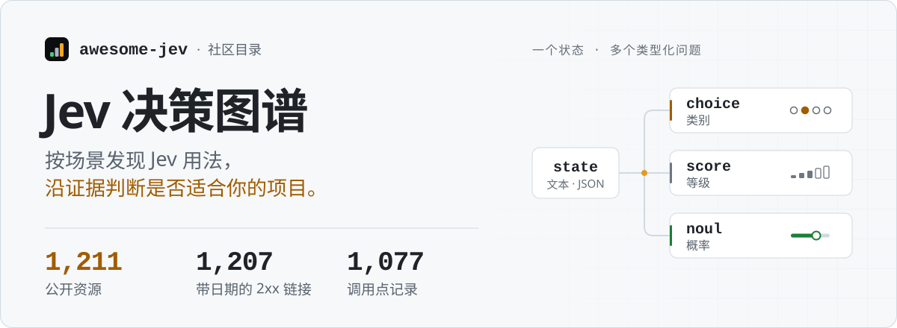
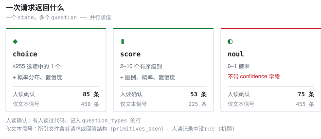
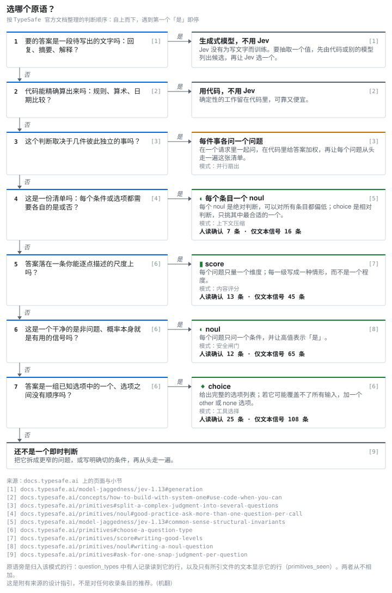
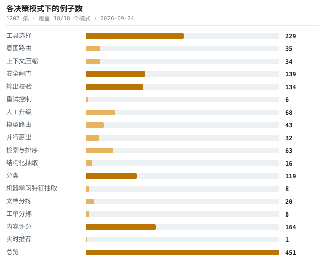

<!--
  本文件由 catalog.json 生成。请修改目录数据后运行 `python3 scripts/build_readme.py`。
-->

<a href="https://kydlikebtc.github.io/awesome-jev/?lang=zh">
<picture>
  <source media="(min-width: 768px) and (prefers-color-scheme: light)" srcset="docs/assets/readme-cover-zh-light.svg">
  <source media="(max-width: 767px) and (prefers-color-scheme: light)" srcset="docs/assets/readme-cover-zh-light-mobile.svg">
  <source media="(max-width: 767px)" srcset="docs/assets/readme-cover-zh-dark-mobile.svg">
  <source media="(prefers-color-scheme: dark)" srcset="docs/assets/readme-cover-zh-dark.svg">
  
</picture>
</a>

<a href="https://kydlikebtc.github.io/awesome-jev/?lang=zh"><kbd>&nbsp;<b>浏览资源目录&nbsp;↗</b>&nbsp;</kbd></a>
<a href="https://kydlikebtc.github.io/awesome-jev/?collection=first-call&amp;lang=zh"><kbd>&nbsp;第一次调用&nbsp;</kbd></a>
<a href="https://kydlikebtc.github.io/awesome-jev/?collection=build&amp;lang=zh"><kbd>&nbsp;改造现有项目&nbsp;</kbd></a>
<a href="https://kydlikebtc.github.io/awesome-jev/?collection=measured&amp;lang=zh"><kbd>&nbsp;独立测量报告&nbsp;</kbd></a>
<a href="README.md"><kbd>&nbsp;English&nbsp;</kbd></a>

数字统计已保存的链接与证据记录，不代表当前 CI 通过数或运行测试结果。 <a href="#哪些经过核实哪些没有">统计口径</a>

<b>阅读导航 · 完整目录</b>

[决策模式](docs/patterns.zh-CN.md) · [兼容性](docs/compatibility.md) · [核查指南](docs/vetting.md)

- 01 [这是什么](#这是什么)
- 02 [Jev 返回什么](#jev-返回什么)
- 03 [从这里开始](#从这里开始)
- 04 [覆盖度](#覆盖度)
- 05 [实测，而非宣称](#实测而非宣称)
- 06 [按决策模式](#按决策模式)
- 07 [按资源形态](#按资源形态)
- 08 [本仓库还有什么](#本仓库还有什么)
- 09 [哪些经过核实，哪些没有](#哪些经过核实哪些没有)
- 10 [机器可读数据](#机器可读数据)
- 11 [参与贡献与许可](#参与贡献与许可)

---

## 这是什么

- **Jev** 是 TypeSafe AI 的决策模型。它不生成文本 —— 你给它状态和类型化问题，它返回带校准置信度的类型化答案，快且便宜到可以放进智能体的内层循环。
- **本仓库**收集它的公开使用例子，按所做的**决策**组织。你这周读的那篇资料是一次性的，决策模式不是。
- **如何判断可信度：**每一行都写明来源；有依据时记录调用点、原语声明和注意事项，方便你查看读过什么，以及哪些部分仍未实测。

> [!NOTE]
> 不是产品本身，不是 SDK，与 TypeSafe AI 无隶属关系，也不构成推荐。收录是一份来源记录，不代表运行验证或性能背书。详见[哪些经过核实](#哪些经过核实哪些没有)。

## Jev 返回什么

三个原语。下面所有模式都由它们构成，而最后一行那个不对称是最常见的 bug 来源。

<picture>
  <source media="(prefers-color-scheme: dark)" srcset="docs/assets/primitives-zh-dark.svg">
  
</picture>

每个原语下方有两个互不相加的数：先是 `question_types` 记录了有人读过代码、确认调用该原语的行数；再是只有文本信号的行数 —— 每周刷新在该行所引的那一个文件中找到了它的请求或回答结构（`primitives_seen`），这并不表明代码调用了它。见[哪些经过核实](#哪些经过核实哪些没有)。 (机翻)

输入**仅支持文本** —— 字符串、JSON 对象、或文本数组。上下文每次请求 **64k** token，其中 state 加最长的那个问题占 **32k**。输出 token 免费。权重未公开，因此无法本地运行。跨平台差异全表见 [`docs/compatibility.md`](docs/compatibility.md)。

某个决策该用哪个原语？下图把 TypeSafe 官方的指引排成一张判断清单：自上而下，遇到第一个「是」即停。顺序与措辞出自本仓库；每一步都注明所依据的页面，列在图下。这是厂商附有来源的设计指引，不是对本目录任何条目的推荐。 (机翻)

<picture>
  <source media="(prefers-color-scheme: dark)" srcset="docs/assets/primitive-picker-zh-dark.svg">
  
</picture>

每个原语旁是归入所列模式的行数，计法同上图：人读确认，或仅文本信号。这些步骤存于 [`picker.json`](picker.json)，网站的原语页也读取它。来源（编号同图中）：[1] [docs.typesafe.ai/model-jaggedness/jev-1.13#generation](https://docs.typesafe.ai/model-jaggedness/jev-1.13#generation) · [2] [docs.typesafe.ai/concepts/how-to-build-with-system-one#use-code-when-you-can](https://docs.typesafe.ai/concepts/how-to-build-with-system-one#use-code-when-you-can) · [3] [docs.typesafe.ai/primitives#split-a-complex-judgment-into-several-questions](https://docs.typesafe.ai/primitives#split-a-complex-judgment-into-several-questions) · [4] [docs.typesafe.ai/primitives/noul#good-practice-ask-more-than-one-question-per-call](https://docs.typesafe.ai/primitives/noul#good-practice-ask-more-than-one-question-per-call) · [5] [docs.typesafe.ai/model-jaggedness/jev-1.13#common-sense-structural-invariants](https://docs.typesafe.ai/model-jaggedness/jev-1.13#common-sense-structural-invariants) · [6] [docs.typesafe.ai/primitives#choose-a-question-type](https://docs.typesafe.ai/primitives#choose-a-question-type) · [7] [docs.typesafe.ai/primitives/score#writing-good-levels](https://docs.typesafe.ai/primitives/score#writing-good-levels) · [8] [docs.typesafe.ai/primitives/noul#writing-a-noul-question](https://docs.typesafe.ai/primitives/noul#writing-a-noul-question) · [9] [docs.typesafe.ai/primitives#ask-for-one-snap-judgment-per-question](https://docs.typesafe.ai/primitives#ask-for-one-snap-judgment-per-question)。 (机翻)

## 从这里开始

六条，按阅读顺序。手工挑选 —— 因为「star 最多」和「该先读哪个」不是一回事。

1. **[Quickstart](https://docs.typesafe.ai/introduction/quickstart)**

   官方第一课：一条工单，一次请求里同时问一个 Choice、一个 Score 和一个 Noul，给了 Python / JS / cURL 三种写法。

2. **[Jev 1.13 known limitations](https://docs.typesafe.ai/model-jaggedness/jev-1.13)**

   官方文档里最有用、却最少被引用的一页。它还解释了一件事：对选项做一个 Choice，和每个选项各问一个 Noul，问的根本不是同一个问题。

3. **[Example: three primitives in one request](https://github.com/kydlikebtc/awesome-jev/blob/main/examples/01-three-primitives/main.py)**

   按官方 API 参考编写并逐字段对照核实，但未针对线上 API 实际执行过。

4. **[fast-jev-compaction](https://github.com/tamaratran/fast-jev-compaction)**

   每次工具调用恰好两个 noul：知道这次调用发生过是否还有意义、以及是否还需要完整原文输出。尽管它自己的描述里用了「打分」，实际并未使用 score 原语。

5. **[ai-cookbook: Jev track](https://github.com/daveebbelaar/ai-cookbook)**

   找到的最好的结构化教程。它明确指出类型化输出不保证决策正确、列出了官方记录的弱项，并且对自己给出的成本示例做了限定而不是拿来营销。

6. **[Hermes Agent: Jev compaction evaluation](https://github.com/NousResearch/hermes-agent)**

   本目录可信度最高的一条。召回率低于他们现有的摘要器，在相同上下文预算下与「按时间倒序」打平。成本确实低得多。在一个被热炒的模型上公开负面结果，非常少见。

## 覆盖度

全部决策模式，按本目录的收录数量排列长度。图表下方的场景索引可跳转到对应章节。数字为 0 的是待补的研究缺口，不是渲染 bug。

<picture>
  <source media="(prefers-color-scheme: dark)" srcset="docs/assets/coverage-zh-dark.svg">
  
</picture>

全部 18 个模式均已收录条目。覆盖不代表已运行验证或各模式成熟度相同。 详见 [`docs/status.md`](docs/status.md)。

**场景索引 · 点击跳转到条目**

| 场景 | 场景 |
| :--- | :--- |
| [工具选择](#工具选择) · **230** | [意图路由](#意图路由) · **35** |
| [上下文压缩](#上下文压缩) · **34** | [安全闸门](#安全闸门) · **139** |
| [输出校验](#输出校验) · **134** | [重试控制](#重试控制) · **7** |
| [人工升级](#人工升级) · **69** | [模型路由](#模型路由) · **44** |
| [并行扇出](#并行扇出) · **32** | [检索与排序](#检索与排序) · **64** |
| [结构化抽取](#结构化抽取) · **17** | [分类](#分类) · **120** |
| [机器学习特征抽取](#机器学习特征抽取) · **8** | [文档分拣](#文档分拣) · **20** |
| [工单分拣](#工单分拣) · **8** | [内容评分](#内容评分) · **166** |
| [实时推荐](#实时推荐) · **1** | [总览](#总览) · **451** |

## 实测，而非宣称

本目录收录的独立测量报告，包括有助于理解适用边界的**负面结果**。这些是原作者的测量，本仓库没有独立复现。比较结果前，请分别查看数据集、测试方法和模型版本。

*作者结论*是基准测试作者本人对 Jev 在其所测任务上给出的结论方向（`measurement.direction`：有利、好坏参半、不利或无定论），按作者的报告索引：属作者自述，未经本仓库复现；作者没有用文字说明结论的则不标。[docs/benchmarks.zh-CN.md](docs/benchmarks.zh-CN.md) 把每条基准测试的测量字段并列展示。 (机翻)

### 负面结果优先

作者本人针对这一用途测量过 Jev 并得出不采用结论的行：基准测试的测量结论为*不利*，或其他行带有*实测后未采用*标记。作者自述，未经本仓库复现。请先读它们，再看正面例子；[站点也列出了它们](https://kydlikebtc.github.io/awesome-jev/?neg=1&lang=zh)。 (机翻)

- **[Hermes Agent: Jev compaction evaluation](https://github.com/NousResearch/hermes-agent)** 
  把 Jev 压缩方案移植过来，与自家在用的摘要器对比实测，最后公开结论：不采用。 
  `基准测试` · ★100k+ · `Py` · `noul` · [调用点](https://github.com/NousResearch/hermes-agent/blob/HEAD/evals/compaction/jev_arm.py)，2026-09-22 阅读 · 作者结论：不利（作者自述，未经本仓库复现）

  > 本目录可信度最高的一条。召回率低于他们现有的摘要器，在相同上下文预算下与「按时间倒序」打平。成本确实低得多。在一个被热炒的模型上公开负面结果，非常少见。

- **[worldmonitor: news threat classification](https://github.com/koala73/worldmonitor)** 
  用两个 Choice 判断威胁等级与类别；盲测发现 Jev 只是与原有模型打平，于是一直保持影子运行。 
  `基准测试` · ★10k+ · `TS` · `choice` · [调用点](https://github.com/koala73/worldmonitor/blob/HEAD/shared/jev-classify.js)，2026-09-22 阅读 · 作者结论：不利（作者自述，未经本仓库复现）

  **注意:** `仅影子运行`

  > 接进去了但故意不生效：按他们自己的说法，Jev 返回的任何东西都不会进入标签、缓存行或告警。带黄金测试集。想在不拿生产环境下注的前提下试新模型，这是值得照抄的做法。

- **[no-mistakes: Jev review pre-brief, measured and retired](https://github.com/kunchenguid/no-mistakes/pull/1165)** 
  为代码审查预选上下文：每个候选文件问一个 Score —— 测了两次后被移除：计费输入明显增加、耗时几乎没有收益；离线回放还表明，候选列表根本够不到审查发现实际所在的位置。 
  `基准测试` · ★1k+ · `Go` · `score` · 作者结论：不利（作者自述，未经本仓库复现）

  > 已在 PR #1165（2026-09-22）中移除。他们的离线测量发现：候选生成器从构造上就排除了被改动的文件，而几乎所有审查发现都落在被改动的文件上；按文件附带摘录反而让列表更不精确、token 成本更高。代码已不在默认分支上，所以这一行引用的是移除它的那次改动。

- **[hermes-jev-skills](https://github.com/kerpopule/hermes-jev-skills)** 
  九个 agent 技能加一个 CLI，覆盖模型路由、记忆过滤、对话轮保留、多选一技能选择和下一步动作决策。 
  `插件` · ★100+ · `Py` · `choice` · `score` · `noul` · [调用点](https://github.com/kerpopule/hermes-jev-skills/blob/HEAD/jevkit/client.py)，2026-09-22 阅读

  **注意:** `实测后未采用`

  > 值得一提的是它公开了一个被放弃的用法：用 Jev 做交接摘要的召回率，反而不如原始对话记录。

- **[jev-skill-router](https://github.com/shimo4228/jev-skill-router)** 
  Claude Code 插件：询问 Jev 哪个已安装技能适配当前提示，并记录答案（先影子运行）。 (项目自述) (机翻) 
  `插件` · shimo4228 · `Py` · [调用点](https://github.com/shimo4228/jev-skill-router/blob/HEAD/scripts/jev_client.py)，2026-09-22 阅读

  **注意:** `实测后未采用`

  > 作者于 2026-09-21 运行后得出结论：作为路由器，它不太可能帮到本来就能看到全部技能描述的强模型。其 README 记录：0.2.0 版上 6 条脚本化请求全部处理得当，0.1.0 版在一次真实会话的 6 条提示中有 3 条出错，作者称这只是个例，不是比率。它一直停留在影子模式。https://dev.to/shimo4228/i-added-jevs-skill-router-to-claude-code-and-turned-back-just-before-rewriting-the-skill-listing-34in 本条中文备注由模型撰写。

### 其他独立测量报告

- **[An early-access test of TypeSafe's Jev: calibrated judgments for half a cent](https://lindfors.no/blog/a-first-look-at-typesafes-jev/)** 
  找到的最好的独立实测：固定单一模型版本、24 份挪威语文档，开篇就展示了一个模型答错、但同时正确报出低置信度的案例。 
  `基准测试` · Lindfors

  > 方法论交代干净，并诚实限定为「单日快照」。开篇就摆失败案例，这才让它成为真正的校准检验，而不是一篇软文。

- **[Testing TypeSafe Jev, Mistral and Gemini for local event validation](https://nearhere.events/blog/typesafe-jev-mistral-gemini-event-validation)** 
  找到的唯一三方横评，每个模型分别调过提示词，且明确把范围限定在单一任务上、不做通用排名。 
  `基准测试` · Near Here

  > 自我限定很规范：这是用例研究，不是模型排行榜。这种克制比数字本身更少见。

- **[hippo-memory](https://github.com/kitfunso/hippo-memory)** 
  受生物启发的智能体记忆：衰减、检索强化与巩固。零运行时依赖，基于 SQLite。 (机翻) 
  `基准测试` · ★100+ · kitfunso · `TS` · [调用点](https://github.com/kitfunso/hippo-memory/blob/HEAD/src/rerankers/jev.ts)，2026-09-22 阅读 · 作者结论：好坏参半（作者自述，未经本仓库复现）

- **[jev-arena](https://github.com/NanmiCoder/jev-arena)** 
  Jev 模型介绍与实测：通过 Choice / Score / Noul 将自然语言转为带类型的判断与概率，用于分类、评分和路由；支持与 DeepSeek 等模型对比评论打标、速度与结果，含 CSV/Excel 导入、原速回放与离线报告。 
  `基准测试` · ★100+ · nanmicoder · `JS` · [调用点](https://github.com/NanmiCoder/jev-arena/blob/HEAD/src/backends/jev.mjs)，2026-09-24 阅读

- **[jevbench](https://github.com/fstandhartinger/jevbench)** 
  JevBench v1 —— 面向 Jev 这类类型化决策模型的基准。 (项目自述) (机翻) 
  `基准测试` · ★100+ · fstandhartinger · `Py` · [调用点](https://github.com/fstandhartinger/jevbench/blob/HEAD/jevbench/adapters/typesafe.py)，2026-09-22 阅读

已显示 **10 / 73** 条：先是负面结果，再是精选路径[独立测量报告](https://kydlikebtc.github.io/awesome-jev/?collection=measured&lang=zh)选出的条目，按该路径的顺序，再按列表顺序补上其余条目中靠前的几条 · [在单独页面查看全部 73 条及全部备注 →](docs/measured.zh-CN.md) · [在站点上筛选](https://kydlikebtc.github.io/awesome-jev/?indep=1&lang=zh) (机翻)

## 按决策模式

主索引。每个标题是智能体必须做的一个决策；下面的行是做这个决策的例子。警示以短标记呈现 —— 每行的完整备注在 [`catalog.json`](catalog.json) 和[站点](https://kydlikebtc.github.io/awesome-jev/)里。

★ 以区间给出仓库的 GitHub star 数 —— ★10+、★100+、★1k+、★10k+、★100k+；没有仓库或不足 10 星的行不标区间。排序：官方优先，其次是含代码的，再按区间，最后按标题。区间只反映热度，不代表质量；最近一次从 GitHub 读到的精确数字在 [`catalog.json`](catalog.json) 和[站点](https://kydlikebtc.github.io/awesome-jev/?lang=zh)上。 (机翻)

*调用点*链接打开该行引用的那一个文件（`evidence.path`）在仓库默认分支 `HEAD` 上的版本；其后的日期是有人最近一次阅读该文件的日期（`evidence.read_on`）：这是阅读记录，不是运行过代码。*引用文件*链接同理，只是该文件表明项目采用了 Jev 的请求结构、并非基于 Jev 构建，或只是项目附带的示例（`evidence.kind`）。两种链接都没有固定到某个提交，打开的是文件的当前版本，可能与当时读到的不同；文件移动后链接就会失效，每周的 claims 检查会报告这种情况。 (机翻)

### 工具选择

_智能体下一步该调用哪个工具或动作。_

- **[Cookbook: Function calling](https://docs.typesafe.ai/cookbooks/function_calling)** ⭐ 
  把自然语言的交易请求映射到普通的类型化函数：函数名和有限取值的参数各自变成一个带置信度的问题。 
  `官方文档` · `Py` · `choice`

- **[Cookbook: Skill suggestion](https://docs.typesafe.ai/cookbooks/skill_suggestion)** ⭐ 
  为智能体的一轮对话从 182 个技能里最多挑一个：第一次请求给所有技能排序并顺便问「这轮到底需不需要技能」，第二次细读前三名。 
  `官方文档` · `Py` · `choice` · `noul`

- **[Demo: Smart home assistant](https://docs.typesafe.ai/demos/smart-home)** ⭐ 
  一个可运行的智能家居助手示例，用类型化决策来解析用户请求。 
  `官方文档` · `Py`

- **[ai-hedge-fund](https://github.com/virattt/ai-hedge-fund)** 
  一支 AI 对冲基金团队：多个投资者智能体协作做出交易决策；TypeSafe（Jev）是可选的模型提供方之一。 (项目自述) (机翻) 
  `平台集成` · ★10k+ · virattt · `Py` · [调用点](https://github.com/virattt/ai-hedge-fund/blob/HEAD/hedge_fund/llm/client.py)，2026-09-24 阅读

- **[claude-code-templates: three Jev plugins](https://github.com/davila7/claude-code-templates)** 
  三个可独立安装的 Claude Code 插件 —— 护栏、模型路由、技能推荐 —— 各自带 hook 和测试。 
  `插件` · ★10k+ · `Py` · `TS` · `choice` · `score` · `noul` · [调用点](https://github.com/davila7/claude-code-templates/blob/HEAD/scripts/jev-spike.mjs)，2026-09-22 阅读

- **[Composio TypeSafe provider](https://github.com/ComposioHQ/composio/tree/next/python/providers/typesafe)** 
  把工具目录编译成问题，再从答案还原出 tool call，并为「弃权」和「需确认」两种情况定义了专门的错误类型。 
  `开源项目` · ★10k+ · `Py` · `choice` · [调用点](https://github.com/ComposioHQ/composio/blob/HEAD/python/providers/typesafe/composio_typesafe/provider.py)，2026-09-22 阅读

- **[Cua driver: jev-use example](https://github.com/trycua/cua/tree/main/libs/cua-driver/examples/jev-use)** 
  Python 与 TypeScript 双实现的 computer-use 动作选择：Jev 从不可变候选集里挑下一个浏览器动作，保留 reobserve 和 abstain 两个特殊选项。 
  `开源项目` · ★10k+ · `Py` · `TS` · `choice` · [调用点](https://github.com/trycua/cua/blob/HEAD/libs/cua-driver/examples/jev-use/python/jev_adapter.py)，2026-09-22 阅读

- **[FastMCP jev_search transform](https://github.com/PrefectHQ/fastmcp/blob/main/fastmcp_slim/fastmcp/experimental/transforms/jev_search.py)** 
  两段式 MCP 工具检索：先用一个宽 Choice 对整个目录粗排，再给候选短名单配完整描述，每个候选各配一个 Noul 判断它到底是否胜任。 
  `开源项目` · ★10k+ · `Py` · `choice` · `noul` · [调用点](https://github.com/PrefectHQ/fastmcp/blob/HEAD/fastmcp_slim/fastmcp/experimental/transforms/jev_search.py)，2026-09-22 阅读

- **[jev-ultrafast](https://github.com/browser-use/jev-ultrafast)** 
  Browser Use 做的高速浏览器 Agent。Jev 每一步只判断「做什么、点哪个元素」，要打字才叫小模型。 
  `开源项目` · ★10k+ · Browser Use · `Py` · `choice` · [调用点](https://github.com/browser-use/jev-ultrafast/blob/HEAD/jev_ultrafast/model.py)，2026-09-22 阅读

  **注意:** `厂商自报数据`

- **[json-render](https://github.com/vercel-labs/json-render)** 
  Vercel Labs 的生成式 UI 框架。实验里 Jev 不逐 token 写 JSON，只负责选组件、属性和布局。 
  `开源项目` · ★10k+ · Vercel Labs · `TS` · `choice` · [调用点](https://github.com/vercel-labs/json-render/blob/HEAD/apps/web/lib/jev/compose.ts)，2026-09-22 阅读

已显示 **10 / 230** 条 · [在单独页面查看全部 230 条 →](docs/by-pattern/tool-selection.zh-CN.md) · [在站点上筛选](https://kydlikebtc.github.io/awesome-jev/?p=tool-selection&lang=zh)

[↑ 场景索引](#pattern-index)

### 意图路由

_判断用户意图，把请求分流到正确的分支。_

- **[Demo: Smart home assistant](https://docs.typesafe.ai/demos/smart-home)** ⭐ 
  一个可运行的智能家居助手示例，用类型化决策来解析用户请求。 
  `官方文档` · `Py`

- **[Pattern: Confidence-gated routing](https://docs.typesafe.ai/patterns/confidence-routing)** ⭐ 
  把 confidence 当作第二个维度：答案告诉你「是什么」，置信度告诉你「该不该照它执行」。 
  `官方文档` · `Py`

- **[Pattern: Intent routing](https://docs.typesafe.ai/patterns/intent-routing)** ⭐ 
  对进来的请求做分类，路由到足够用的最便宜那个处理方：确定性代码、专用 LLM、或人。 
  `官方文档` · `Py` · `choice`

- **[AutoGPT TypeSafe blocks](https://github.com/Significant-Gravitas/AutoGPT/tree/master/autogpt_platform/backend/backend/blocks/typesafe)** 
  七个生产级 block（choice/score/yes-no/ask-many/route/pick-best/filter），带 UTF-8 字节预算、逐字报文留存和十一个测试文件。 
  `开源项目` · ★100k+ · `Py` · `choice` · `score` · `noul` · [调用点](https://github.com/Significant-Gravitas/AutoGPT/blob/HEAD/autogpt_platform/backend/backend/blocks/typesafe/_client.py)，2026-09-22 阅读

- **[Airflow LLMBranchOperator with Jev](https://airflow.apache.org/docs/apache-airflow-providers-common-ai/stable/index.html)** 
  把下游任务 id 变成 choice 的选项集，并用最小置信度闸门把不确定的运行转给人处理。 
  `平台集成` · ★10k+ · `Py` · `choice`

- **[Inbox Zero: seven email decisions](https://github.com/elie222/inbox-zero)** 
  七个互不相同的邮件决策，每个都有自己单独设定的阈值，任何出错都回落到普通 LLM。 
  `开源项目` · ★10k+ · `TS` · `choice` · `noul` · [调用点](https://github.com/elie222/inbox-zero/blob/HEAD/apps/web/utils/decision-model/typesafe.ts)，2026-09-22 阅读

- **[ai-cookbook: Jev track](https://github.com/daveebbelaar/ai-cookbook)** 
  一套循序渐进的课程：从第一次调用、逐个原语、state 形状与 criteria，一直到工单分拣和多步工作流，并对应了全部四个官方模式。 
  `教程` · ★1k+ · `Py` · `choice` · `score` · `noul` · [调用点](https://github.com/daveebbelaar/ai-cookbook/blob/HEAD/models/jev/06-criteria.py)，2026-09-22 阅读

- **[jev-chat-jarvis](https://github.com/jev-chat/jev-chat-jarvis)** 
  一个 Android 回复副驾：从屏幕文本判断意图、时机和风险，OCR 与文案起草交给另外的模型。 
  `开源项目` · ★1k+ · `Java` · `choice` · `score` · `noul` · [调用点](https://github.com/jev-chat/jev-chat-jarvis/blob/HEAD/app/src/main/java/com/jev/probe/jev/JevQuestions.kt)，2026-09-22 阅读

- **[Real Python: hello-jev](https://github.com/realpython/materials/tree/master/hello-jev)** 
  带对照组的教学示例：同一个问询台任务，一份是只认 Y/N 的纯 Python 写法，旁边是一个能读出意图的 Noul。 
  `教程` · ★1k+ · Real Python · `Py` · `noul` · [调用点](https://github.com/realpython/materials/blob/HEAD/hello-jev/jev_noul.py)，2026-09-22 阅读

- **[foreman](https://github.com/thruwire/foreman)** 
  一个「软件工厂工头」，用 Jev 决定智能体流水线下一步该做什么。 
  `开源项目` · ★100+ · thruwire · `Py` · [调用点](https://github.com/thruwire/foreman/blob/HEAD/src/foreman/foreman/jev.py)，2026-09-22 阅读

已显示 **10 / 35** 条 · [在单独页面查看全部 35 条 →](docs/by-pattern/intent-routing.zh-CN.md) · [在站点上筛选](https://kydlikebtc.github.io/awesome-jev/?p=intent-routing&lang=zh)

[↑ 场景索引](#pattern-index)

### 上下文压缩

_判断哪些工具调用和结果仍然相关，从而丢弃过期上下文。_

- **[Hermes Agent: Jev compaction evaluation](https://github.com/NousResearch/hermes-agent)** 
  把 Jev 压缩方案移植过来，与自家在用的摘要器对比实测，最后公开结论：不采用。 
  `基准测试` · ★100k+ · `Py` · `noul` · [调用点](https://github.com/NousResearch/hermes-agent/blob/HEAD/evals/compaction/jev_arm.py)，2026-09-22 阅读 · 作者结论：不利（作者自述，未经本仓库复现）

- **[jcode: memory recall without embeddings](https://github.com/1jehuang/jcode)** 
  把记忆召回的整套检索栈替换掉 —— 不用 embedding、不用 BM25、不用重排器 —— 改为对每条候选记忆批量问一个 Noul。 
  `开源项目` · ★10k+ · `Rs` · `noul` · [调用点](https://github.com/1jehuang/jcode/blob/HEAD/crates/jcode-base/src/jev.rs)，2026-09-22 阅读

- **[fast-jev-compaction](https://github.com/tamaratran/fast-jev-compaction)** 
  一个 Claude Code 插件，用逐条决策取代压缩式摘要：过期的工具调用被丢弃或截断，保留下来的全部逐字不变。 
  `插件` · ★1k+ · tamaratran · `TS` · `noul` · [调用点](https://github.com/tamaratran/fast-jev-compaction/blob/HEAD/src/request.ts)，2026-09-22 阅读

- **[compact-adviser](https://github.com/kunchenguid/compact-adviser)** 
  判断工作是否已完成或已记录，据此提示运行上下文压缩。 (项目自述) (机翻) 
  `开源项目` · ★100+ · kunchenguid · `TS` · [调用点](https://github.com/kunchenguid/compact-adviser/blob/HEAD/packages/claude-mod/lib/judge.ts)，2026-09-22 阅读

- **[hermes-jev-skills](https://github.com/kerpopule/hermes-jev-skills)** 
  九个 agent 技能加一个 CLI，覆盖模型路由、记忆过滤、对话轮保留、多选一技能选择和下一步动作决策。 
  `插件` · ★100+ · `Py` · `choice` · `score` · `noul` · [调用点](https://github.com/kerpopule/hermes-jev-skills/blob/HEAD/jevkit/client.py)，2026-09-22 阅读

  **注意:** `实测后未采用`

- **[jev-pruner](https://github.com/tamaratran/jev-pruner)** 
  在模型看到之前先修剪冗长的 shell 输出，每个片段问一个 Noul。 
  `插件` · ★100+ · tamaratran · `TS` · `noul` · [调用点](https://github.com/tamaratran/jev-pruner/blob/HEAD/src/jev.ts)，2026-09-22 阅读

- **[Winnow](https://github.com/GhalebDweikat/winnow)** 
  给 Claude Code 做上下文垃圾回收。Read / Bash / Grep 吐一大堆时，Jev 先判断哪些真和当前任务有关。 
  `插件` · ★100+ · `Py` · `noul` · [调用点](https://github.com/GhalebDweikat/winnow/blob/HEAD/sidecar/src/winnow/judge.py)，2026-09-22 阅读

- **[claude-jev](https://github.com/0x7067/claude-jev)** 
  Claude Code 插件：Jev 负责规则检查、逐字压缩与提示路由。 (项目自述) (机翻) 
  `插件` · ★10+ · 0x7067 · `Py` · [调用点](https://github.com/0x7067/claude-jev/blob/HEAD/scripts/jev.py)，2026-09-22 阅读

- **[dsh-jev-tools](https://github.com/HorusJiang/dsh-jev-tools)** 
  用 Jev 做判断而不是生成：修剪过长的工具输出、筛查抓取页面中注入的指令、为“完成”把关。 (项目自述) (机翻) 
  `插件` · ★10+ · horusjiang · `TS` · [调用点](https://github.com/HorusJiang/dsh-jev-tools/blob/HEAD/src/config.ts)，2026-09-24 阅读

- **[fast-dev-compaction](https://github.com/leonaaardob/fast-dev-compaction)** 
  Codex 插件：在会话压缩前后，由 Jev 引导逐字恢复上下文。移植自 tamaratran/fast-jev-compaction，适配 Codex 的生命周期钩子。 (项目自述) (机翻) 
  `插件` · ★10+ · leonaaardob · `TS` · [调用点](https://github.com/leonaaardob/fast-dev-compaction/blob/HEAD/src/request.ts)，2026-09-24 阅读

已显示 **10 / 34** 条 · [在单独页面查看全部 34 条 →](docs/by-pattern/context-compaction.zh-CN.md) · [在站点上筛选](https://kydlikebtc.github.io/awesome-jev/?p=context-compaction&lang=zh)

[↑ 场景索引](#pattern-index)

### 安全闸门

_在执行前判断一个动作是否安全。属纵深防御，绝不是安全边界。_

- **[Cookbook: Classifying RAG passages](https://docs.typesafe.ai/cookbooks/classifying_rag_passages)** ⭐ 
  给每条召回的段落打分，再由代码决定哪些能进入回答模型 —— 矛盾的标记保留，夹带提示注入的直接丢弃。 
  `官方文档` · `Py`

- **[Cookbook: Guardrails for LLMs](https://docs.typesafe.ai/cookbooks/llm_guardrails)** ⭐ 
  用一次请求筛查 LLM 应用的每一条进出消息，既点明风险类型、又给「照做会造成多大危害」打分。 
  `官方文档` · `Py` · `noul` · `score`

- **[@langchain/typesafe](https://github.com/langchain-ai/langchainjs)** 
  LangChain 集成的 JavaScript 对应版本，分类器与 middleware 形状一致。 
  `平台集成` · ★10k+ · `TS` · `choice` · `score` · `noul` · [调用点](https://github.com/langchain-ai/langchainjs/blob/HEAD/libs/providers/langchain-typesafe/src/types.ts)，2026-09-22 阅读

- **[claude-code-templates: three Jev plugins](https://github.com/davila7/claude-code-templates)** 
  三个可独立安装的 Claude Code 插件 —— 护栏、模型路由、技能推荐 —— 各自带 hook 和测试。 
  `插件` · ★10k+ · `Py` · `TS` · `choice` · `score` · `noul` · [调用点](https://github.com/davila7/claude-code-templates/blob/HEAD/scripts/jev-spike.mjs)，2026-09-22 阅读

- **[sub2api: Jev as a moderation endpoint](https://github.com/Wei-Shaw/sub2api)** 
  作为审核 API 的直接替代：一次请求并行问多个 Noul，每个危害类别一个，且每条指令都带反注入前缀。 
  `开源项目` · ★10k+ · `Go` · `noul` · [调用点](https://github.com/Wei-Shaw/sub2api/blob/HEAD/backend/internal/pkg/typesafe/client.go)，2026-09-22 阅读

- **[agentgateway: CI-validated LLM guardrail](https://github.com/agentgateway/agentgateway)** 
  三个共用同一严重度量表的 Score 问题，两项以上越线即拦截请求，并且失败时默认关闭。 
  `开源项目` · ★1k+ · `Rs` · `score` · [调用点](https://github.com/agentgateway/agentgateway/blob/HEAD/examples/llm-guardrail-jev/guardrail.ts)，2026-09-22 阅读

- **[DeepChat: agent tool-permission review](https://github.com/ThinkInAIXYZ/deepchat)** 
  从三个维度审查每次工具调用：风险等级、用户是否授权、以及一个显式的提示注入压力检查。 
  `开源项目` · ★1k+ · `TS` · `choice` · `noul` · [调用点](https://github.com/ThinkInAIXYZ/deepchat/blob/HEAD/src/shared/jevProtocol.ts)，2026-09-22 阅读

- **[atomic](https://github.com/bastani-inc/atomic)** 
  可验证的编程智能体运行时：用自然语言定义智能体的流程。 (机翻) 
  `开源项目` · ★100+ · bastani-inc · `TS` · [调用点](https://github.com/bastani-inc/atomic/blob/HEAD/packages/ai/src/decision-models.generated.ts)，2026-09-24 阅读

- **[Jev-cu](https://github.com/Sac-Y/Jev-cu)** 
  一个 computer-use 智能体：判断该对无障碍树里哪个元素操作，并单独用一个 noul 判断这个动作是否需要用户显式确认。 
  `开源项目` · ★100+ · `JS` · `choice` · `noul` · [调用点](https://github.com/Sac-Y/Jev-cu/blob/HEAD/scripts/jev-decide.mjs)，2026-09-22 阅读

- **[jev-drone](https://github.com/RomanSlack/jev-drone)** 
  拿 Jev 控无人机。底层飞控继续负责稳定和安全，Jev 只做爬升、刹车、穿越障碍这类上层判断。 
  `开源项目` · ★100+ · `Py` · `choice` · `score` · `noul` · [调用点](https://github.com/RomanSlack/jev-drone/blob/HEAD/tactics.py)，2026-09-22 阅读

  **注意:** `宣称未核实`

已显示 **10 / 139** 条 · [在单独页面查看全部 139 条 →](docs/by-pattern/safety-gating.zh-CN.md) · [在站点上筛选](https://kydlikebtc.github.io/awesome-jev/?p=safety-gating&lang=zh)

[↑ 场景索引](#pattern-index)

### 输出校验

_在输出到达用户前，按评分标准检查模型产出。_

- **[Cookbook: Double-checking citations](https://docs.typesafe.ai/cookbooks/citation_check)** ⭐ 
  用一个 Choice 对着原文核查引用是否错误或凭空编造，并用它的置信度把边缘情况标出来送审。 
  `官方文档` · `Py` · `choice`

- **[Cookbook: Guardrails for LLMs](https://docs.typesafe.ai/cookbooks/llm_guardrails)** ⭐ 
  用一次请求筛查 LLM 应用的每一条进出消息，既点明风险类型、又给「照做会造成多大危害」打分。 
  `官方文档` · `Py` · `noul` · `score`

- **[latitude-llm](https://github.com/latitude-dev/latitude-llm)** 
  面向 AI 智能体的开源可观测性：定位智能体在哪里失败。 (项目自述) (机翻) 
  `开源项目` · ★1k+ · latitude-dev · `TS` · [调用点](https://github.com/latitude-dev/latitude-llm/blob/HEAD/packages/platform/ai-jev/src/jev-shadow-decision-provider.ts)，2026-09-22 阅读

- **[reticle](https://github.com/reticlehq/reticle)** 
  AI 智能体能生成代码，却仍难以理解自己构建的东西。Reticle 用 TypeSafe Jev 路由验证流程，并由 Jev 驱动对页面的探索。 (项目自述) (机翻) 
  `开源项目` · ★1k+ · reticlehq · `TS` · [调用点](https://github.com/reticlehq/reticle/blob/HEAD/bench/harness/jev.mjs)，2026-09-24 阅读

- **[abide](https://github.com/coldteadotai/abide)** 
  让你的编码智能体遵守项目里的所有规则。 (项目自述) (机翻) 
  `插件` · ★100+ · coldteadotai · `TS` · [调用点](https://github.com/coldteadotai/abide/blob/HEAD/packages/cli/src/lib/jev.ts)，2026-09-24 阅读

- **[atomic](https://github.com/bastani-inc/atomic)** 
  可验证的编程智能体运行时：用自然语言定义智能体的流程。 (机翻) 
  `开源项目` · ★100+ · bastani-inc · `TS` · [调用点](https://github.com/bastani-inc/atomic/blob/HEAD/packages/ai/src/decision-models.generated.ts)，2026-09-24 阅读

- **[Canny](https://github.com/qkal/Canny)** 
  防 Coding Agent 嘴硬说自己做完了。看工具输出、代码 diff 和测试结果，再判断完成声明靠不靠谱。 
  `开源项目` · ★100+ · `TS` · `noul` · `score` · [调用点](https://github.com/qkal/Canny/blob/HEAD/src/jev.ts)，2026-09-22 阅读

- **[fastbrowse](https://github.com/agent-labs-dev/fastbrowse)** 
  快速浏览器智能体：Jev 从页面现有内容里挑动作，LLM 负责阅读与规划。 (项目自述) (机翻) 
  `开源项目` · ★100+ · agent-labs-dev · `Py` · [调用点](https://github.com/agent-labs-dev/fastbrowse/blob/HEAD/src/fastbrowse/clients/typesafe.py)，2026-09-22 阅读

- **[formanator](https://github.com/timrogers/formanator)** 
  从命令行和 MCP 客户端提交福利报销单。 (项目自述) (机翻) 
  `插件` · ★100+ · timrogers · `Rs` · [调用点](https://github.com/timrogers/formanator/blob/HEAD/src/typesafe.rs)，2026-09-22 阅读

- **[jev-eval-agent](https://github.com/vinilana/jev-eval-agent)** 
  一个把评测工作通过类型化决策来路由的智能体。 
  `开源项目` · ★100+ · vinilana · `TS` · [调用点](https://github.com/vinilana/jev-eval-agent/blob/HEAD/agent/lib/jev-router.ts)，2026-09-22 阅读

  **注意:** `无许可证`

已显示 **10 / 134** 条 · [在单独页面查看全部 134 条 →](docs/by-pattern/output-validation.zh-CN.md) · [在站点上筛选](https://kydlikebtc.github.io/awesome-jev/?p=output-validation&lang=zh)

[↑ 场景索引](#pattern-index)

### 重试控制

_判断失败的步骤是否值得重试。_

- **[jev-harness](https://github.com/ismaelsoilet/jev-harness)** 
  零依赖的 System One 决策框架：用 5 道语义关卡，在琐碎错误和“死循环”上替前沿 AI 智能体省下 token。 (项目自述) (机翻) 
  `插件` · ★10+ · ismaelsoilet · `Py` · [调用点](https://github.com/ismaelsoilet/jev-harness/blob/HEAD/src/jev_harness/client.py)，2026-09-24 阅读

- **[harnessjudge](https://github.com/ndolinschi/harnessjudge)** 
  评判智能体的每一步：通过／重试／升级／停止。 (项目自述) (机翻) 
  `开源项目` · ndolinschi · `TS` · [调用点](https://github.com/ndolinschi/harnessjudge/blob/HEAD/src/lib/jev.ts)，2026-09-22 阅读

  **注意:** `仅一次提交` · `无许可证`

- **[Jev by Example](https://github.com/ReallyArtificial/jev-by-example)** 
  十个可运行的 JavaScript 智能体决策，一个文件一个：新记忆与旧记忆冲突时该改还是该留、工具返回 200 是否真的完成了任务、写入超时后该重试还是该对账、上下文分块在预算内如何取舍、压缩后的交接是否丢掉了某条禁令。Jev 只回答带类型的问题，阈值和最终提案由普通代码决定。 
  `开源项目` · Really Artificial · `JS` · `choice` · `score` · `noul` · [调用点](https://github.com/ReallyArtificial/jev-by-example/blob/HEAD/src/client.mjs)，2026-09-22 阅读

  **注意:** `疑似 AI 生成`

- **[jev-reasoning-navigator](https://github.com/AndreuVM/praxeon)** 
  JEV 推理导航器：面向自主 LLM 智能体的认知监督、防止循环与反幻觉引擎。 (机翻) 
  `开源项目` · andreuvm · `Py` · [调用点](https://github.com/AndreuVM/praxeon/blob/HEAD/jev_navigator/core/typesafe_client.py)，2026-09-24 阅读

  **注意:** `无许可证`

- **[jev-resilience](https://github.com/Vicente-MD/jev-resilience)** 
  给 Spring WebFlux 的非阻塞 Starter，实现一个语义熔断器来检测静默故障。 (项目自述) (机翻) 
  `插件` · vicente-md · `Java` · [调用点](https://github.com/Vicente-MD/jev-resilience/blob/HEAD/src/main/java/ai/jev/resilience/client/dto/JevRequest.java)，2026-09-22 阅读

  **注意:** `无许可证`

- **[jevswiftsdk](https://github.com/NSStudent/JevSwiftSDK)** 
  独立的类型安全 Swift SDK，支持 async/await、批处理与重试。 (项目自述) (机翻) 
  `SDK` · nsstudent · `Swift` · [调用点](https://github.com/NSStudent/JevSwiftSDK/blob/HEAD/Sources/JevSwiftSDK/Configuration.swift)，2026-09-22 阅读

- **[XavierJev](https://github.com/liu-x27/XavierJev)** 
  Jev 形状的本地决策层：是非、选择和量表问题都从本地模型单个 token 的 logprob 读出答案；附带一个在留出命令集上测量过的 Claude Code 权限闸门。 (机翻) 
  `Jev 替代实现` · Xinyu Liu · `TS` · `noul` · `choice` · `score` · [引用文件](https://github.com/liu-x27/XavierJev/blob/HEAD/src/gate.ts)，2026-09-25 阅读

  **注意:** `并非 Jev 本身` · `疑似 AI 生成`

已显示全部 7 条 · [单独页面](docs/by-pattern/retry-control.zh-CN.md) · [在站点上筛选](https://kydlikebtc.github.io/awesome-jev/?p=retry-control&lang=zh)

[↑ 场景索引](#pattern-index)

### 人工升级

_用校准置信度决定哪些情况必须由人来看。_

- **[Cookbook: Classification using confidence](https://docs.typesafe.ai/cookbooks/classification_using_confidence)** ⭐ 
  把年报分入 75 个行业组，再根据答案自身的置信度决定：报这个细分组，还是退回上一层的大类。 
  `官方文档` · `Py` · `choice`

- **[Cookbook: Double-checking citations](https://docs.typesafe.ai/cookbooks/citation_check)** ⭐ 
  用一个 Choice 对着原文核查引用是否错误或凭空编造，并用它的置信度把边缘情况标出来送审。 
  `官方文档` · `Py` · `choice`

- **[Cookbook: Knowledge graph entity alignment](https://docs.typesafe.ai/cookbooks/entity_alignment)** ⭐ 
  判断两份商品目录间 450 个候选配对里哪些指的是同一个东西 —— 一个 Score 就够，它的三级正好对应三种可执行动作。 
  `官方文档` · `Py` · `score`

- **[Cookbook: Self-consistency with choices](https://docs.typesafe.ai/cookbooks/consistency_choice_cookbook)** ⭐ 
  在内容审核决策里显式加入「不确定」这个选项，并衡量标签一致率与自动处置比例之间的取舍。 
  `官方文档` · `Py` · `choice`

- **[Cookbook: Self-consistency with nouls](https://docs.typesafe.ai/cookbooks/consistency_noul_cookbook)** ⭐ 
  把不确定的概率转人工复核，同时保留底层的 noul 数值本身，而不是压成一个标签了事。 
  `官方文档` · `Py` · `noul`

- **[Pattern: Confidence-gated routing](https://docs.typesafe.ai/patterns/confidence-routing)** ⭐ 
  把 confidence 当作第二个维度：答案告诉你「是什么」，置信度告诉你「该不该照它执行」。 
  `官方文档` · `Py`

- **[Confidence](https://docs.typesafe.ai/confidence)** ⭐ 
  confidence 如何从概率分布推导出来，以及为什么在一种问题类型上调好的阈值不能挪到另一种上用。 
  `官方文档`

- **[Airflow LLMBranchOperator with Jev](https://airflow.apache.org/docs/apache-airflow-providers-common-ai/stable/index.html)** 
  把下游任务 id 变成 choice 的选项集，并用最小置信度闸门把不确定的运行转给人处理。 
  `平台集成` · ★10k+ · `Py` · `choice`

- **[Composio TypeSafe provider](https://github.com/ComposioHQ/composio/tree/next/python/providers/typesafe)** 
  把工具目录编译成问题，再从答案还原出 tool call，并为「弃权」和「需确认」两种情况定义了专门的错误类型。 
  `开源项目` · ★10k+ · `Py` · `choice` · [调用点](https://github.com/ComposioHQ/composio/blob/HEAD/python/providers/typesafe/composio_typesafe/provider.py)，2026-09-22 阅读

- **[Inbox Zero: seven email decisions](https://github.com/elie222/inbox-zero)** 
  七个互不相同的邮件决策，每个都有自己单独设定的阈值，任何出错都回落到普通 LLM。 
  `开源项目` · ★10k+ · `TS` · `choice` · `noul` · [调用点](https://github.com/elie222/inbox-zero/blob/HEAD/apps/web/utils/decision-model/typesafe.ts)，2026-09-22 阅读

已显示 **10 / 69** 条 · [在单独页面查看全部 69 条 →](docs/by-pattern/human-escalation.zh-CN.md) · [在站点上筛选](https://kydlikebtc.github.io/awesome-jev/?p=human-escalation&lang=zh)

[↑ 场景索引](#pattern-index)

### 模型路由

_选择由哪个下游模型或档位处理请求。_

- **[Cookbook: Structured data extraction cascade](https://docs.typesafe.ai/cookbooks/sde_cascade)** ⭐ 
  「小模型 → 校验 → 推理模型」的两段级联，用一小部分成本拿到接近大推理模型的质量。 
  `官方文档` · `Py`

- **[Pattern: Intent routing](https://docs.typesafe.ai/patterns/intent-routing)** ⭐ 
  对进来的请求做分类，路由到足够用的最便宜那个处理方：确定性代码、专用 LLM、或人。 
  `官方文档` · `Py` · `choice`

- **[@langchain/typesafe](https://github.com/langchain-ai/langchainjs)** 
  LangChain 集成的 JavaScript 对应版本，分类器与 middleware 形状一致。 
  `平台集成` · ★10k+ · `TS` · `choice` · `score` · `noul` · [调用点](https://github.com/langchain-ai/langchainjs/blob/HEAD/libs/providers/langchain-typesafe/src/types.ts)，2026-09-22 阅读

- **[claude-code-templates: three Jev plugins](https://github.com/davila7/claude-code-templates)** 
  三个可独立安装的 Claude Code 插件 —— 护栏、模型路由、技能推荐 —— 各自带 hook 和测试。 
  `插件` · ★10k+ · `Py` · `TS` · `choice` · `score` · `noul` · [调用点](https://github.com/davila7/claude-code-templates/blob/HEAD/scripts/jev-spike.mjs)，2026-09-22 阅读

- **[Astra-Ares](https://github.com/miuuyy/Astra-Ares)** 
  在 Codex 任务中为 GPT-6 自适应地调整推理力度，由 Jev 驱动，以减少 token 消耗。 (项目自述) (机翻) 
  `插件` · ★100+ · miuuyy · `JS` · [调用点](https://github.com/miuuyy/Astra-Ares/blob/HEAD/src/jev.mjs)，2026-09-24 阅读

- **[hermes-jev-skills](https://github.com/kerpopule/hermes-jev-skills)** 
  九个 agent 技能加一个 CLI，覆盖模型路由、记忆过滤、对话轮保留、多选一技能选择和下一步动作决策。 
  `插件` · ★100+ · `Py` · `choice` · `score` · `noul` · [调用点](https://github.com/kerpopule/hermes-jev-skills/blob/HEAD/jevkit/client.py)，2026-09-22 阅读

  **注意:** `实测后未采用`

- **[jev-codex-router](https://github.com/0xNatoshi/jev-codex-router)** 
  先让 Jev 判断这一轮编程任务有多难，再决定模型档位、推理深度和速度模式。 
  `插件` · ★100+ · `JS` · `choice` · `score` · [调用点](https://github.com/0xNatoshi/jev-codex-router/blob/HEAD/server/jev_server.py)，2026-09-22 阅读

  **注意:** `已归档`

- **[jev-eval-agent](https://github.com/vinilana/jev-eval-agent)** 
  一个把评测工作通过类型化决策来路由的智能体。 
  `开源项目` · ★100+ · vinilana · `TS` · [调用点](https://github.com/vinilana/jev-eval-agent/blob/HEAD/agent/lib/jev-router.ts)，2026-09-22 阅读

  **注意:** `无许可证`

- **[jev-review](https://github.com/devagrawal09/jev-review)** 
  代码审查前先过一遍 Jev，把高风险改动挑出来，再交给更贵的大模型或人。带本地看板。 
  `开源项目` · ★100+ · `TS` · `choice` · `score` · `noul` · [调用点](https://github.com/devagrawal09/jev-review/blob/HEAD/src/review/codebase-judgments.ts)，2026-09-22 阅读

- **[jevrouter](https://github.com/BillionsBobby/JevRouter)** 
  面向模型、工具和子智能体的路由器。 
  `开源项目` · ★100+ · billionsbobby · `TS` · [调用点](https://github.com/BillionsBobby/JevRouter/blob/HEAD/functions/api/jev.js)，2026-09-22 阅读

已显示 **10 / 44** 条 · [在单独页面查看全部 44 条 →](docs/by-pattern/model-routing.zh-CN.md) · [在站点上筛选](https://kydlikebtc.github.io/awesome-jev/?p=model-routing&lang=zh)

[↑ 场景索引](#pattern-index)

### 并行扇出

_把大量问题（包括推测性的）打包进一次请求，再由代码挑出真正用得上的答案。_

- **[Cookbook: Parallel questions](https://docs.typesafe.ai/cookbooks/parallel_questions)** ⭐ 
  对一篇长文提 13 个合规问题，证明全部打包进一次调用便宜得多、也快得多，而答案不变。 
  `官方文档` · `Py`

- **[Pattern: Speculative fan-out](https://docs.typesafe.ai/patterns/fan-out)** ⭐ 
  把大量问题（包括可能用不上的）打包进一次请求，之后再由代码决定哪些答案真的用得上。 
  `官方文档` · `Py`

- **[Quickstart](https://docs.typesafe.ai/introduction/quickstart)** ⭐ 
  官方第一课：一条工单，一次请求里同时问一个 Choice、一个 Score 和一个 Noul，给了 Python / JS / cURL 三种写法。 
  `官方文档` · `Py` · `TS` · `sh` · `choice` · `score` · `noul`

- **[AutoGPT TypeSafe blocks](https://github.com/Significant-Gravitas/AutoGPT/tree/master/autogpt_platform/backend/backend/blocks/typesafe)** 
  七个生产级 block（choice/score/yes-no/ask-many/route/pick-best/filter），带 UTF-8 字节预算、逐字报文留存和十一个测试文件。 
  `开源项目` · ★100k+ · `Py` · `choice` · `score` · `noul` · [调用点](https://github.com/Significant-Gravitas/AutoGPT/blob/HEAD/autogpt_platform/backend/backend/blocks/typesafe/_client.py)，2026-09-22 阅读

- **[jev-ultrafast](https://github.com/browser-use/jev-ultrafast)** 
  Browser Use 做的高速浏览器 Agent。Jev 每一步只判断「做什么、点哪个元素」，要打字才叫小模型。 
  `开源项目` · ★10k+ · Browser Use · `Py` · `choice` · [调用点](https://github.com/browser-use/jev-ultrafast/blob/HEAD/jev_ultrafast/model.py)，2026-09-22 阅读

  **注意:** `厂商自报数据`

- **[sub2api: Jev as a moderation endpoint](https://github.com/Wei-Shaw/sub2api)** 
  作为审核 API 的直接替代：一次请求并行问多个 Noul，每个危害类别一个，且每条指令都带反注入前缀。 
  `开源项目` · ★10k+ · `Go` · `noul` · [调用点](https://github.com/Wei-Shaw/sub2api/blob/HEAD/backend/internal/pkg/typesafe/client.go)，2026-09-22 阅读

- **[ai-cookbook: Jev track](https://github.com/daveebbelaar/ai-cookbook)** 
  一套循序渐进的课程：从第一次调用、逐个原语、state 形状与 criteria，一直到工单分拣和多步工作流，并对应了全部四个官方模式。 
  `教程` · ★1k+ · `Py` · `choice` · `score` · `noul` · [调用点](https://github.com/daveebbelaar/ai-cookbook/blob/HEAD/models/jev/06-criteria.py)，2026-09-22 阅读

- **[jev-chat: a tool-calling chatbot with no LLM](https://github.com/w3cj/jev-chat)** 
  一个完全不含语言模型的 tool calling 聊天机器人：一次请求同时问清请求类型、该调哪个工具、以及每个工具的参数。 
  `开源项目` · ★100+ · `TS` · `choice` · `noul` · [调用点](https://github.com/w3cj/jev-chat/blob/HEAD/apps/server/src/jev/client.ts)，2026-09-22 阅读

- **[jev-forge](https://github.com/zwliJay/jev-forge)** 
  面向 Jev 式决策模型的开源训练与推理栈。 (项目自述) (机翻) 
  `Jev 替代实现` · ★10+ · zwlijay · `Py` · [引用文件](https://github.com/zwliJay/jev-forge/blob/HEAD/jevforge/bench_jev.py)，2026-09-22 阅读

  **注意:** `并非 Jev 本身` · `仅一次提交`

- **[jev-sift](https://github.com/kbhuw/jev-sift)** 
  先分类，再选择性阅读：可移植的批量文本分类插件与 MCP 工具。 (项目自述) (机翻) 
  `插件` · ★10+ · kbhuw · `JS` · [调用点](https://github.com/kbhuw/jev-sift/blob/HEAD/dist/server.mjs)，2026-09-22 阅读

  **注意:** `无许可证`

已显示 **10 / 32** 条 · [在单独页面查看全部 32 条 →](docs/by-pattern/fan-out.zh-CN.md) · [在站点上筛选](https://kydlikebtc.github.io/awesome-jev/?p=fan-out&lang=zh)

[↑ 场景索引](#pattern-index)

### 检索与排序

_对来自廉价检索步骤的候选做打分或重排。_

- **[Cookbook: Classifying RAG passages](https://docs.typesafe.ai/cookbooks/classifying_rag_passages)** ⭐ 
  给每条召回的段落打分，再由代码决定哪些能进入回答模型 —— 矛盾的标记保留，夹带提示注入的直接丢弃。 
  `官方文档` · `Py`

- **[Cookbook: Line-by-line search](https://docs.typesafe.ai/cookbooks/semantic_find)** ⭐ 
  对一份服务条款做语义检索：一次请求用 Choice 给 218 个行号打分，同时用 Noul 判断文档里到底有没有答案。 
  `官方文档` · `Py` · `choice` · `noul`

- **[Cookbook: Re-ranking](https://docs.typesafe.ai/cookbooks/rerank_typesafe)** ⭐ 
  对 40 个法律检索问题各取 30 条 BM25 候选，按「问题-候选」逐对提问重排，top-1 与 top-10 准确率均大幅提升。 
  `官方文档` · `Py`

- **[AutoGPT TypeSafe blocks](https://github.com/Significant-Gravitas/AutoGPT/tree/master/autogpt_platform/backend/backend/blocks/typesafe)** 
  七个生产级 block（choice/score/yes-no/ask-many/route/pick-best/filter），带 UTF-8 字节预算、逐字报文留存和十一个测试文件。 
  `开源项目` · ★100k+ · `Py` · `choice` · `score` · `noul` · [调用点](https://github.com/Significant-Gravitas/AutoGPT/blob/HEAD/autogpt_platform/backend/backend/blocks/typesafe/_client.py)，2026-09-22 阅读

- **[FastMCP jev_search transform](https://github.com/PrefectHQ/fastmcp/blob/main/fastmcp_slim/fastmcp/experimental/transforms/jev_search.py)** 
  两段式 MCP 工具检索：先用一个宽 Choice 对整个目录粗排，再给候选短名单配完整描述，每个候选各配一个 Noul 判断它到底是否胜任。 
  `开源项目` · ★10k+ · `Py` · `choice` · `noul` · [调用点](https://github.com/PrefectHQ/fastmcp/blob/HEAD/fastmcp_slim/fastmcp/experimental/transforms/jev_search.py)，2026-09-22 阅读

- **[jcode: memory recall without embeddings](https://github.com/1jehuang/jcode)** 
  把记忆召回的整套检索栈替换掉 —— 不用 embedding、不用 BM25、不用重排器 —— 改为对每条候选记忆批量问一个 Noul。 
  `开源项目` · ★10k+ · `Rs` · `noul` · [调用点](https://github.com/1jehuang/jcode/blob/HEAD/crates/jcode-base/src/jev.rs)，2026-09-22 阅读

- **[LanceDB TypeSafeReranker](https://github.com/lancedb/lancedb/blob/main/python/python/lancedb/rerankers/typesafe.py)** 
  向量数据库的重排器：对每条结果问一个 Noul，把「是」的概率当作绝对相关性分数 —— 可以跨查询比较。 
  `开源项目` · ★10k+ · `Py` · `noul` · [调用点](https://github.com/lancedb/lancedb/blob/HEAD/python/python/lancedb/rerankers/typesafe.py)，2026-09-22 阅读

- **[OpenViking: retrieval reranking](https://github.com/volcengine/OpenViking)** 
  单次批量请求里对每个候选文档问一个 Noul，直接把「是」的概率当相关性分数。 
  `开源项目` · ★10k+ · `Py` · `noul` · [调用点](https://github.com/volcengine/OpenViking/blob/HEAD/openviking/models/rerank/jev_rerank.py)，2026-09-22 阅读

- **[jev-chat-jarvis](https://github.com/jev-chat/jev-chat-jarvis)** 
  一个 Android 回复副驾：从屏幕文本判断意图、时机和风险，OCR 与文案起草交给另外的模型。 
  `开源项目` · ★1k+ · `Java` · `choice` · `score` · `noul` · [调用点](https://github.com/jev-chat/jev-chat-jarvis/blob/HEAD/app/src/main/java/com/jev/probe/jev/JevQuestions.kt)，2026-09-22 阅读

- **[no-mistakes: Jev review pre-brief, measured and retired](https://github.com/kunchenguid/no-mistakes/pull/1165)** 
  为代码审查预选上下文：每个候选文件问一个 Score —— 测了两次后被移除：计费输入明显增加、耗时几乎没有收益；离线回放还表明，候选列表根本够不到审查发现实际所在的位置。 
  `基准测试` · ★1k+ · `Go` · `score` · 作者结论：不利（作者自述，未经本仓库复现）

已显示 **10 / 64** 条 · [在单独页面查看全部 64 条 →](docs/by-pattern/search-ranking.zh-CN.md) · [在站点上筛选](https://kydlikebtc.github.io/awesome-jev/?p=search-ranking&lang=zh)

[↑ 场景索引](#pattern-index)

### 结构化抽取

_从杂乱文本中取出类型化字段 —— 靠在候选中选择，而不是生成。_

- **[Cookbook: Date extraction](https://docs.typesafe.ai/cookbooks/date_extraction_cookbook)** ⭐ 
  抽取绝对与相对日期：先问文档里点明了哪些部分，再在代码里做解析与校验，并按置信度决定是否送审。 
  `官方文档` · `Py`

- **[Cookbook: Pre-parsed value extraction](https://docs.typesafe.ai/cookbooks/pre_parsed_value_extraction_cookbook)** ⭐ 
  先用正则找出候选的邮箱、电话、金额，再让模型挑出被问到的那一段，于是代码拿到的是逐字原值。 
  `官方文档` · `Py` · `choice`

- **[Cookbook: Structure recovery](https://docs.typesafe.ai/cookbooks/autoformat)** ⭐ 
  用两次请求把丢了格式的纯文本还原成 Markdown：一次把硬换行的段落重新接起来，一次给每个块分类。 
  `官方文档` · `Py`

- **[Cookbook: Structured data extraction cascade](https://docs.typesafe.ai/cookbooks/sde_cascade)** ⭐ 
  「小模型 → 校验 → 推理模型」的两段级联，用一小部分成本拿到接近大推理模型的质量。 
  `官方文档` · `Py`

- **[jev-macos-loop](https://github.com/jcpsimmons/jev-macos-loop)** 
  开源的 macOS computer use 与原生 GUI 自动化，运行在 Apple 芯片上。 (项目自述) (机翻) 
  `开源项目` · ★10+ · jcpsimmons · `JS` · [调用点](https://github.com/jcpsimmons/jev-macos-loop/blob/HEAD/src/providers.mjs)，2026-09-22 阅读

- **[jev-reviewer](https://github.com/choxos/jev-reviewer)** 
  系统综述的数据抽取：让 Jev 从论文及其补充材料里按抽取表取值，并附原文引用。 (机翻) 
  `开源项目` · ★10+ · choxos · `JS` · [调用点](https://github.com/choxos/jev-reviewer/blob/HEAD/docs/jev.js)，2026-09-22 阅读

- **[jevfill](https://github.com/imohitmayank/jevfill)** 
  一个 Chrome 扩展：用 Jev 根据零散的文字笔记自动填写网页表单。把个人信息以纯文本粘贴一次即可，无需结构化档案，随时按需填表。 (机翻) 
  `插件` · ★10+ · imohitmayank · `TS` · [调用点](https://github.com/imohitmayank/jevfill/blob/HEAD/src/jev/client.ts)，2026-09-24 阅读

- **[smart-paste](https://github.com/nomanjack/smart-paste)** 
  根据粘贴的文本自动填写表单：把表单标题、字段标签和你的文字交给 TypeSafe，插入匹配到的值，提交前由你检查。 (机翻) 
  `插件` · ★10+ · nomanjack · `JS` · [调用点](https://github.com/nomanjack/smart-paste/blob/HEAD/worker.js)，2026-09-24 阅读

- **[ask-jev](https://github.com/logicrw/ask-jev)** 
  极快、失败即放行的建议式决策，以及面向 AI 编码智能体和 CLI 管道的逐字抽取式阅读视图。 (项目自述) (机翻) 
  `开源项目` · logicrw · `Py` · [调用点](https://github.com/logicrw/ask-jev/blob/HEAD/scripts/jev_context.py)，2026-09-24 阅读

- **[jev-data-questions](https://github.com/narulaskaran/jev-data-questions)** 
  带上数据集，看到合适的图表：界面检查 CSV 的结构并提出洞察，由 Jev 填入具体数值。 (机翻) 
  `开源项目` · narulaskaran · `TS` · [调用点](https://github.com/narulaskaran/jev-data-questions/blob/HEAD/src/server/jev.ts)，2026-09-24 阅读

  **注意:** `无许可证`

已显示 **10 / 17** 条 · [在单独页面查看全部 17 条 →](docs/by-pattern/data-extraction.zh-CN.md) · [在站点上筛选](https://kydlikebtc.github.io/awesome-jev/?p=data-extraction&lang=zh)

[↑ 场景索引](#pattern-index)

### 分类

_把条目归入分类体系，包括用概率遍历的深层层级。_

- **[Cookbook: Classification using confidence](https://docs.typesafe.ai/cookbooks/classification_using_confidence)** ⭐ 
  把年报分入 75 个行业组，再根据答案自身的置信度决定：报这个细分组，还是退回上一层的大类。 
  `官方文档` · `Py` · `choice`

- **[Cookbook: Hierarchical classification](https://docs.typesafe.ai/cookbooks/hierarchical_classification)** ⭐ 
  用对 Choice 概率做并行 beam search 的方式，遍历专利、零售、生物医学、源码这几套很深的分类体系。 
  `官方文档` · `Py` · `choice`

- **[Cookbook: Knowledge graph entity alignment](https://docs.typesafe.ai/cookbooks/entity_alignment)** ⭐ 
  判断两份商品目录间 450 个候选配对里哪些指的是同一个东西 —— 一个 Score 就够，它的三级正好对应三种可执行动作。 
  `官方文档` · `Py` · `score`

- **[Cookbook: Structure recovery](https://docs.typesafe.ai/cookbooks/autoformat)** ⭐ 
  用两次请求把丢了格式的纯文本还原成 Markdown：一次把硬换行的段落重新接起来，一次给每个块分类。 
  `官方文档` · `Py`

- **[Inbox Zero: seven email decisions](https://github.com/elie222/inbox-zero)** 
  七个互不相同的邮件决策，每个都有自己单独设定的阈值，任何出错都回落到普通 LLM。 
  `开源项目` · ★10k+ · `TS` · `choice` · `noul` · [调用点](https://github.com/elie222/inbox-zero/blob/HEAD/apps/web/utils/decision-model/typesafe.ts)，2026-09-22 阅读

- **[json-render](https://github.com/vercel-labs/json-render)** 
  Vercel Labs 的生成式 UI 框架。实验里 Jev 不逐 token 写 JSON，只负责选组件、属性和布局。 
  `开源项目` · ★10k+ · Vercel Labs · `TS` · `choice` · [调用点](https://github.com/vercel-labs/json-render/blob/HEAD/apps/web/lib/jev/compose.ts)，2026-09-22 阅读

- **[worldmonitor: news threat classification](https://github.com/koala73/worldmonitor)** 
  用两个 Choice 判断威胁等级与类别；盲测发现 Jev 只是与原有模型打平，于是一直保持影子运行。 
  `基准测试` · ★10k+ · `TS` · `choice` · [调用点](https://github.com/koala73/worldmonitor/blob/HEAD/shared/jev-classify.js)，2026-09-22 阅读 · 作者结论：不利（作者自述，未经本仓库复现）

  **注意:** `仅影子运行`

- **[332_lab-jev-chat](https://github.com/Liyucheng1997/332_lab-jev-chat)** 
  电脑版微信助手：由 Jev 判断每条消息的意图，DeepSeek 给出建议回复。 (机翻) 
  `开源项目` · ★100+ · liyucheng1997 · `Kt` · [调用点](https://github.com/Liyucheng1997/332_lab-jev-chat/blob/HEAD/windows/jev_windows/jev_api.py)，2026-09-24 阅读

- **[classifier-dev](https://github.com/mrmps/classifier-dev)** 
  基于纯 HTTP 的零样本文本分类 —— 不需要密钥、不需要账号，一个 Cloudflare Worker。 (项目自述) (机翻) 
  `插件` · ★100+ · mrmps · `TS` · [调用点](https://github.com/mrmps/classifier-dev/blob/HEAD/src/jev.ts)，2026-09-22 阅读

- **[docjev](https://github.com/jerryjliu/docjev)** 
  非常快的文档分类与切分器。 (项目自述) (机翻) 
  `开源项目` · ★100+ · jerryjliu · `Py` · [调用点](https://github.com/jerryjliu/docjev/blob/HEAD/src/jev_docs/engines/jev.py)，2026-09-22 阅读

已显示 **10 / 120** 条 · [在单独页面查看全部 120 条 →](docs/by-pattern/classification.zh-CN.md) · [在站点上筛选](https://kydlikebtc.github.io/awesome-jev/?p=classification&lang=zh)

[↑ 场景索引](#pattern-index)

### 机器学习特征抽取

_把自由文本转成数值特征，喂给下游的传统模型。_

- **[Cookbook: Autoresearch feature discovery](https://docs.typesafe.ai/cookbooks/autoresearch_feature_discovery)** ⭐ 
  一个自动研究循环：自己提出问题、把自由文本转成数值特征、再用误差反过来改进下游的梯度提升回归模型。 
  `官方文档` · `Py`

- **[nimble](https://github.com/bespokelabsai/nimble)** 
  本地类型化决策、对比式数据筛选与模型评测。 (项目自述) (机翻) 
  `开源项目` · ★1k+ · bespokelabsai · `Py` · [调用点](https://github.com/bespokelabsai/nimble/blob/HEAD/nimble/evaluation/evaluate_public_jev.py)，2026-09-22 阅读

  **注意:** `无许可证`

- **[jev-align](https://github.com/sutro-sh/jev-align)** 
  从人类反馈出发，构建经过校准的决策函数。 
  `开源项目` · ★100+ · sutro-sh · `Py` · [调用点](https://github.com/sutro-sh/jev-align/blob/HEAD/src/jev_align/jev.py)，2026-09-22 阅读

- **[Prism](https://github.com/irfndi/prism-liquidity-agent)** 
  不直接让 Jev 下单。它判断 toxic flow、市场压力、均值回归之类的状态，再交给原来的策略。 
  `开源项目` · ★100+ · `TS` · `choice` · `score` · [调用点](https://github.com/irfndi/prism-liquidity-agent/blob/HEAD/engine/jev-service.ts)，2026-09-22 阅读

- **[jev-curate](https://github.com/AkashPriyadarshii/jev-curate)** 
  拿 Jev 筛训练数据。JSONL / Parquet 先做质量、相关性和风险判断，再决定哪些进后面的训练。 
  `开源项目` · ★10+ · `Rs` · `score` · `noul` · [调用点](https://github.com/AkashPriyadarshii/jev-curate/blob/HEAD/src/client.rs)，2026-09-22 阅读

- **[jev-board-lab](https://github.com/WebGrga/jev-board-lab)** 
  面向 Jev Board 数据集的交互式浏览与问题工作区。 (项目自述) (机翻) 
  `开源项目` · webgrga · `JS` · [调用点](https://github.com/WebGrga/jev-board-lab/blob/HEAD/worker/src/index.js)，2026-09-22 阅读

  **注意:** `无许可证`

- **[jev-calibrated-narrative-coding](https://github.com/pozapas/jev-calibrated-narrative-coding)** 
  用 System One 模型把警方的交通事故叙述，校准地转换为带概率的事故变量。包含完整流程。 (项目自述) (机翻) 
  `开源项目` · pozapas · `Py` · [调用点](https://github.com/pozapas/jev-calibrated-narrative-coding/blob/HEAD/src/jev_runner.py)，2026-09-24 阅读

- **[tiershift](https://github.com/iamvatsalpatel/tiershift)** 
  把每次 LLM 调用下沉到能胜任的最便宜模型，路由由 Jev 在约 180 毫秒内决定，无需训练。 (项目自述) (机翻) 
  `开源项目` · iamvatsalpatel · `TS` · [调用点](https://github.com/iamvatsalpatel/tiershift/blob/HEAD/bench/experiments/gate-experiment.ts)，2026-09-22 阅读

已显示全部 8 条 · [单独页面](docs/by-pattern/feature-extraction.zh-CN.md) · [在站点上筛选](https://kydlikebtc.github.io/awesome-jev/?p=feature-extraction&lang=zh)

[↑ 场景索引](#pattern-index)

### 文档分拣

_对进来的文档、发票、表单做分类和路由。_

- **[docjev](https://github.com/jerryjliu/docjev)** 
  非常快的文档分类与切分器。 (项目自述) (机翻) 
  `开源项目` · ★100+ · jerryjliu · `Py` · [调用点](https://github.com/jerryjliu/docjev/blob/HEAD/src/jev_docs/engines/jev.py)，2026-09-22 阅读

- **[formanator](https://github.com/timrogers/formanator)** 
  从命令行和 MCP 客户端提交福利报销单。 (项目自述) (机翻) 
  `插件` · ★100+ · timrogers · `Rs` · [调用点](https://github.com/timrogers/formanator/blob/HEAD/src/typesafe.rs)，2026-09-22 阅读

- **[tax-doc-classifier](https://github.com/kyotofin/tax-doc-classifier)** 
  基于 Jev 决策的税务文档分页分类器，在 261 种 IRS 表单上达到严格全对，每页约 $0.001。 (项目自述) (机翻) 
  `开源项目` · ★100+ · kyotofin · `TS` · [调用点](https://github.com/kyotofin/tax-doc-classifier/blob/HEAD/src/backend.ts)，2026-09-22 阅读

- **[doc-router](https://github.com/misbahsy/doc-router)** 
  文档 OCR 路由器，按页面内容分流。 (项目自述) (机翻) 
  `开源项目` · ★10+ · misbahsy · `Rs` · [调用点](https://github.com/misbahsy/doc-router/blob/HEAD/crates/doc-router-jev/src/wire.rs)，2026-09-22 阅读

- **[jev-capability-atlas](https://github.com/Zaious/jev-capability-atlas)** 
  独立的、基于证据的能力地图：Jev 在哪些场景站得住、在哪些场景崩掉 —— 附真实 API 调用凭据。 (项目自述) (机翻) 
  `基准测试` · ★10+ · zaious · `Py` · [调用点](https://github.com/Zaious/jev-capability-atlas/blob/HEAD/scripts/common/jev_client.py)，2026-09-22 阅读 · 作者结论：好坏参半（作者自述，未经本仓库复现）

- **[jevmory](https://github.com/romiluz13/jevmory)** 
  编程智能体的记忆：每条事实都是一句逐字引文，由 Jev 的校准置信度评级。 (项目自述) (机翻) 
  `开源项目` · ★10+ · romiluz13 · `Py` · [调用点](https://github.com/romiluz13/jevmory/blob/HEAD/jevmory/cli.py)，2026-09-22 阅读

- **[pdf-race](https://github.com/goodrahstar/pdf-race)** 
  Docling → Jev 对比 Docling → Gemini Flash 以及 Gemini 直接读 PDF：同样的文档、同一个计时器，按 arXiv 标准打分。 (项目自述) (机翻) 
  `基准测试` · ★10+ · goodrahstar · `JS` · [调用点](https://github.com/goodrahstar/pdf-race/blob/HEAD/lib/lanes.mjs)，2026-09-24 阅读

- **[decision-first](https://github.com/harrymunro/decision-first)** 
  一个 agent 技能：识别出有界判断步骤，优先尝试用类型化决策模型解决。 (项目自述) (机翻) 
  `插件` · harrymunro · `Py` · [调用点](https://github.com/harrymunro/decision-first/blob/HEAD/skills/decision-first/scripts/ask.py)，2026-09-22 阅读

- **[jev-boe-demo](https://github.com/Tatuck/jev-boe-demo)** 
  每天把 TypeSafe 的 Jev 模型应用于西班牙官方公报（BOE）的演示。 (项目自述) (机翻) 
  `开源项目` · tatuck · `TS` · [调用点](https://github.com/Tatuck/jev-boe-demo/blob/HEAD/pipeline/analyze.ts)，2026-09-24 阅读

  **注意:** `无许可证`

- **[jev-builder](https://github.com/collapseindex/jev-builder)** 
  构建 Jev 请求的网页表单：选模板、填空、复制代码。 (项目自述) (机翻) 
  `开源项目` · collapseindex · `JS` · [调用点](https://github.com/collapseindex/jev-builder/blob/HEAD/jev-builder-core.js)，2026-09-22 阅读

已显示 **10 / 20** 条 · [在单独页面查看全部 20 条 →](docs/by-pattern/document-triage.zh-CN.md) · [在站点上筛选](https://kydlikebtc.github.io/awesome-jev/?p=document-triage&lang=zh)

[↑ 场景索引](#pattern-index)

### 工单分拣

_按意图和紧急度路由支持工单与会话。_

- **[Quickstart](https://docs.typesafe.ai/introduction/quickstart)** ⭐ 
  官方第一课：一条工单，一次请求里同时问一个 Choice、一个 Score 和一个 Noul，给了 Python / JS / cURL 三种写法。 
  `官方文档` · `Py` · `TS` · `sh` · `choice` · `score` · `noul`

- **[ai-cookbook: Jev track](https://github.com/daveebbelaar/ai-cookbook)** 
  一套循序渐进的课程：从第一次调用、逐个原语、state 形状与 criteria，一直到工单分拣和多步工作流，并对应了全部四个官方模式。 
  `教程` · ★1k+ · `Py` · `choice` · `score` · `noul` · [调用点](https://github.com/daveebbelaar/ai-cookbook/blob/HEAD/models/jev/06-criteria.py)，2026-09-22 阅读

- **[spring-ai-typesafe](https://spring.io/blog/2026/09/21/spring-ai-typesafe-structured-judgment)** 
  社区维护的 Spring AI starter，把类型化决策带到 Java，用 builder API 封装三种问题类型。 
  `平台集成` · ★10+ · `Java` · `choice` · `score` · `noul` · [调用点](https://github.com/spring-ai-community/spring-ai-typesafe/blob/HEAD/examples/src/main/java/org/springaicommunity/typesafe/demo/JevQuickstart.java)，2026-09-22 阅读

- **[Example: three primitives in one request](https://github.com/kydlikebtc/awesome-jev/blob/main/examples/01-three-primitives/main.py)** 
  最小化的第一次调用：同时问一个 choice、一个 score 和一个 noul，并标注了容易踩的那几处不对称。 
  `代码片段` · `Py` · `choice` · `score` · `noul` · [调用点](https://github.com/kydlikebtc/awesome-jev/blob/HEAD/examples/01-three-primitives/main.py)，2026-09-22 阅读

  **注意:** `代码未实测`

- **[Jev AI Use Cases](https://medium.com/data-science-in-your-pocket/jev-ai-use-cases-9a87d57ac3b4)** 
  逐个用例走一遍 —— 智能体路由、智能体内部的决策层、工单分拣 —— 每个都给出具体的选项集和示例响应。 
  `教程` · Mehul Gupta · `Py` · `choice`

  **注意:** `付费墙`

- **[Jev on AI/ML API](https://docs.aimlapi.com/api-references/decision-models/typesafe/jev)** 
  又一个网关接入路径，值得记一笔是因为它的端点路径和请求外壳跟原生 API、跟 Cloudflare 都不一样。 
  `平台集成` · `Py` · `noul` · `choice` · `score`

- **[Jev on Cloudflare Workers AI](https://developers.cloudflare.com/ai/models/typesafe/jev/)** 
  Workers AI binding 与 REST 示例：一次调用同时问 noul、choice、score，并给出含逐答案置信度的完整响应。 
  `平台集成` · `TS` · `sh` · `noul` · `choice` · `score`

- **[jev-triage](https://github.com/boldbug1/jev-triage)** 
  基于 TypeSafe AI Jev 决策模型的 Go 消息分诊 CLI：为消息归类、给紧急程度打分并决定去向。 (项目自述) (机翻) 
  `开源项目` · boldbug1 · `Go` · [调用点](https://github.com/boldbug1/jev-triage/blob/HEAD/main.go)，2026-09-24 阅读

已显示全部 8 条 · [单独页面](docs/by-pattern/support-triage.zh-CN.md) · [在站点上筛选](https://kydlikebtc.github.io/awesome-jev/?p=support-triage&lang=zh)

[↑ 场景索引](#pattern-index)

### 内容评分

_在有序量表上给质量、风险或相关性打分。_

- **[Cookbook: Self-consistency with choices](https://docs.typesafe.ai/cookbooks/consistency_choice_cookbook)** ⭐ 
  在内容审核决策里显式加入「不确定」这个选项，并衡量标签一致率与自动处置比例之间的取舍。 
  `官方文档` · `Py` · `choice`

- **[Pattern: Composite scoring](https://docs.typesafe.ai/patterns/composite-scoring)** ⭐ 
  把一个笼统的判断拆成若干原子评分，再用你自己代码里的权重（而不是提示词里的）组合起来。 
  `官方文档` · `Py` · `score`

- **[AutoGPT TypeSafe blocks](https://github.com/Significant-Gravitas/AutoGPT/tree/master/autogpt_platform/backend/backend/blocks/typesafe)** 
  七个生产级 block（choice/score/yes-no/ask-many/route/pick-best/filter），带 UTF-8 字节预算、逐字报文留存和十一个测试文件。 
  `开源项目` · ★100k+ · `Py` · `choice` · `score` · `noul` · [调用点](https://github.com/Significant-Gravitas/AutoGPT/blob/HEAD/autogpt_platform/backend/backend/blocks/typesafe/_client.py)，2026-09-22 阅读

- **[worldmonitor: news threat classification](https://github.com/koala73/worldmonitor)** 
  用两个 Choice 判断威胁等级与类别；盲测发现 Jev 只是与原有模型打平，于是一直保持影子运行。 
  `基准测试` · ★10k+ · `TS` · `choice` · [调用点](https://github.com/koala73/worldmonitor/blob/HEAD/shared/jev-classify.js)，2026-09-22 阅读 · 作者结论：不利（作者自述，未经本仓库复现）

  **注意:** `仅影子运行`

- **[ai-cookbook: Jev track](https://github.com/daveebbelaar/ai-cookbook)** 
  一套循序渐进的课程：从第一次调用、逐个原语、state 形状与 criteria，一直到工单分拣和多步工作流，并对应了全部四个官方模式。 
  `教程` · ★1k+ · `Py` · `choice` · `score` · `noul` · [调用点](https://github.com/daveebbelaar/ai-cookbook/blob/HEAD/models/jev/06-criteria.py)，2026-09-22 阅读

- **[gptcache](https://github.com/zilliztech/GPTCache)** 
  面向 LLM 的语义缓存，已完整集成主流框架。 (项目自述) (机翻) 
  `开源项目` · ★1k+ · zilliztech · `Py` · [调用点](https://github.com/zilliztech/GPTCache/blob/HEAD/gptcache/similarity_evaluation/jev.py)，2026-09-22 阅读

- **[jev-chat-jarvis](https://github.com/jev-chat/jev-chat-jarvis)** 
  一个 Android 回复副驾：从屏幕文本判断意图、时机和风险，OCR 与文案起草交给另外的模型。 
  `开源项目` · ★1k+ · `Java` · `choice` · `score` · `noul` · [调用点](https://github.com/jev-chat/jev-chat-jarvis/blob/HEAD/app/src/main/java/com/jev/probe/jev/JevQuestions.kt)，2026-09-22 阅读

- **[jev-lint](https://github.com/mizchi/jev-lint)** 
  用 Jev 打分器给代码中的文本做 lint。 (项目自述) (机翻) 
  `开源项目` · ★100+ · mizchi · `TS` · [调用点](https://github.com/mizchi/jev-lint/blob/HEAD/src/jev.ts)，2026-09-22 阅读

- **[jev-review](https://github.com/NiazMorshed2007/jev-review)** 
  一个本地优先的 MCP 插件，供编程智能体做持续的代码质量审查。 
  `插件` · ★100+ · niazmorshed2007 · `TS` · [调用点](https://github.com/NiazMorshed2007/jev-review/blob/HEAD/src/jev/client.ts)，2026-09-22 阅读

- **[jev-review](https://github.com/devagrawal09/jev-review)** 
  代码审查前先过一遍 Jev，把高风险改动挑出来，再交给更贵的大模型或人。带本地看板。 
  `开源项目` · ★100+ · `TS` · `choice` · `score` · `noul` · [调用点](https://github.com/devagrawal09/jev-review/blob/HEAD/src/review/codebase-judgments.ts)，2026-09-22 阅读

已显示 **10 / 166** 条 · [在单独页面查看全部 166 条 →](docs/by-pattern/content-scoring.zh-CN.md) · [在站点上筛选](https://kydlikebtc.github.io/awesome-jev/?p=content-scoring&lang=zh)

[↑ 场景索引](#pattern-index)

### 实时推荐

_选择下一步呈现什么，快到能用在实时会话里。_

- **[Jevflix](https://github.com/ArielBubis/Jevflix)** 
  Jev 来挑，你来看。一个混合电影推荐器：快速的语义加关键词检索把 4,800 部电影缩小成短名单，再由 TypeSafe Jev 读懂你的请求并挑选。 (项目自述) (机翻) 
  `开源项目` · arielbubis · `Py` · [调用点](https://github.com/ArielBubis/Jevflix/blob/HEAD/movie_rec/jev_client.py)，2026-09-24 阅读

已显示全部 1 条 · [单独页面](docs/by-pattern/recommendation.zh-CN.md) · [在站点上筛选](https://kydlikebtc.github.io/awesome-jev/?p=recommendation&lang=zh)

[↑ 场景索引](#pattern-index)

### 总览

_介绍模型或整个领域，而非单一模式。_

- **[Official agent skill for Claude Code](https://docs.typesafe.ai/agent-skill)** ⭐ 
  把 TypeSafe 官方技能装进 Claude Code，让智能体自己写出正确的 Jev 调用，不必每次手动贴 API 结构。 
  `官方文档` · ★1k+ · `sh`

- **[@typesafe-ai/sdk (TypeScript / JavaScript)](https://github.com/typesafe-ai/typesafe-sdk-js)** ⭐ 
  官方 TypeScript 客户端。同时提供 ESM、CJS 和类型声明，辅助函数是小写的 choice()/score()/noul()。 
  `SDK` · ★100+ · `TS` · `JS` · `choice` · `score` · `noul` · [调用点](https://github.com/typesafe-ai/typesafe-sdk-js/blob/HEAD/src/types.ts)，2026-09-22 阅读

- **[system-one-adapter-python](https://github.com/typesafe-ai/system-one-adapter-python)** ⭐ 
  一个可直接替换 TypeSafeClient 的适配器，底层走普通 LLM API —— 没有 Jev 权限也能跑 Jev 形状的代码。 
  `SDK` · ★100+ · `Py` · [引用文件](https://github.com/typesafe-ai/system-one-adapter-python/blob/HEAD/src/system_one_adapter/_client.py)

- **[typesafe-sdk (Python)](https://github.com/typesafe-ai/typesafe-sdk-python)** ⭐ 
  官方 Python 客户端。含同步与异步客户端、支持 retry-after 的重试策略，以及 Choice/Score/Noul 辅助类。 
  `SDK` · ★100+ · `Py` · `choice` · `score` · `noul` · [调用点](https://github.com/typesafe-ai/typesafe-sdk-python/blob/HEAD/src/typesafe_sdk/_core/client/aio/client.py)，2026-09-22 阅读

- **[API reference](https://docs.typesafe.ai/api)** ⭐ 
  唯一的端点 POST /v1/systemone，给出三种问题类型的完整请求与应答结构。 
  `官方文档` · `sh` · `Py` · `TS`

- **[Models, pricing and limits](https://docs.typesafe.ai/models)** ⭐ 
  权威参数表：jev-1.13.0、输入 $0.042/Mtok 且输出免费、64k 上下文、state 加最长问题 32k、仅支持文本输入。 
  `官方文档` · `sh` · `Py` · `TS`

- **[Primitives: Choice, Score, Noul](https://docs.typesafe.ai/primitives)** ⭐ 
  三个原语各自的用途与 criteria 写法，含 Choice 最多 255 个选项、Score 只能 2–10 级这些硬限制。 
  `官方文档` · `Py` · `TS` · `choice` · `score` · `noul`

- **[Introducing System One models and Jev](https://typesafe.ai/blog/introducing-system-one-models-and-jev)** ⭐ 
  发布博文：什么是 System One 模型、为什么要把决策从生成里拆出来，以及厂商自报的延迟与成本数字。 
  `文章` · Diogo Almeida

  **注意:** `厂商自报数据`

- **[Jev 1.13 known limitations](https://docs.typesafe.ai/model-jaggedness/jev-1.13)** ⭐ 
  厂商自己列出的失效场景：字面化理解、算术与计数、日期比较、间接指代、夹杂大量无关细节的长 state、对抗性内容。 
  `官方文档`

- **[Use case map](https://docs.typesafe.ai/concepts/use-case-map)** ⭐ 
  厂商自己的分类体系：五大类、十九个行业方向、十种决策形态（从分类一直到结构化数据抽取）。 
  `官方文档`

已显示 **10 / 451** 条 · [在单独页面查看全部 451 条 →](docs/by-pattern/overview.zh-CN.md) · [在站点上筛选](https://kydlikebtc.github.io/awesome-jev/?p=overview&lang=zh)

#### 尚未按模式索引

其中 **252** 行是带代码的项目或插件。`overview` 也是关键词规则无法归类时给出的默认值，而这些行没有任何人对照决策模式阅读过的记录（`patterns_reviewed`），因此单独列出：见 [Overview 页面末尾](docs/by-pattern/overview.zh-CN.md#unindexed)、[站点](https://kydlikebtc.github.io/awesome-jev/?p=overview&lang=zh)，以及附有规则建议的[复核队列](docs/review-queue.md#unsorted-overview)。 (机翻)

[↑ 场景索引](#pattern-index)

## 按资源形态

同样这些行，按你点开链接后会看到什么来分组。

| 形态 | 例子数 | 点开会看到 |
| --- | ---: | --- |
| **官方文档** | **31** | 厂商文档、cookbook 与模式页。 |
| **SDK** | **94** | 客户端库，官方与社区。 |
| **平台集成** | **34** | 接入模型的网关、框架或平台路径。 |
| **代码片段** | **4** | 本仓库内的小型可运行样例。 |
| **开源项目** | **655** | 真正在调用 Jev 的应用或库。 |
| **插件** | **238** | 可安装的编辑器、智能体、MCP 集成。 |
| **教程** | **9** | 带代码的分步教学材料。 |
| **基准测试** | **71** | 实测。注意区分独立实测与厂商自报。 |
| **文章** | **12** | 讲解、分析与发布报道。 |
| **视频** | **3** | 演示与评测。 |
| **讨论** | **2** | 值得读的讨论，包括质疑的声音。 |
| **Jev 替代实现** | **58** | 独立复现实现。它们**不**调用 Jev。 |

## 本仓库还有什么

除目录数据之外的部分。

<b>查看可搜索站点预览</b>

点击条形即可筛选。另有两个视图：<a href="https://kydlikebtc.github.io/awesome-jev/?view=prims&lang=zh">三个原语</a> · <a href="https://kydlikebtc.github.io/awesome-jev/?view=compat&lang=zh">兼容性矩阵</a>。每个筛选条件和每个条目都是可分享的 URL。

| 文件 | 是什么 |
| --- | --- |
| [`docs/patterns.zh-CN.md`](docs/patterns.zh-CN.md) | 逐个定义每个模式，并明确写出**什么时候不该用它**。 |
| [`docs/compatibility.md`](docs/compatibility.md) | 模型串、字段名、请求结构、端点、环境变量 —— 每个平台都不一样。这就是那张对照表。 |
| [`docs/vetting.md`](docs/vetting.md) | 信任一个条目之前该检查什么，以及大多数人会犯的那一个错。 |
| [`docs/status.md`](docs/status.md) | 这个生态第一周的真实样貌，包括缺口。 |
| [`docs/shape.zh-CN.md`](docs/shape.zh-CN.md) | 把目录当作数据集来看：语言、如何接入 Jev、各类型的 star 区间、各模式用的语言。 (机翻) |
| [`docs/method.md`](docs/method.md) | 目录是如何建起来的、排除了什么、以及它最弱的地方在哪。 |
| [`docs/sources.md`](docs/sources.md) | 每一行的来源，以及许可状况。 |
| [`examples/`](examples/) | 四个可运行样例。其中一个刻意把阈值策略留给你写。 |
| [`schema/entry.schema.json`](schema/entry.schema.json) | 一条目录记录允许包含什么。 |
| [`.claude-plugin/`](.claude-plugin/) | 在 Claude Code 里一次装好技能和 MCP server：先 `/plugin marketplace add kydlikebtc/awesome-jev`，再 `/plugin install awesome-jev@awesome-jev`。 |
| [`src/awesome_jev_mcp/`](src/awesome_jev_mcp/) | 一个 MCP server —— 让智能体可以查询目录而不是阅读它。每条结果都带着它的警示，也带着数据有多新。 |
| [`skills/awesome-jev/`](skills/awesome-jev/) | 一份 agent 技能：生成的 Jev 代码最常搞错的那些事实，以及值得遵循的设计规则。 |
| [`scripts/verify_claims.py`](scripts/verify_claims.py) | 每周重读每一处被引用的调用点 —— 让原语声明可核实，而不只是被断言。 |
| [`scripts/refresh_metadata.py`](scripts/refresh_metadata.py) | 从 GitHub API 重新读取 star、许可证与归档状态，并开 PR。 |

`skills/awesome-jev/` 是对 TypeSafe 官方智能体技能 [typesafe-ai/skills](https://github.com/typesafe-ai/skills)（[目录条目](https://kydlikebtc.github.io/awesome-jev/?lang=zh#typesafe-skills-repo)）的补充，而非替代：API 契约与问题设计以官方技能及其所读的实时文档为准；本技能补充公开生态里能看到的东西——实际示例及其警示、各平台差异，以及独立测量与负面结果。 (机翻)

## 哪些经过核实，哪些没有

- **链接检查** —— 有 1207 行记录了 HTTP 2xx 响应和 `checked` 日期，另有 4 行没有带日期的成功记录。检查日期因条目而异，过去成功不保证今天仍可访问。star 数和许可证也是仓库元数据的快照。

- **来源与代码阅读** —— `evidence.path` 指向所读文件，`evidence.read_on` 记录声明的阅读日期，`evidence_none` 解释缺少文件证据的原因。阅读调用点与运行代码是两件事。摘要包含源项目描述与机翻，详见[方法与局限](docs/method.md)。

- **摘要是谁的文字** —— 882 条摘要的英文原文就是被链接项目自己在 GitHub 上的描述，逐字相同，这些行标为 *(项目自述)*；9 条标为 *(项目旧自述)*：英文取自项目描述，但两者已不再相同。这些文字出自项目作者，中文摘要是其译文。3 条摘要标明为本目录撰写，317 条未作记录。每周刷新会把每条英文摘要与其仓库描述比对并标出相同者；只有人才能把摘要标为本目录撰写。 (机翻)

- **中文是谁写的** —— 1211 行中有 195 行的中文摘要由人撰写；其余 1016 行由模型翻译，带有 `zh_machine`，并在中文 README、中文模式页面和站点的中文视图中逐条标为 *(机翻)*。[翻译队列](docs/zh-queue.md)列出等待有人替换的机翻：先是星标最高各行的全部机翻，再按星标从高到低列出被脚本计算的三项文本信号（比英文短得多、缺少英文里的数字、大部分是 ASCII 字符）中至少一项标出的其他机翻。信号只是对照比较，不是对译文的结论，README、模式页面和站点上的各行都不显示信号。认领方法见[认领翻译](CONTRIBUTING.md#claim-a-translation)；只有你自己写的译文才能去掉 `zh_machine`。 (机翻)

- **调用点文本复查** —— 有 1077 行通过 `evidence` 记录了项目调用 Jev 的文件及其中匹配的字符串。另有 56 行记录的文件只表明项目采用了 Jev 的请求结构、并非基于 Jev 构建（所有 `alternative`——无论是自己提供这种结构，还是向 Jev 发送同样的请求作对比——以及由其他模型支撑的适配器），0 行记录的只是项目附带的示例；`evidence.kind` 标明属于哪一种。每周 [claims 任务](https://github.com/kydlikebtc/awesome-jev/actions/workflows/claims.yml) 检查这些字符串是否仍在默认分支，发现文本或文件缺失时报告。这些数字是已记录的证据数量，**不是最新 CI 通过数**。文本匹配不能证明调用实际执行、API 兼容或结果正确。脚本标出、需要人重读的引用列在[复核队列](docs/review-queue.md)。 (机翻)

- **用了哪些原语** —— 有 105 行在 `question_types` 中记录了有人读代码时确认调用的原语。另有 684 行带 `primitives_seen`，这是机器文本信号：每周刷新在该行所引的那一个文件中找到了某个原语的请求或回答结构（`"type": "choice"`、`Noul(`、`.noul`）。文件里出现这种结构不等于调用；其中 632 行没有 `question_types`，这个信号就是关于它们所用原语的全部记录。本目录的筛选、计数和规则都不会把它当作原语声明。 (机翻)

- **本仓库未独立验证运行与性能** —— 所有目录条目默认都未经本仓库实测，没有 `code-untested` 标签也不代表已测试。被收录的基准是原作者的测量，本目录没有独立复现。仓库构建检查与安装包冒烟测试不运行这些集成，也不调用 Jev 在线 API；收录亦不代表安全审计。

### 这些标记是什么意思

| 标记 | 含义 |
| --- | --- |
| `并非 Jev 本身` | 完全不调用 Jev。协议兼容不等于校准兼容，所以阈值不能迁移。 |
| `仅影子运行` | 接进去了但故意不生效 —— 它返回的东西不会进入任何对用户可见的决策。 |
| `需早期访问` | 需要通过等候名单才能运行。 |
| `代码未实测` | 代码是读过的，没有实际运行。 |
| `仅一次提交` | 每周刷新上次询问 GitHub 时，默认分支只有一次提交；此标记由每周刷新自动添加和移除。 |
| `无许可证` | 没有 LICENSE 文件，不管 README 徽章怎么写。复用时这是硬障碍。 |
| `需第三方密钥` | 需要 TypeSafe 之外某个服务的密钥。 |
| `厂商自报数据` | 照搬厂商自测数据，不是独立实测。 |
| `宣称未核实` | 做出了无法核实的量化宣称。 |
| `疑似 AI 生成` | 读起来像机器生成的内容。 |
| `营销内容` | 发布目的既是讲解也是推销。 |
| `付费墙` | 有付费墙或阅读次数限制。 |
| `已归档` | 开发明显已经停止。 |
| `作者自荐` | 由项目作者或维护者本人提交。这是对关系的披露，不是质量评判。 |
| `实测后未采用` | 项目作者本人针对这一用途测量过 Jev，结论是不采用或已将其移除。这是作者的结论，未经本仓库复现；请先读它，再看正面例子。基准测试行改用 measurement.direction（不利）记录同一件事。 |

### 已退休的链接

已无法访问的链接。保留下来，让失效的引用仍可被搜索到，而不是凭空消失。

| 例子 | 原因 |
| --- | --- |
| jev-atlas | 2026-09-24 退役：仓库在 API 和网页上都返回 404，而作者账号仍然存在 —— 已删除或转为私有。保留于此，以便这条引用仍可检索。 `HTTP 404` |
| jev-mac-voice | 2026-09-24 退役：仓库在 API 和网页上都返回 404，而作者账号仍然存在 —— 已删除或转为私有。保留于此，以便这条引用仍可检索。 `HTTP 404` |

## 机器可读数据

每个例子一条记录，每次推送都按 JSON Schema 校验。

| 文件 | 是什么 |
| --- | --- |
| [`catalog.json`](https://raw.githubusercontent.com/kydlikebtc/awesome-jev/main/catalog.json) | 1211 条目 |
| [`retired.json`](https://raw.githubusercontent.com/kydlikebtc/awesome-jev/main/retired.json) | 2 已退休 |
| [`compat.json`](https://raw.githubusercontent.com/kydlikebtc/awesome-jev/main/compat.json) | `docs/compatibility.md` 使用的平台兼容性数据 |
| [`patterns.json`](https://raw.githubusercontent.com/kydlikebtc/awesome-jev/main/patterns.json) | 生成器与 MCP server 共用的决策模式分类 |
| [`collections.json`](https://raw.githubusercontent.com/kydlikebtc/awesome-jev/main/collections.json) | 双语精选路径、推荐理由与使用限制 |
| [`schema/entry.schema.json`](https://raw.githubusercontent.com/kydlikebtc/awesome-jev/main/schema/entry.schema.json) | 每条目录记录的字段规范 |
| [`llms.txt`](https://raw.githubusercontent.com/kydlikebtc/awesome-jev/main/llms.txt) | 供智能体读取的目录说明，明确附带限制 |

## 参与贡献与许可

纠错优先于新增 —— 一个错的条目比一个缺失的条目代价更大。详见 [CONTRIBUTING.md](CONTRIBUTING.md)；收录标准是：*读者不点开链接，能否据此行动？*

`scripts/`、`site/`、`examples/` 中的代码采用 [MIT](LICENSE-MIT)。目录元数据采用 [CC0-1.0](LICENSE-CC0)，并带逐行 `license` 字段。被链接的作品各自保留原许可 —— `repo_license` 记录了各自声明的内容。标有 *(项目自述)* 或 *(项目旧自述)* 的摘要是被链接项目自己的文字（中文为其译文），不在上述 CC0 声明之内（见[来源与许可](docs/sources.md#licences)）。 (机翻)

**维护检查:**  · [定期链接检查](https://github.com/kydlikebtc/awesome-jev/actions/workflows/links.yml) · [调用点文本检查](https://github.com/kydlikebtc/awesome-jev/actions/workflows/claims.yml)

---

**Jev Decision Atlas** · [↑ 返回顶部](#top) · [English](README.md)
